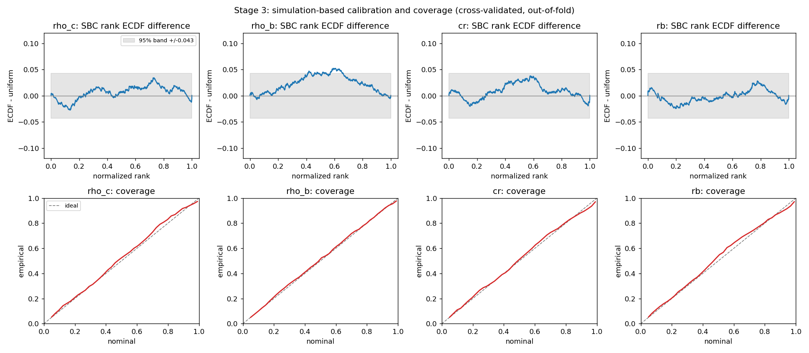

# Geom Mesh Net: calibrated inference of cluster parameters from spatial summary statistics

A Python package for simulating clustered three-dimensional marked point
patterns, characterising them with classical spatial-summary statistics, and
recovering the physical parameters that produced them with quantified
uncertainty.

---

## Abstract

Atom probe tomography and related techniques produce large labelled
three-dimensional point clouds in which solute atoms may be clustered into
precipitates. The scientific quantities of interest — the solute concentration
inside precipitates, the concentration remaining in the matrix, and the
precipitate size distribution — are not directly observable. Standard practice
computes the spatial summary functions *G*, *F*, *K* and the guest-to-host cross-*G*,
compares them against a null model, and argues qualitatively that clustering is
present. This establishes *whether* structure exists but does not deliver the
parameters, and delivers no error bars, because the forward map from physical
parameters to observed point pattern has no tractable likelihood.

This package treats that as a simulation-based inference problem. It contains a
cluster simulator with exactly known parameter priors, a Python port of the
`rapt`/`rTEM` spatial-summary machinery producing a fourteen-dimensional feature
vector, and a conditional normalising flow trained by maximum likelihood on
simulated parameter–observation pairs. Because the pairs are drawn from the joint
distribution, the minimiser of the training loss is the true posterior.

Over 1,000 simulated patterns of 216,000 points each, the resulting posterior is
**calibrated**: ninety-percent credible intervals contain the truth 88–92% of the
time for all four parameters, and simulation-based calibration ranks are uniform
for three of the four. The fourth, the matrix concentration, covers correctly but
retains a small rank bias traced to a confounding with the radius-spread
parameter. An ablation shows each parameter is carried by exactly one summary
function, with the second-order *K* statistics the sole carrier of cluster length
scale. With independently simulated point patterns, the radius-spread parameter is
nearly unidentifiable from these features, and the posterior reports that
honestly: it returns 96% of its prior width and remains calibrated. It becomes
partly recoverable for small clusters, and more so when every pattern shares one
underlying point pattern, as in the published design.

The work is presented with its corrections intact. Eight stated conclusions were
subsequently overturned by measurement, two of which reversed a planned course of
work; these are recorded rather than overwritten, because the corrections are
part of the result.

---

## Table of contents

1. [Introduction](#1-introduction)
2. [Background](#2-background)
3. [Methods](#3-methods)
4. [Results](#4-results)
5. [Discussion](#5-discussion)
6. [Conclusion](#6-conclusion)
7. [Experiment walkthroughs](#7-experiment-walkthroughs)
8. [Package reference](#8-package-reference)
9. [Reproducing the work](#9-reproducing-the-work)
10. [References and provenance](#10-references-and-provenance)

### Experiment walkthroughs

Each walkthrough is a self-contained report in the same format as this document,
covering one experiment with its own figures and tables.

| | Experiment | Question | Outcome |
| --- | --- | --- | --- |
| E1 | [Ground-truth recovery](docs/experiments/E1_ground_truth_recovery.md) | Can the unsaved simulator parameters be recovered? | Passed, exact |
| E2 | [Feature extraction and screening](docs/experiments/E2_feature_extraction.md) | Do the 14 features carry information about the parameters? | Passed; 3 of 4 recoverable |
| E3 | [Posterior estimation](docs/experiments/E3_posterior_estimation.md) | Can a flow beat the prior on held-out data? | Passed, +5.5 nats |
| E4 | [Simulation-based calibration](docs/experiments/E4_calibration.md) | Are the credible intervals honest? | Passed; the decisive gate |
| E5 | [Feature sufficiency](docs/experiments/E5_feature_sufficiency.md) | Which summary functions carry which parameters? | One carrier each |
| E6 | [Observation augmentation](docs/experiments/E6_observation_augmentation.md) | Does re-observing each pattern help? | Little; features robust to thinning |
| E7 | [Diagnosing `rho_b`](docs/experiments/E7_rho_b_diagnosis.md) | Why is one parameter miscalibrated? | Width, then bias; fixed by ensembling |
| E8 | [Global feature validation](docs/experiments/E8_global_feature_validation.md) | Are the ported summary functions numerically sound? | Passed, no failures |
| E9 | [Local features in a neural field](docs/experiments/E9_local_feature_neural_field.md) | Do spatially varying features improve field reconstruction? | Halted at its own gate |
| E10 | [The replay oracle](docs/experiments/E10_replay_oracle.md) | Can the true guest probability of every simulated atom be computed? | Passed, exact; lattice artefact found |
| E11 | [Baselines and the headroom map](docs/experiments/E11_baselines_headroom.md) | How close does standard smoothing come to the truth, and where does it fall short? | Passed; 48% of cells have headroom |

---

## 1. Introduction

### 1.1 The measurement problem

An atom probe produces a list of atoms with three-dimensional positions and
chemical identities. When a material contains precipitates, some solute atoms sit
inside them and some remain dissolved in the surrounding matrix. An
experimentalist wants four numbers: how concentrated the solute is inside the
precipitates, how much remains in the matrix, how large the precipitates are, and
how variable their size is.

None of these is directly measurable. What is measured is a point cloud, and the
relationship between the cloud and the parameters is mediated by a stochastic
process — where precipitates nucleated, which atoms the detector happened to
register, how solute partitioned between phases. Two materials with identical
parameters produce different point clouds.

### 1.2 Why the usual tools stop short

The classical approach characterises the point pattern with summary functions:
*G* (nearest-neighbour distances), *F* (empty-space distances), *K* (second-order
intensity), and a guest-to-host cross-*G*. Each is compared against the value
expected under a null model — complete spatial randomness, or a random relabelling
of the observed points. Departure from the null is evidence of clustering.

This is a hypothesis test, and it answers a hypothesis-testing question. It does
not produce parameter estimates, and when practitioners do extract parameters —
typically by running a cluster-finding algorithm and measuring the clusters it
identifies — the estimates arrive without error bars, because there is no ground
truth against which to calibrate them.

The obstacle to doing better is that the likelihood is intractable. There is no
closed form for

> the probability of observing these 216,000 labelled points given
> (`rho_c`, `rho_b`, `cr`, `rb`)

so the posterior cannot be written down and sampled by conventional means.

### 1.3 The approach taken here

What *is* available is a simulator that draws from that likelihood. That is
precisely the setting of simulation-based inference: replace the unavailable
likelihood with samples from it, and learn the posterior directly.

The asset that makes this work is that the package owns the simulator, and
therefore knows the ground truth for every pattern it has ever generated. Nobody
analysing a real measurement has that. It converts an unanswerable inverse
problem into a supervised one.

### 1.4 Contributions

1. A Python port of the `rapt`/`rTEM` spatial-summary machinery, with the
   estimators validated against closed forms rather than against previously
   recorded output (E8, and `tests/`).
2. Six corrections to that machinery, of which one — a silent boundary-pinning
   defect corrupting roughly two thirds of the *K*-derived features — materially
   changed what those features could support (E2). A later comparison against
   rapt showed that this defect was introduced by the port. The published method
   never had it.
3. An exact reproduction of rapt's feature extraction, agreeing with the R package
   to 6.8e-13 on every feature and every missing-value case, with parity tests
   that regenerate their references from R when R is installed (ROADMAP §8.9).
4. A conditional normalising flow written directly rather than imported, verified
   against a problem with a closed-form posterior (E3).
5. A calibrated posterior over four physical parameters, validated by
   simulation-based calibration and interval coverage (E4).
5. A measurement of which summary function carries which parameter, by posterior
   contraction rather than correlation (E5).
6. A negative result on observation augmentation, with the mechanism measured
   rather than assumed (E6).

---

## 2. Background

### 2.1 Spatial summary functions

For a point pattern observed in a bounded window, four summary functions are used
here. Each is a function of a radius *r*.

| Function | Definition | Sensitive to |
| --- | --- | --- |
| *G*(r) | distribution of distances from a guest point to its nearest guest neighbour | short-range guest clustering |
| *F*(r) | distribution of distances from an arbitrary location to the nearest guest point | guest-free voids |
| *K*(r) | expected number of further guest points within *r* of a typical guest, scaled by intensity | structure across a range of scales |
| cross-*G*(r) | distances from guest points to the nearest host point | guest–host spatial relationship |

*G* and *F* are estimated with a Kaplan–Meier edge correction, which treats a
point whose nearest neighbour might lie outside the observation window as
censored rather than discarding it. *K* is estimated with a translation
correction, weighting each pair by the volume of the window's self-intersection
under the translation separating them.

### 2.2 Null models and the fourteen features

A raw summary curve is hard to interpret; what carries information is its
departure from a null. Two nulls are implemented:

- **Complete spatial randomness (CSR)**, available in closed form. Under CSR in
  three dimensions, *K*(r) is the volume of a radius-*r* ball, and *G* and *F*
  are both `1 − exp(−λ·(4/3)πr³)`.
- **Random relabelling**, which preserves every measured coordinate and the total
  guest count, and reassigns labels at random. This conditions on the measured
  physical point structure and asks only whether the *labels* are spatially
  unusual.

From the observed-minus-expected difference curves, fourteen scalar features are
extracted, following Bennett et al. Four from *G*, two from *F*, five from *K*,
three from cross-*G*. These are the port's principal output and the input to
everything downstream.

### 2.3 Neural posterior estimation

Given pairs (θᵢ, xᵢ) drawn from the joint distribution p(θ)p(x|θ), fit a
conditional density estimator q_φ(θ|s) by maximum likelihood:

> minimise over φ:  −Σᵢ log q_φ(θᵢ | sᵢ)

The load-bearing fact is that the minimiser of this loss **is** the true posterior
p(θ|s). This is not an approximation of a different quantity; it is Bayesian
inference recast as conditional density estimation over samples already in hand.
Training happens once, after which inference on a new dataset is a single forward
pass — the estimator is *amortised*.

### 2.4 Simulation-based calibration

A posterior can beat a prior handsomely and still be systematically
overconfident, and an overconfident posterior is worse than no posterior because
it resembles an answer. The check used here is simulation-based calibration.

For each held-out pattern, draw *L* samples from q(θ|s) and count how many fall
below the true θ. That count is the *rank* of the truth within the posterior. If
q is the true posterior, and θ was drawn from the prior with x simulated from it —
which is exactly how this dataset was built — then those ranks are **uniform** by
construction.

The strength of the test is that uniformity is not a threshold anyone chose.
Departures are diagnostic:

| Rank distribution | Diagnosis |
| --- | --- |
| Uniform | calibrated |
| Peaked in the centre | posteriors too wide (underconfident) |
| Peaked at both edges | posteriors too narrow (**overconfident**) |
| Sloped | biased |

---

## 3. Methods

### 3.1 The simulator and its priors

`clustersim.py` generates clustered marked point patterns by placing cluster
centres from an overlying point process, then assigning labels with a
distance-dependent probability. The dataset used throughout is 1,000 patterns of
216,000 points in a 60 × 60 × 60 domain, with labels 0 and 1 for host species and
2 and 3 for guest species.

Four parameters are varied, drawn independently and uniformly. The prior is
therefore known *exactly* rather than assumed, which is unusual and makes it a
fact rather than a modelling choice.

| Parameter | Prior | Meaning |
| --- | --- | --- |
| `rho_c` | U(0.2, 1.0) | guest concentration inside clusters |
| `rho_b` | U(0.0, 0.05) | guest concentration in the matrix |
| `cr` | U(3.0, 15.0) | mean cluster radius, domain units |
| `rb` | U(0.0, 0.5) | relative spread of cluster radii |

Two quantities that appear parameter-like are **not** inferable and are excluded:
`pcp`, the overall solute fraction, is held constant at 0.1 across every
simulation and so carries no variation; and the per-pattern `radii` array is a
realised output of variable length, not a parameter.

### 3.2 Feature configuration

Global features are computed with the closed-form CSR null rather than random
relabelling. Inference requires only a deterministic statistic of the point
cloud, not a hypothesis test against a null, and the two give near-identical
features at a quarter of the cost (1.61 s against 6.23 s per pattern). The `sqrt`
variance-stabilising transform is retained to match the published feature
definitions; see E5 for the measured comparison against the three-dimensional
`cube_root` alternative.

The *K* radius is set to 40 domain units with 801 radii. This is not a default: at
the original setting of 10, roughly two thirds of the *K*-derived features were
grid endpoints rather than measurements. E2 covers this at length.

This workaround belongs to the port. rapt, the reference implementation, never
produces those endpoints: it reports `NA` and drops the pattern (§4.5). All results
in §4 use the port's `stage1` configuration. `extract_features.py --preset paper`
reproduces rapt's extraction and the grids of its published walkthrough instead.

### 3.3 The posterior estimator

A conditional autoregressive flow over a uniform box prior. Each layer applies an
affine transform in which the shift and log-scale for dimension *i* are produced
by a small network reading the conditioning features and the preceding
dimensions. The transform is triangular, so its Jacobian determinant is the
product of the scales; density evaluation is one parallel pass and sampling
inverts one dimension at a time. Dimensions are reversed between layers.

Because the prior is uniform on a box, the posterior is too. The flow works in an
unconstrained space reached by a logit transform of the normalised parameters, so
every sample lands inside the prior box **by construction** rather than by
rejection, which would bias the result. The change of variables contributes a
Jacobian term, included so the reported log-density is a genuine density over θ
and comparable against the uniform prior.

It was written directly rather than taken from a library. A dry run confirmed the
obvious dependency would not have forced a version downgrade, so the deciding
argument was not dependency risk but verifiability: a four-dimensional flow is
small enough to check against a problem with a closed-form posterior, which is
stronger evidence than trusting an unverified package.

### 3.4 Validation protocol

Splitting is always **by pattern**, never by row. Where a pattern contributes
several observations (E6), all of them stay on the same side of the split;
otherwise near-duplicates of training examples leak into the held-out set and
every calibration number becomes optimistic.

Calibration is assessed by ten-fold cross-validation rather than on a single
held-out set. Only data a flow never trained on is admissible, and a 100-pattern
rank ECDF carries a Kolmogorov band of ±0.136 — wide enough to accept badly
miscalibrated posteriors. Refitting per fold yields an out-of-fold posterior for
all 1,000 patterns and narrows the band to ±0.043. Each fold is a different flow,
so this measures the calibration of the *procedure*, which is the right target for
a method being proposed.

Posteriors are reported from an **ensemble** of five independently seeded flows,
pooling an equal share of draws from each so the total per pattern is unchanged.
Equal draw counts matter: rank granularity depends on the number of draws, so an
ensemble sampling more heavily than the single model it is compared against
produces an incomparable deviation.

### 3.5 Pre-registration

Every stage has a gate stated before it was run, and the gates were not adjusted
afterwards. Where a registered prediction failed — as one did, on the
identifiability of `rb` — the failure is recorded and the threshold left alone.

---

## 4. Results

### 4.1 Headline

Ninety-percent credible intervals contain the truth 88–92% of the time across all
four parameters, measured out-of-fold on every pattern.



**Figure 1.** Simulation-based calibration rank ECDF differences (top) and
coverage curves (bottom), cross-validated over all 1,000 patterns. Three
parameters oscillate inside the grey uniform band; `rho_b` traces a smooth arch
that breaches it.

### 4.2 Per-parameter summary

**Table 1.** Identifiability and calibration, ensemble of five flows, ten-fold
cross-validated over 1,000 patterns. R² is from an independent ridge screen over
25 random splits. Contraction is `1 − posterior sd / prior sd`.

| Parameter | R² | Contraction | 90% coverage | SBC verdict | Carried by |
| --- | ---: | ---: | ---: | --- | --- |
| `rho_c` | 0.964 ± 0.037 | 0.865 | 0.919 | uniform | cross-*G* |
| `rho_b` | 0.925 ± 0.061 | 0.901 | 0.902 | **departs** | *G*, *F* |
| `cr` | 0.843 ± 0.025 | 0.649 | 0.885 | uniform | *K* |
| `rb` | 0.112 ± 0.045 | 0.039 | 0.882 | uniform | nothing |

### 4.3 Honest ignorance

`rb`, the radius-spread parameter, is the most informative row in Table 1. It
governs the *variance* of cluster radii, and with a median of eight clusters per
pattern there is almost no sample from which to estimate a variance. Its measured
R² is 0.112 and its posterior returns 96% of its prior width.

Its ranks are nonetheless uniform and its 90% interval covers 88.2% of the time.
The method reports honest ignorance *and* its error bars are trustworthy. This is
the property no point estimate can have: a regression would return a confident
`rb` value with no mechanism to signal that it was meaningless.

### 4.4 Division of labour among the summary functions


**Figure 2.** Left: posterior contraction achieved by each summary-function
family in isolation. Right: the change in contraction when each family is removed
from the full set. Dropping *K* costs `cr` 0.254 of contraction while leaving
`rho_c` and `rho_b` untouched to within 0.01.

Each parameter is carried by exactly one family, and the mapping is physically
sensible: guest-to-host cross-*G* carries the in-cluster concentration,
empty-space *F* and nearest-neighbour *G* carry the matrix concentration,
second-order *K* carries the cluster length scale, and nothing carries the radius
spread.

This confirms an independent correlation screen from a different direction.
Correlation asks whether a feature moves *with* a parameter; contraction asks
whether it reduces the uncertainty remaining *after every other feature is
accounted for*. They need not have agreed.

### 4.5 Corrections to the feature library

Six defects were found and fixed. The consequential one was silent.

**Table 2.** Corrections, with the section of `experiments/inference/ROADMAP.md`
recording each.

| § | Defect | Consequence |
| --- | --- | --- |
| 8.1 | none — *K* estimator validated | ratio to analytic CSR 1.0009 |
| 8.2 | transform is the 2D form in 3D | measured indistinguishable; `sqrt` retained |
| 8.3 | **extrema pinned to the grid boundary** | ~2/3 of *K* features were artefacts; introduced by the port (8.9) |
| 8.4 | extractor takes the first local maximum | fragile for narrow peaks; recorded, not changed |
| 8.5 | **data generator could not run at all** | broken import since the package restructure |
| 8.6 | `k_r_max` unbounded | radius exceeding the window now refused |
| 8.9 | **port had diverged from rapt** | `NA` replaced by endpoints, plus loess and window differences; now reproduced exactly |
| 8.10 | drop rule and shared point pattern measured | rapt keeps 35% of rows; sharing points raises `rb` R² from 0.24 to 0.44 inside the paper's radius range |

§8.3 is the one that mattered, and §8.9 later traced it to the port.
`_extract_k_features` returns a radius from a grid;
when the difference curve has no interior extremum, the peak finder falls back to
`argmax` and returns a grid endpoint *as though it were a measurement*. At the
original radius setting only 4 of 12 patterns had a genuine interior extremum.
This is the most likely explanation for the *K*-derived features scoring 0.53–0.72
on an earlier interpolation test while the *G*, *F* and cross-*G* features scored
0.90–0.98: interpolating a boundary artefact cannot succeed, because the quantity
is not a smooth function of position.

rapt reports `NA` where the port returned an endpoint, and drops the pattern.
Checked against the installed R package on 60 patterns, the legacy port invented
a value in every such case: 17 of 17 for `Rm`, 40 of 40 for `Rdm`. The faithful
port now agrees with rapt on all 14 features to 6.8e-13, including every `NA`.

The summary-function estimators were checked against spatstat on identical
patterns too. *G* and cross-*G* agree to 2e-5. *K* agrees to 1e-13 after a constant
n/(n−1) normalisation factor. *F* does not: spatstat's `F3est` measures distance
with a 26-neighbour chamfer transform on a fine voxel grid, and the port's exact
Euclidean distances differ from it by up to 0.1.

### 4.6 Negative results

Two experiments returned negative or null results and are reported as such.

**Observation augmentation** (E6) adds little. Independent thinnings of the same
pattern move the features by only 4–9% of the between-pattern spread; even
discarding 95% of the atoms the summary statistics barely change. The replicates
are near-duplicates. Quadrupling the training rows improved coverage slightly but
simulation-based calibration for only two of four parameters.

That robustness is a positive finding in its own right: the features are
insensitive to detector efficiency across an order of magnitude, which is
directly relevant to any future application to real measurements.

**`Rddm`** (E5) remains unresolved at +0.149 ± 0.144 — no evidence it contributes,
some evidence it is unstable, and the noisiest feature measured. Only 3 of 14
features resolve at two standard errors, which is expected rather than a failure:
the features are redundant, so leave-one-out is the wrong instrument for them.

---

## 5. Discussion

### 5.1 What has been established

The core claim holds: physical cluster parameters can be recovered from classical
spatial-summary features with calibrated uncertainty. Three of four parameters are
strongly identified, the fourth is honestly reported as unidentified, and the
intervals mean what they say.

The value over current practice is not a better point estimate. It is that the
output carries a calibrated statement of what is *not* known — including the
ability to say that a parameter is not determined by the data at all, which is
`rb`'s case and which no point estimate can express.

### 5.2 What has not

**No comparison against the incumbent exists.** Standard practice runs a
cluster-finding algorithm and measures the clusters it identifies. Nothing here
shows the posterior beats that, and the ground truth to settle it is on disk.
This is the most valuable outstanding piece of work and requires no new data.

**The overall solute fraction is held fixed.** `pcp = 0.1` throughout, so it
cannot be inferred. In a real measurement it is a primary unknown, which makes
the problem as posed easier than the real one in a way that matters.

**Rare structures are unlearnable at this sample size.** Two of 1,000 patterns
contain zero clusters despite parameters specifying large ones. One landed in a
test set and was assigned a log-density of −19,409 nats, dominating a mean by
itself. The flow had a single training example of that structure.

### 5.3 Where this work departs from the published design

The paper reports R² ≈ 0.71 for radius dispersity. The posterior here recovers
almost nothing for it. The two pipelines differ in more than the port:

| | Bennett et al. (2023), rapt walkthrough | This work |
| --- | --- | --- |
| Underlying points | one pattern shared by every training and test pattern | independent per pattern |
| Null model | 10,000 relabelings of the shared pattern | analytic CSR |
| Guest fraction | 0.051 | 0.1 |
| Mean radius | [2, 6.5] | [3, 15] |
| Background concentration | [0, 0.035] | [0, 0.05] |
| Position blur | U(0, 0.2) | none |
| Patterns | 100,000 | 1,000 |
| Missing *K* features | row dropped | endpoint (legacy port) |
| *F* distances | 26-neighbour chamfer (spatstat) | exact Euclidean |
| Model | Bayesian-regularised network per parameter | conditional normalising flow |

ROADMAP §8.10 measures three of these with a ridge screen. Keeping only complete
rows, restricting to the paper's radius range, and sharing the point pattern
raises `rb`'s R² from 0.07 to 0.44. Sharing the point pattern accounts for most of
that rise. It helps only through the *K* features, and only where they exist.

That gain comes from removing positional noise that a real measurement always
contains. The independent-points design is the harder test, and the one that
matches applying the method to data.

Applying rapt's drop rule would discard 65% of this dataset, concentrated at large
radii. The existing results therefore keep the legacy features, which match rapt's
wherever rapt defines them and carry a usable censoring signal where it does not.

### 5.4 The simulator defines what is being inferred

A flow trained on `clustersim` output infers `clustersim`'s parameters. Applying
it to a real measurement would meet detector efficiency, trajectory aberration,
and non-spherical, non-Gaussian precipitate morphology that the forward model does
not describe. A flow trained on simulation and applied to real data will produce
confident, calibrated-looking, wrong answers, and simulation-based calibration
cannot detect this, because it only ever validates self-consistency *within* the
simulator.

Addressing it requires model-misspecification work in its own right: robust or
noise-aware summary statistics, prior predictive checks confirming the simulator
can produce patterns resembling real data at all, and ideally a measurement with
independently known ground truth. This is a separate research problem, not a next
step.

The simulation-to-simulation result stands on its own regardless, and is the
honest prerequisite for anything on real data.

### 5.5 On the corrections

Eight stated conclusions were later overturned by measurement. They are recorded
in `experiments/inference/ROADMAP.md` rather than overwritten, for three reasons.

First, two of them **reversed a planned course of work**: a conclusion that more
simulations would worsen calibration was reached by faulty reasoning about
augmentation, and although the conclusion survived on independent evidence, the
reasoning did not.

Second, one correction concerns a diagnostic introduced *to catch* a different
problem, which turned out to carry the same defect it was meant to detect — a
ratio of standard deviations dominated by two patterns in a thousand. Recording
that is more useful than a clean narrative in which the diagnostic simply worked.

Third, a pre-registered prediction failed. `rb` was registered as uninformative,
operationalised as R² ≤ 0.10; it measured 0.112 on all 25 splits. The ceiling was
not moved. The substantive expectation survived — contraction is 0.039, so the
posterior is 96% as wide as the prior — but the strict claim was too strong.

### 5.6 Relationship to the neural field work

The package originally aimed at neural field reconstruction of continuous density
fields, and that line is retained (E9). Its screening experiment concluded that
local spatial features did not improve reconstruction, correctly halting at a
prespecified interpolation gate.

Re-examining its own numbers against a constant-predictor baseline complicates
that reading. On two of its three patterns the coordinate-only control had already
solved the task — 200× and 11× better than a constant — so no feature set could
improve on it. On the third, where the control barely beat a constant (1.13×),
local features won clearly. The conclusion about *interpolation* was sound; the
conclusion about *features* was an artefact of pattern selection, the median
having been taken over one unsolved problem and two solved ones.

Two confounds must be removed before that comparison is rerun: no positional
encoding exists anywhere in the codebase, so the field is a plain ReLU MLP on raw
coordinates and subject to spectral bias exactly where the one informative pattern
sits; and the *K* features it used were largely the port's boundary artefacts
(§4.5).

---

## 6. Conclusion

This package demonstrates that the classical spatial-summary statistics used for
decades to *test* for clustering also carry enough information to *estimate* the
underlying physical parameters, and that the estimate can be made with honest
error bars.

Four results stand out. The posterior is calibrated, with 90% intervals covering
88–92% across all parameters. Each parameter is carried by one interpretable
summary function, so the inference is not a black box over an undifferentiated
feature vector. A parameter the data cannot determine is reported as such, with
calibrated intervals that are simply wide. And the *K*-derived features, despite
carrying a defect that made two thirds of them artefacts, turn out to be
indispensable — without them the cluster length scale is not recoverable at all.

What remains before this is a result rather than a method is a comparison against
what practitioners currently do. That work needs no new data and the ground truth
to settle it is already on disk.

---

## 7. Experiment walkthroughs

Each walkthrough is a standalone report with its own abstract, methods, results,
discussion and conclusion, covering one experiment in detail.

### Inference track

- **[E1 — Ground-truth recovery](docs/experiments/E1_ground_truth_recovery.md)**
  Recovering two simulator parameters that were varied but never written to disk,
  by replaying a seeded generator, and verifying the replay by regenerating
  patterns from scratch.

- **[E2 — Feature extraction and screening](docs/experiments/E2_feature_extraction.md)**
  Computing the 14 features for every pattern, the porting defect that made two
  thirds of the *K* features artefacts, and a ridge screen establishing
  which parameters are recoverable at all.

- **[E3 — Posterior estimation](docs/experiments/E3_posterior_estimation.md)**
  The conditional flow, its verification against a closed-form posterior, and the
  fit that beats the uniform prior by 5.5 nats.

- **[E4 — Simulation-based calibration](docs/experiments/E4_calibration.md)**
  The decisive gate. Rank uniformity, interval coverage, and why the assessment is
  cross-validated rather than run on a single held-out set.

- **[E5 — Feature sufficiency](docs/experiments/E5_feature_sufficiency.md)**
  Ablation by posterior contraction, the one-carrier-per-parameter result, the
  `sqrt` versus `cube_root` comparison, and the unresolved status of `Rddm`.

- **[E6 — Observation augmentation](docs/experiments/E6_observation_augmentation.md)**
  Re-observing each pattern by independent thinning, why it adds little, and the
  robustness-to-thinning finding that came out of it.

- **[E7 — Diagnosing `rho_b`](docs/experiments/E7_rho_b_diagnosis.md)**
  Four hypotheses tested in order of cost, three ruled out by measurement, and the
  ensembling fix.

### Feature library and neural field track

- **[E8 — Global feature validation](docs/experiments/E8_global_feature_validation.md)**
  Numerical validation of the ported summary functions on ten patterns.

- **[E9 — Local features in a neural field](docs/experiments/E9_local_feature_neural_field.md)**
  The prespecified screening experiment that halted at its own interpolation gate,
  and the reinterpretation of its result.

### Reconstruction track

Specified in [`experiments/reconstruction/ROADMAP.md`](experiments/reconstruction/ROADMAP.md),
with a proposal ([`PROPOSAL.md`](experiments/reconstruction/PROPOSAL.md)) describing its
background, questions and methods.

- **[E10 — The replay oracle](docs/experiments/E10_replay_oracle.md)**
  An exact guest probability for every simulated atom, by replaying the simulator's
  labelling. It replaces a density grid that was wrong inside clusters. The stage
  also found that cluster centres in `data/` lie on a lattice, and that 22 patterns
  lost clusters to it.

- **[E11 — Baselines and the headroom map](docs/experiments/E11_baselines_headroom.md)**
  Kernel delocalisation, the estimator of standard practice, scored against the
  oracle on 300 test cells.
  - It comes within 10% of the truth for large clusters at realistic efficiency, but
    leaves room in 92% of small-cluster cells.
  - Its error sits at cluster rims and cores.
  - Guest-adaptive smoothing closes 41% of the remaining gap and is the baseline later
    stages must beat.

- **[E15 — A simulator with a physical law](docs/experiments/E15_diffusion_simulator.md)**
  Stage 5.1 gives the simulator's matrix a screened diffusion field with Gibbs–Thomson
  interfaces, so that a physics-informed network has a law to enforce.
  - The design as first written missed its own boundary condition, and the benchmark
    geometry overlapped too much to hold one; both were fixed before any network was
    trained.
  - A prior was chosen by the Cramér–Rao bound, so that the capillary and screening
    lengths can be recovered at all.
  - Gate 5.1 passed. Stage 2's walkthrough is E19; Stages 3 and 4 follow it.

- **[E16 — A physics-informed network that prefers the wrong physics](docs/experiments/E16_soft_pinn.md)**
  Stage 5.2 as first designed: a neural field with the diffusion equation and the
  Gibbs–Thomson condition as penalties, on development patterns.
  - Given the true geometry, it still could not recover the constants: the screening
    length ended at 0.005–18 times its true value.
  - The loss itself preferred flat constants, by 3 to 144 times the data margin, because
    the evidence is 0.001–0.002 nats per atom and the penalties cost a finite network far more.
  - The same law imposed exactly recovered the capillary length within 5%.

- **[E17 — The diffusion law as a hard constraint: Gate 5.2](docs/experiments/E17_physics_fit.md)**
  Stage 5.2 as corrected: the exact diffusion field around precipitates detected in the data.
  - Choosing matrix atoms from their own labels had biased them by 11–19 standard errors;
    leaving each atom's label out removed it.
  - The law predicted the matrix far better than an unconstrained network, and a rule based on
    identifiability rejected 61 of 72 misspecified matrices.
  - Gate 5.2 failed on the capillary length (median error 3.5 times its bound): errors in the
    detected radii pull it toward zero.

- **[E18 — Fitting the precipitates with the law](docs/experiments/E18_joint_geometry.md)**
  After Gate 5.2: what the capillary length can be worth when the geometry is unknown, and which
  fit reaches it. Development work, not a gate.
  - Leaving every radius and the interior profile unknown widens the bound on ℓ by only 7–29%:
    the gate's shortfall was the method's.
  - The bound on ℓ times the radius spread is 0.03–0.045: without a spread of radii, ℓ is gone.
  - Fitting the radii alone makes ℓ worse; freeing the centres as well brings it to 0.89 times
    the bound, at the level of a fit handed the true geometry.

---

## 8. Package reference

```
geom_mesh_net/                      the library (installed with pip install -e .)
  simulation/clustersim.py          simulate clustered marked point patterns
  simulation/parameters.py          parameter names, the prior, the data factory's draws
  statistics/paper_spatial_features.py  G, F, K, cross-G and the 14 scalar features
  statistics/presets.py             the stage1 and paper feature configurations
  statistics/feature_cache.py       offline feature caching
  statistics/barcode.py             binned pair-correlation "spatial barcode"
  fields/oracle.py                  exact guest probabilities by replaying the simulator
  fields/baselines.py               kernel-smoothing baselines B0, B1, B2
  fields/point_cloud.py             voxel guest-probability fields
  fields/density_grid.py            density grids from simulation parameters (deprecated)
  fields/physics.py                 screened diffusion field around precipitates (Stage 5)
  fields/misspecified.py            matrix fields that break that law (Stage 5.2 controls)
  fields/cluster_extraction.py      precipitates and matrix atoms from a smoothed field (Stage 5.2)
  neural/datasets.py                torch Dataset and collate function
  neural/models.py                  neural field models
  neural/implicit.py                SIREN field with physics penalties; the analytic diffusion family
  inference/flow.py                 conditional autoregressive normalising flow
  inference/calibration.py          SBC ranks, ECDF bands, coverage, width ratio
  viz/                              3D plotting and benchmark figures
  paths.py                          data, experiment and figure locations
  core_functions/                   deprecated aliases for the old module names

experiments/inference/              posterior inference of cluster parameters
  ROADMAP.md                        the authoritative record: gates, corrections
  recover_ground_truth.py           E1
  extract_features.py               E2
  screen_features.py                E2, ridge screen
  fit_posterior.py                  E3
  validate_posterior.py             E4
  ablate_features.py                E5
  augment_features.py               E6
  compare_augmentation.py           E6
  diagnose_rho_b.py                 E7

experiments/neural_field/           neural field experiments (E8, E9)
experiments/reconstruction/         solute-field reconstruction (E10 onward)
scripts/generate_data.py            the data factory that wrote data/
docs/experiments/                   one walkthrough per experiment
docs/guides/                        introductory explanatory documents
tests/                              252 regression tests
data/                               1,000 simulated patterns (gitignored, ~5 GB)
```

Experiment scripts are run from the repository root as modules, for example
`python -m experiments.inference.fit_posterior`. Results files written before the
repository was reorganised record the scripts' old locations: `inference/`,
`reconstruction/` and `example_01/` are now under `experiments/`, and
`deprecated_code/tester_scripts/data_factory.py` is `scripts/generate_data.py`.

### Testing philosophy

Where a closed form exists, tests compare against it rather than against a
previously recorded output, so they can catch a genuine error rather than merely
detecting change. Ripley's *K* is checked against the analytic CSR value on
Poisson patterns; the Kaplan–Meier estimator against a hand-worked censored
example; the CSR baselines against their closed forms; the flow against a
conjugate Gaussian posterior.

The calibration diagnostics are themselves validated before being trusted:
`tests/test_calibration.py` constructs posteriors that are calibrated,
overconfident, underconfident and biased, and checks the diagnostic accepts the
first and rejects the other three *in the correct diagnosable direction*. A
diagnostic that only passed the calibrated case would certify anything.

---

## 9. Reproducing the work

### Environment

```bash
mamba create -n geom_mesh_net python=3.10
mamba activate geom_mesh_net
mamba install numpy scipy matplotlib pandas pyvista -c conda-forge
pip install torch plotly trame trame-vtk trame-vuetify
pip install -e ".[dev,notebooks]"
```

### Pipeline

```bash
python -m pytest                                                    # 252 tests, a few minutes

PYTHONPATH=. python scripts/generate_data.py                        # ~8 min, 5 GB
python -m experiments.inference.recover_ground_truth                # E1, 6 s
python -m experiments.inference.extract_features --workers 7        # E2, 7.6 min
python -m experiments.inference.screen_features                     # E2, 20 s
python -m experiments.inference.fit_posterior                       # E3, 7 s
python -m experiments.inference.validate_posterior --ensemble 5     # E4, 11 min
python -m experiments.inference.ablate_features --seeds 6           # E5, 15 min
python -m experiments.inference.augment_features --workers 7        # E6, 11 min
python -m experiments.inference.compare_augmentation                # E6, 12 min
python -m experiments.inference.diagnose_rho_b                      # E7, 2 min

PYTHONPATH=. python docs/make_figures.py                            # rebuild figures
```

Run from the repository root. `data/` is gitignored; the generator writes 1,000
patterns of roughly 5 MB each. Feature caches and posterior samples are also
gitignored and regenerable; the metadata, metrics and figures beside them are
tracked.

### A note on the data generator

`scripts/generate_data.py` seeds `np.random.default_rng(42)` and draws parameters in a
fixed order. **Rerunning it unchanged reproduces the identical 1,000 patterns**,
so extending the dataset requires a different seed and an index offset, or the
new batch will overwrite the existing one. The generator now writes all four
parameters directly, so future datasets need no recovery step.

---

## 10. References and provenance

### Method sources

- Spatial summary functions and the fourteen-feature extraction follow

  > Bennett, R. A., Proudian, A. P., & Zimmerman, J. D. (2023). Cluster
  > characterization in atom probe tomography: Machine learning using multiple
  > summary functions. *Ultramicroscopy* **247**, 113687.
  > https://doi.org/10.1016/j.ultramic.2023.113687

  ported from the R packages `rapt` (<https://github.com/rolandrolandroland/rapt>)
  and `rTEM`. `feature_method="rapt"` reproduces rapt's extraction exactly;
  `feature_method="legacy_port"` preserves the earlier port used for §4.
- Neural posterior estimation follows the standard formulation in which a
  conditional density estimator fitted by maximum likelihood on joint samples
  recovers the posterior.
- Simulation-based calibration follows the rank-uniformity construction of Talts
  et al.

### Authoritative records

`experiments/inference/ROADMAP.md` is the authoritative record of this work. It contains every
gate definition, the measured result against each, the full correction history
with the reasoning that produced each error, and the risks and limitations in
their original form. This document summarises it; where the two differ, the
roadmap governs.

`experiments/neural_field/EXPERIMENTAL_METHODOLOGY_01.md` and its report play the same role for
the neural field track.
