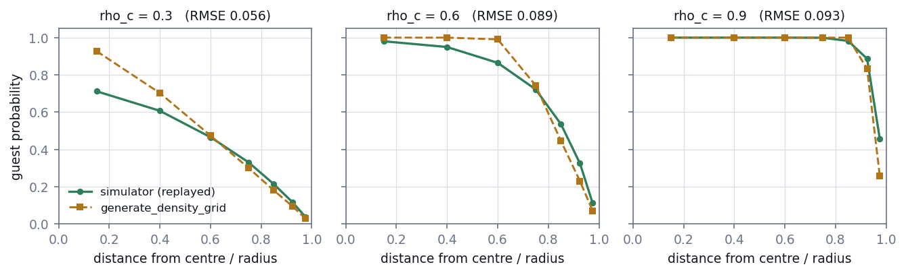
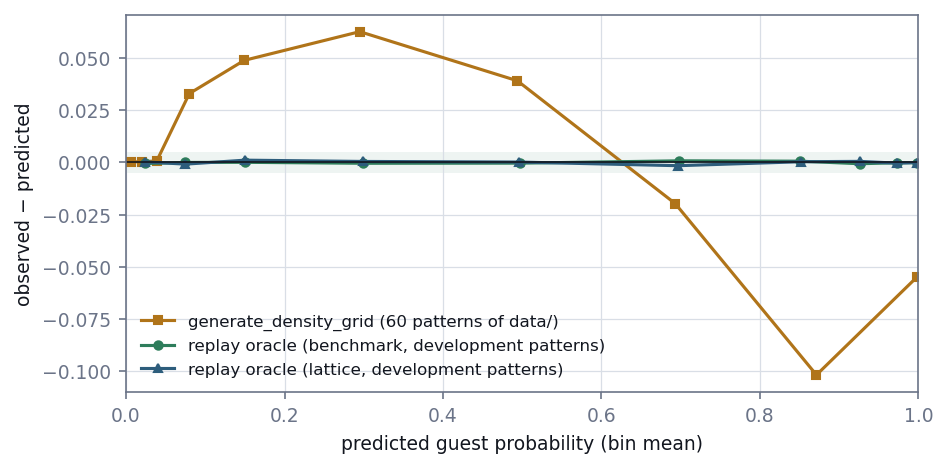
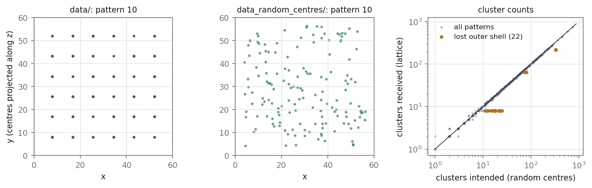

# E10 — The yardstick: an exact oracle for the solute field

*Reconstruction Stage 0. Can the true guest probability of every simulated atom
be computed, and is the benchmark free of simulator artefacts?*

[← back to README_detailed](../../README_detailed.md#7-experiment-walkthroughs) ·
Protocol: [`experiments/reconstruction/ROADMAP.md`](../../experiments/reconstruction/ROADMAP.md), Stage 0 ·
Implemented by [`fields/oracle.py`](../../geom_mesh_net/fields/oracle.py),
[`generate_random_centres.py`](../../experiments/reconstruction/generate_random_centres.py),
[`freeze_benchmark.py`](../../experiments/reconstruction/freeze_benchmark.py) and
[`stage0_oracle.py`](../../experiments/reconstruction/stage0_oracle.py) ·
Runtime: 95 s to generate the dataset, 107 s for the gate

---

## Abstract

Every later stage of the reconstruction track scores an estimate of the solute
field against a reference. If that reference is wrong, every score is wrong in the
same direction, and no later stage can detect it. This stage asks whether such a
reference can be computed exactly for simulated atom probe patterns.

The field the package previously used as ground truth fails that test. Checked
against 13 million simulated atoms, `generate_density_grid` is correct in the
matrix but wrong inside clusters. Its radial profiles are too peaked, it floors
cluster rims at the matrix concentration, and it combines overlapping clusters by
maximum instead of union. Where it predicts 0.87, only 77% of atoms are guests.

A replacement was built by replaying the simulator's own labelling on the stored
atoms and cluster geometry. Two facts made this exact and fast. NumPy's weighted
sampling without replacement is successive sampling, which can be simulated with
exponential clocks; this was verified against exact enumeration and against the
simulator itself. And inclusion probability rises with selection weight, which
allows noise-removing isotonic smoothing.

Against the realised labels of 2.9 million in-sphere atoms, the oracle's logistic
recalibration slope is 1.0007 ± 0.0013, and no reliability bin misses by more than
0.0008. **Gate 0 passed.**

Along the way, cluster centres in the original dataset turned out to lie on an
exact lattice, an artefact a learning method could exploit. In 22 patterns the
lattice lost its outer shell, leaving far fewer clusters than the parameters
specify. A benchmark dataset with the same parameters and random centres was
generated to replace it.

---

## 1. Introduction

### 1.1 The question

> **Q0.** Can the probability that each atom of a simulated pattern is a guest,
> given the atom positions, the cluster geometry and the concentrations, be
> computed exactly?

This probability, p*, is what a reconstruction of the solute field estimates.
It is the reference against which Stages 1–6 are scored.

### 1.2 Why the realised labels are not the reference

A simulated pattern stores one labelling: which atoms the simulator happened to
make guests. That labelling is a single random draw. An atom whose true guest
probability is 0.4 is either a guest or a host, never "0.4". Scoring a
reconstruction against realised labels mixes the error of the reconstruction with
the randomness of that one draw.

The reference must therefore be the probability that generated the labels, not
the labels themselves.

### 1.3 The inherited reference had never been checked

`fields.density_grid.generate_density_grid` computes a guest-probability grid from
the cluster geometry, and `LoadData` used it as the simulation target. It
approximates the simulator's labelling rather than reproducing it, and nobody had
compared it with the labels the simulator actually produces. Before building
anything new, that comparison was made.

---

## 2. Methods

### 2.1 The labelling procedure

`clustersim` labels atoms as follows, given the stored atom positions, cluster
centres and realised radii:

1. For each cluster, take the N atoms within its radius.
2. Choose round(`rho_c` · N) of them as guests with
   `rng.choice(replace=False, p=w)`, where w = 1 − d / d_max. Despite the option's
   name, `Gaussian_decay`, the decay is linear.
3. An atom chosen by any cluster is a guest. Clusters choose independently, so
   overlapping clusters combine as a union: p = 1 − Π(1 − π_k).
4. Every atom outside all spheres is a guest with probability `rho_b`. Atoms
   inside a sphere but not chosen stay hosts; they are never background guests.

Replaying steps 1–4 many times on the stored inputs and averaging gives p*.

### 2.2 Successive sampling and exponential clocks

Weighted sampling without replacement picks atoms one at a time, each in
proportion to its weight among those not yet picked. That is successive sampling.
Its inclusion probabilities have no closed form, and they are *not* proportional
to the weights: heavy atoms saturate towards 1, and light ones are picked more
often than proportionality suggests.

Successive sampling has the same distribution as an exponential race. Give each
atom an independent clock E_i / w_i with E_i ~ Exp(1), and pick the n atoms whose
clocks ring first. The race vectorises across thousands of replays, where
`rng.choice` must be called once per replay. Both equivalences were verified
before the race was used (Section 3.2).

### 2.3 Isotonic smoothing

Under successive sampling, a heavier atom is never less likely to be picked than
a lighter one. Within a cluster, inclusion probability is therefore a
non-decreasing function of weight. Each cluster's replay frequencies are fitted by
isotonic regression against weight (pool adjacent violators), then averaged over
ties.

This removes most of the Monte Carlo noise without assuming any functional form.
It also keeps the expected number of guests exactly n, because pooling preserves
sums.

### 2.4 A continuous field

For rendering and for later stages, the oracle also gives p* at points that are
not atoms. At those points, each cluster's fitted inclusion probability is
interpolated in weight, and the same union and matrix rules apply. At the atoms
themselves, it reproduces the per-atom values exactly.

### 2.5 The benchmark dataset

In `data/`, cluster centres come from a lattice (Section 3.5). The benchmark
dataset, `data_random_centres/`, reuses every parameter vector of `data/` and
every other setting of the data factory, and changes one thing: the overlying
pattern that supplies centres is uniform random.

`clustersim` shrinks that pattern to a target density of centres and keeps a
random subset of the size it needs. A new option, `opp_oversample = 8`, makes the
pattern eight times denser than the target, so the window is almost never short of
centres. NumPy's global generator is seeded per pattern, which makes regeneration
deterministic.

### 2.6 The frozen benchmark

`freeze_benchmark.py` fixes the following, before any model is fitted:

| Item | Setting |
| --- | --- |
| Development patterns | 0–99 |
| Training patterns | 100–799 |
| Validation patterns | 800–899 |
| Test patterns | 900–999 |
| Efficiencies | 0.1, 0.37, 0.8 |
| Thinning mask | seeded by (entropy, pattern, efficiency in per mille), so a mask never depends on any other draw |
| Stage 2 subset | 36 test patterns, six per (cluster-radius band × concentration band) |

SHA-256 checksums of the 900 evaluation masks and of the 1,000 dataset files are
tracked in `experiments/reconstruction/benchmark/`.

### 2.7 Checks, and the gate

The oracle was checked against references that share none of its code:

- exact enumeration of successive sampling for a six-atom population;
- `rng.choice` itself;
- thousands of replays of the simulator's own labelling functions on a full
  `clustersim` pattern;
- closed-form limits: all atoms picked, none picked, no clusters, zero radius,
  constant weights.

**Gate 0**, stated in the roadmap before the stage ran, applies to the in-sphere
atoms of the benchmark's development patterns:

- the logistic recalibration of labels on logit p* has slope in [0.99, 1.01] and
  |intercept| ≤ 0.01;
- every reliability bin holding at least 10,000 atoms lies within
  max(0.005, three standard errors) of its observed guest fraction;
- the matrix guest fraction lies within three standard errors of `rho_b` in at
  least 95 of 100 patterns;
- the test suite passes;
- the masks regenerate to their frozen checksums.

---

## 3. Results

### 3.1 The inherited grid is wrong inside clusters

**Table 1.** `generate_density_grid` against realised labels, 60 patterns of
`data/`, 12.96 million atoms.

| Region | Share of atoms | Grid | Observed |
| --- | ---: | ---: | ---: |
| Matrix | 85.8% | 0.0256 | 0.0255 |
| Inside one sphere | 13.1% | 0.551 | 0.556 |
| Rim, where within-cluster p < `rho_b` | 0.5% | 0.043 | 0.022 |
| Overlapping spheres | 0.6% | 0.475 | 0.550 |

The matrix is right, and inside clusters the average is nearly right. The error
lies in how probability is distributed within a cluster.



**Figure 1.** Radial guest-probability profile of one cluster of radius 8, from
400 replays of the simulator's selection, and as `generate_density_grid` computes
it. At `rho_c` = 0.3 the grid overstates the core, 0.93 against 0.71. At `rho_c` =
0.9 it understates the rim, 0.26 against 0.46. Clipping rescaled weights at 1 is
not what successive sampling does.

The grid also raised an error on 53, 55 and 60 of the 1,000 patterns at
resolutions 0.5, 0.6 and 1.0: any cluster whose bounding box contained no voxel
centre left an empty array. It now skips such clusters, and warns on every call
that it is not the simulator's field.

### 3.2 The sampling equivalences hold

- Exponential clocks with 200,000 replays reproduce exact enumeration
  (six atoms, three picks) within four standard errors for every atom.
- `rng.choice` with 40,000 replays reproduces it within four standard errors too.
- On a realistic 113-atom cluster at 200,000 replays, `rng.choice` against clocks
  gives a per-atom two-sample mean z² of 0.81 and 1.25 in two runs. Clocks against
  clocks gives 1.12 and 1.16, so ±0.2 is this statistic's noise level at this atom
  count.
- The z² did not grow from 60,000 to 200,000 replays. A real bias would make it
  grow in proportion to the replay count.

### 3.3 The oracle matches the simulator atom by atom

A full `clustersim` pattern (8,000 atoms, 11 clusters) was relabelled 6,000 times
by the simulator's own functions, `assign_clust_points` and `gen_back_guest`,
exactly as `clustersim` loops over them. Each atom's guest frequency was compared
with a 200,000-replay oracle.

Across the 1,154 in-sphere atoms, mean z² is **1.040**; under pure sampling noise
its standard deviation is 0.042. Every probability band and every cluster sits
near 1.

### 3.4 Gate 0

**Table 2.** Gate 0: benchmark development patterns, 1,000 replays per cluster,
isotonic smoothing.

| Condition | Required | Measured | |
| --- | --- | --- | --- |
| Recalibration slope | [0.99, 1.01] | 1.0007 ± 0.0013 | pass |
| Recalibration intercept | \|·\| ≤ 0.01 | −0.0000 ± 0.0015 | pass |
| Reliability bins | within max(0.005, 3 s.e.) | largest gap 0.0008 | pass |
| Matrix guest fraction | within 3 s.e. in ≥ 95 of 100 | 99 of 100 | pass |
| Test suite | passes | 178 passed | pass |
| Masks | match frozen checksums | 900 of 900 | pass |



**Figure 2.** Observed minus predicted guest fraction, by bin of predicted
probability. The old grid misses by up to 0.10. The oracle stays inside the shaded
±0.005 band on both datasets. On `data/` (unscored) its slope is 0.9984 ± 0.0012
and its largest gap 0.0015.

Isotonic smoothing is what closed the last gap. The pilot oracle, at 200 replays
without smoothing, had a slope of 0.981, which is the regression dilution Monte
Carlo noise produces. In a 4,000-atom cluster at equal replays, smoothing cuts
squared error by more than a factor of five.

### 3.5 Cluster centres lie on a lattice, and 22 patterns lost clusters to it

**Table 3.** Placement of cluster centres, from
`experiments/reconstruction/pilot/check_lattice.py`.

| Dataset | On an exact lattice | Too few centres to test | Not a lattice |
| --- | ---: | ---: | ---: |
| `data/` | 820 | 180 | 0 |
| `data_random_centres/` | 0 | 55 | 945 |

In `data/`, centres sit on a cubic grid centred on the box, its spacing fixed by
the parameters, with no offset and no jitter. In 12 of the 820 patterns a whole
plane of the grid was dropped by subsampling.

The lattice also caused a defect. For an odd number of lattice points per side,
the outermost planes fall exactly on the edges of the window `clustersim` keeps,
and floating point decides whether that shell survives. Where it did not, the
pattern received (side − 1)³ centres, and the subsample that normally trims the
lattice to the intended count had nothing to trim.

**Table 4.** Patterns of `data/` that lost the outer shell. The criterion: odd
side, a count of exactly (side − 1)³, and a shortfall beyond volume-estimate
rounding.

| Lattice side | Patterns | Clusters received | Clusters intended |
| ---: | ---: | ---: | ---: |
| 3 | 18 | 8 | 11–25 |
| 5 | 2 | 64 | 72–81 |
| 7 | 2 | 216 | 326–328 |

Their realised solute fraction averages 0.062, against 0.098 for the other
patterns. By split, 2 are development patterns, 17 training, 1 validation and 2
test.



**Figure 3.** Left and centre: the centres of pattern 10, projected along z, in
each dataset. Right: clusters received in `data/` against clusters intended, with
the lost-shell patterns highlighted.

### 3.6 The benchmark dataset

- The 1,000 patterns generated in 95 s, with no failures and no lattice.
- 956 cluster counts are within one of `data/`. The rest are the lost shells above,
  plus rounding at large counts.
- Regenerating the first three patterns reproduced their stored checksums
  bit for bit.
- Its realised solute fraction averages 0.095, against 0.097 for `data/`. Random
  centres overlap more often than lattice centres, which removes a little cluster
  volume.

---

## 4. Discussion

### 4.1 What the oracle is, and what it is not

The oracle conditions on the cluster geometry and the atom positions, not on the
observed labels. Within a cluster the number of guests is fixed, so observed and
held-out labels are weakly dependent. A predictor that knew both the geometry and
the observed labels could beat p* by a finite-population term of order 1/N.

For the clusters simulated here that term is negligible. It is still recorded,
because the oracle is described as exact and the qualifier belongs next to the
word.

### 4.2 Why the lattice matters

A method fitted to one pattern cannot exploit a lattice. A network trained
across patterns can: the lattice spacing follows from the cluster count, so a
network that recognises a regime could predict where clusters are allowed to be,
without seeing the atoms that show where they are. That would be learning
`clustersim`, not materials.

The benchmark removes the lattice, and Stage 3 keeps `data/` specifically to
measure how much a learned prior exploits it.

The finding reaches beyond this track. The inference track's flow was trained on
lattice-placed clusters, including the 22 lost-shell patterns, and `data_shared_upp/`
keeps the lattice as well. rapt's published design used Poisson centres. None of
this is yet recorded in `experiments/inference/ROADMAP.md`.

### 4.3 Deprecating rather than repairing the grid

The grid's profile could be corrected by computing successive-sampling inclusion
probabilities on voxel centres. It was deprecated instead, with its crash fixed.
Earlier experiments and `LoadData` depend on its exact output, and the oracle
already provides the correct field at any point. Changing the grid silently would
alter the meaning of past results.

---

## 5. Corrections

### 5.1 A test that suggested a bias

The first version of the atom-by-atom test compared 1,500 simulator replays with
a 4,000-replay oracle, using only the simulator replays' binomial variance. It
failed with mean z² = 1.39 and was briefly read as a possible bias.

The oracle's own Monte Carlo variance predicts 1.375, and counting it gives
1.009. The test now counts both variances. The investigation it prompted produced
the evidence in Sections 3.2 and 3.3.

### 5.2 Regeneration is deterministic

The roadmap's Stage 0 plan expected regeneration not to be bit-identical, because
`estimate_cluster_volume` draws from NumPy's unseeded global generator. Seeding
that generator per pattern made it deterministic, as the checksums confirm.

---

## 6. Conclusion

The true guest probability of every simulated atom can be computed. The replay
oracle matches the simulator atom by atom, and is calibrated against millions of
realised labels to within 0.0008. Gate 0 passed.

The reference it replaces was wrong exactly where reconstruction matters. The
dataset it was checked on had two problems: its cluster centres sit on a lattice,
and 22 of its patterns received far fewer clusters than intended. Both are fixed
in the benchmark every later stage uses.

---

## Outputs

| File | Contents |
| --- | --- |
| `geom_mesh_net/fields/oracle.py` | replay oracle, exponential clocks, isotonic smoothing, continuous field |
| `experiments/reconstruction/results/stage0_gate.json` | Gate 0 report for both datasets, per-pattern diagnostics |
| `experiments/reconstruction/results/oracle/` | cached p* for development, validation and test patterns (gitignored) |
| `experiments/reconstruction/benchmark/` | frozen splits, strata, Stage 2 subset, mask and dataset checksums |
| `experiments/reconstruction/pilot/results/density_grid.json` | Section 3.1 |
| `experiments/reconstruction/pilot/results/lattice.json` | Section 3.5 |
| `data_random_centres/` | benchmark dataset (gitignored, 5 GB) |
| `tests/test_field_oracle.py`, `test_clustersim.py`, `test_voxelize_clusters.py`, `test_reconstruction_benchmark.py` | 32 tests |

## Reproduce

```bash
python -m experiments.reconstruction.pilot.check_density_grid
python -m experiments.reconstruction.generate_random_centres
python -m experiments.reconstruction.freeze_benchmark
python -m experiments.reconstruction.stage0_oracle
python -m experiments.reconstruction.pilot.check_lattice
PYTHONPATH=. python docs/make_reconstruction_figures.py
python -m pytest -q tests/test_field_oracle.py tests/test_clustersim.py tests/test_voxelize_clusters.py tests/test_reconstruction_benchmark.py
```
