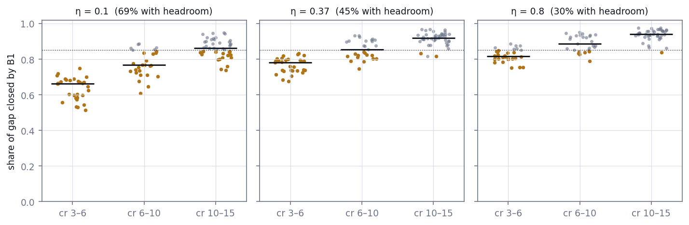
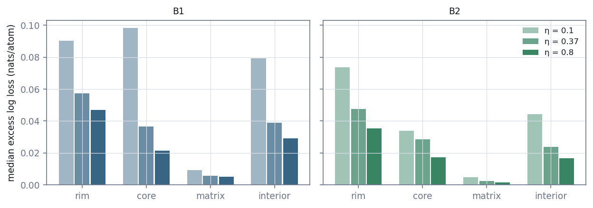
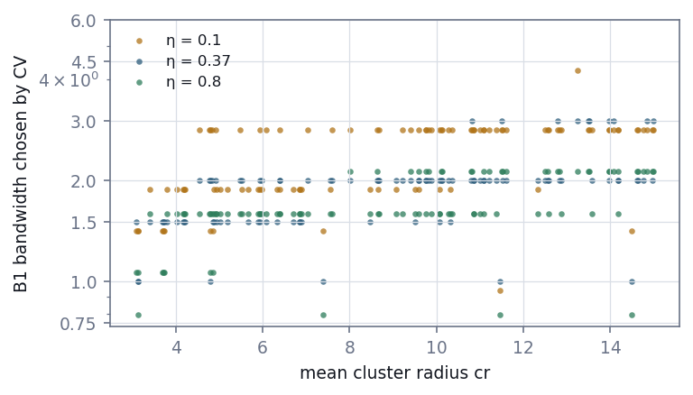
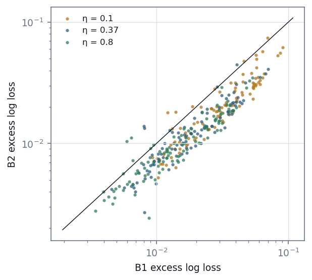
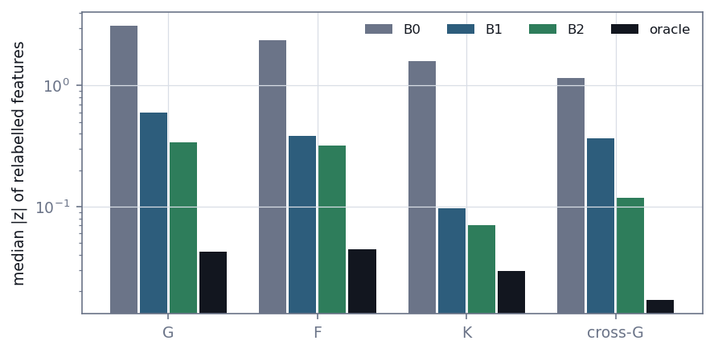

# E11 — Baselines and the headroom map

*Reconstruction Stage 1. How close does standard smoothing come to the truth, and
where does it fall short?*

[← back to README_detailed](../../README_detailed.md#7-experiment-walkthroughs) ·
Protocol: [`experiments/reconstruction/ROADMAP.md`](../../experiments/reconstruction/ROADMAP.md), Stage 1 ·
Implemented by [`fields/baselines.py`](../../geom_mesh_net/fields/baselines.py)
and [`stage1_baselines.py`](../../experiments/reconstruction/stage1_baselines.py) ·
Runtime 30 min on six workers

---

## Abstract

Stage 0 built an exact reference for the solute field of simulated atom probe
patterns. This stage measures against it the estimator practitioners already use,
kernel delocalisation, before any neural method is fitted. It asks where that
estimator leaves room for a better one.

On 100 test patterns, each observed at three detection efficiencies (300 cells),
B1 is Nadaraya–Watson smoothing with a cross-validated bandwidth. It closes a median
of 78–94% of the distance from a constant guess to the truth, depending on cluster
size and efficiency.

**Gate 1 passed: 48% of cells have headroom**, meaning smoothing leaves at least
15% of that distance open. The headroom is concentrated where the pilot predicted:

- in 92% of cells with small clusters, but only 16% with large ones;
- in 69% of cells at 10% efficiency, and 30% at 80%;
- at the rims and cores of clusters, where the median excess per atom is ten times
  the matrix's.

B2 adapts its bandwidth to the local density of observed guest atoms. It beats B1 in
94% of cells, and where there is headroom it closes a median 41% of the gap B1
leaves. It, not the textbook smoother, is the baseline later stages must beat, and
even it leaves headroom in 19% of cells.

Smoothing is also measurably miscalibrated. It distorts short-range summary
statistics far more than Ripley's K, which barely notices, as the scoring design
anticipated.

---

## 1. Introduction

### 1.1 The question

> **Q1.** How close does the standard way of estimating the solute field come to
> the truth, and where does it fall short?

Stage 0 built the truth: an exact guest probability p* for every simulated atom.
This stage measures the estimator practitioners already use against it, before any
neural method is fitted.

### 1.2 Why this decides what comes next

If kernel smoothing were already close to p* everywhere, no reconstruction method
could improve on it by much, and a neural field that "beat" it would be beating
noise. Where smoothing falls short is where later stages should be judged.

The headroom map produced here tells Stages 2–5 where to look. Gate 1 decides
whether looking is worthwhile at all.

### 1.3 Standard practice, written as an estimator

Delocalisation voxelises the atoms, spreads each atom's contribution over its
neighbourhood with a Gaussian kernel, and divides solute counts by total counts.
That is the Nadaraya–Watson estimator of the guest probability:

    q(x) = Σᵢ K_h(x − xᵢ) yᵢ / Σᵢ K_h(x − xᵢ)

The sums run over observed atoms, yᵢ is 1 for a guest, and K_h is a Gaussian of
width h. The analyst's choice of kernel width becomes a hyperparameter, chosen here
by cross-validation instead of by eye.

---

## 2. Methods

### 2.1 Observations

The 100 test patterns (900–999) of the random-centre benchmark were each observed
at efficiencies η = 0.1, 0.37 and 0.8, giving 300 *cells*. The kept atoms come from
the masks frozen in Stage 0, so every method sees identical observations. Methods
are fitted to the observed atoms and scored on the rest.

### 2.2 The three baselines

| | Estimator | Chosen by five-fold cross-validation on observed atoms |
| --- | --- | --- |
| B0 | the observed guest fraction, everywhere | nothing to choose |
| B1 | Nadaraya–Watson with one Gaussian bandwidth | h ∈ {0.75, 1, 1.5, 2, 3, 4.5, 6} |
| B2 | Nadaraya–Watson with h(x) = c · (distance to the k-th nearest observed guest), clipped to [0.75, 6] | k ∈ {4, 8, 16, 32, 64} and c ∈ {0.25, 0.35, 0.5, 0.7, 1} |

Kernel sums are computed on a 0.5-unit grid. Atom and guest counts are binned and
Gaussian-filtered at each bandwidth, and the ratio is interpolated trilinearly at
query points. B2's per-point bandwidth interpolates, in log bandwidth, between the
two neighbouring precomputed fields. A test against a brute-force kernel sum
confirms the binned estimator (`tests/test_field_baselines.py`).

### 2.3 Scoring

Each method, and the oracle, is scored by log loss on the scored atoms. Expected log
loss is the entropy of p* plus the KL divergence of the prediction from p*, so:

- **excess log loss** (method minus oracle) is the method's mean divergence from the
  truth, in nats per atom;
- **gap closed** = (L_B0 − L_method) / (L_B0 − L_oracle) runs from 0, a constant
  guess, to 1, the oracle.

A cell has **headroom** when B1 leaves at least 15% of the gap open and at least
0.01 nats per atom.

### 2.4 Regions, calibration and Brier excess

Each scored atom gets one region, tested in this order:

1. **rim**: within 2 units of a cluster surface;
2. **core**: inside a cluster, below 0.7 of its radius;
3. **matrix**: outside every sphere;
4. **interior**: otherwise.

Excess log loss is reported per region, because most atoms are matrix atoms and an
overall mean would hide the clusters. Expected calibration error (ECE) uses 20
equal-width bins on the prediction. Brier excess is the mean of (q − p*)².

### 2.5 The predictive check

For every cell and method:

- each of the 216,000 atoms was relabelled as a guest with probability q;
- the 14 global features were computed with the inference track's `stage1`
  configuration;
- each feature's difference from the realised pattern's value was standardised by
  that feature's spread across the 100 test patterns.

Relabelling from the oracle gives the floor set by sampling noise alone. Summary
statistics survive thinning, so this check can expose a distortion but cannot
certify accuracy. It is reported, not gated.

### 2.6 The gate

**Gate 1**, stated in the roadmap before this stage ran: at least 25% of the 300
test cells have headroom. Had it failed, smoothing would be within 15% of the truth
almost everywhere. Stages 2 and 3 would then be skipped, and smoothing would go
forward to precipitate measurement.

### 2.7 Two corrections made before the test run

- **B2 follows guests, not atoms.** The roadmap first set B2's width from the
  distance to the k-th nearest observed *atom*. Atom positions are uniform, so that
  distance hardly varies, and B2 would have been B1 plus noise.
- **B2's c grid was widened.** A smoke test on development patterns 0 and 1 found
  cross-validation choosing c = 0.5, the edge of the original grid {0.5, 1}, in all
  six cells, with c = 1 worse by 0.01–0.04 nats. The grid was widened so that B2 would
  not be an under-tuned baseline.

Both changes are recorded in the roadmap. Both were made before any test pattern was
scored.

---

## 3. Results

### 3.1 Gate 1

**Table 1.** Gate 1.

| Condition | Required | Measured | |
| --- | --- | --- | --- |
| Test cells with headroom | ≥ 25% | 48% (144 of 300) | **pass** |

The pilot on 12 development patterns of the lattice dataset had predicted about
40%.

### 3.2 The headroom map

**Table 2.** Share of cells with headroom, B1's median gap closed (95% bootstrap
interval) and B2's median gap closed, by mean cluster radius and efficiency. Each
row has 30, 27 or 43 patterns.

| `cr` | η | Headroom | B1 gap closed | B2 gap closed |
| --- | ---: | ---: | --- | ---: |
| 3–6 | 0.1 | 100% | 0.66 (0.60–0.67) | 0.75 |
| 3–6 | 0.37 | 100% | 0.78 (0.74–0.79) | 0.85 |
| 3–6 | 0.8 | 77% | 0.82 (0.81–0.84) | 0.89 |
| 6–10 | 0.1 | 78% | 0.77 (0.74–0.83) | 0.87 |
| 6–10 | 0.37 | 48% | 0.85 (0.82–0.90) | 0.92 |
| 6–10 | 0.8 | 22% | 0.89 (0.86–0.93) | 0.93 |
| 10–15 | 0.1 | 42% | 0.86 (0.84–0.89) | 0.92 |
| 10–15 | 0.37 | 5% | 0.92 (0.91–0.93) | 0.95 |
| 10–15 | 0.8 | 2% | 0.94 (0.93–0.95) | 0.96 |

Across all patterns:

- **By cluster size:** 92% of cells with small clusters (cr 3–6) have headroom, 49%
  with medium ones and 16% with large ones.
- **By efficiency:** 69% at η = 0.1, 45% at 0.37 and 30% at 0.8.
- **The gap itself** is a median of 0.152 nats per atom, ranging from 0.054 to 0.356.

Concentration matters less than size. Patterns with in-cluster concentration above
0.5 have larger gaps (median 0.179 against 0.116), but a similar share of cells with
headroom.



**Figure 1.** Share of the constant-to-oracle gap closed by B1, one dot per test
pattern. Orange dots have headroom; the dotted line marks 85% closed, the headroom
threshold. Horizontal bars are medians.

### 3.3 Where the error sits

**Table 3.** Median excess log loss per atom by region, over all 300 cells, and each
region's median share of scored atoms.

| Region | Share of atoms | B1 | B2 |
| --- | ---: | ---: | ---: |
| Rim | 15.4% | 0.063 | 0.049 |
| Core | 2.9% | 0.047 | 0.026 |
| Interior | 1.0% | 0.044 | 0.027 |
| Matrix | 78.7% | 0.006 | 0.003 |



**Figure 2.** Median excess log loss by region, efficiency and method. B1's worst
cells are cores at 10% efficiency. B2 cuts those errors most.

The overall median excess of B1, 0.019 nats per atom, is mostly the matrix. At the
rims of clusters the error is ten times larger. For small clusters at 10% efficiency,
B1's median excess in cores reaches 0.20 nats per atom.

The three worst cells overall are all dense, small clusters at 10% efficiency. The
worst is pattern 921: 111 clusters of mean radius 3.1 at in-cluster concentration
0.88, where B1 closes only 58% of the gap.

### 3.4 The bandwidth cross-validation chooses



**Figure 3.** B1's cross-validated bandwidth against cluster radius.

The chosen kernel narrows as efficiency rises. For small clusters it moves from 2 at
η = 0.1 to 1.5 at 0.8; for large clusters, from 3 to 2. More observed atoms can
support a narrower kernel before noise dominates.

Cross-validation chose a grid edge (0.75 or 6) in only 4 of 300 cells, so the
bandwidth grid did not constrain B1.

### 3.5 Adaptive smoothing is much the stronger baseline



**Figure 4.** Excess log loss of B2 against B1, one dot per cell. Points below the
diagonal favour B2.

- B2 beats B1 in 94% of cells: 96%, 98% and 90% for small, medium and large clusters.
- In headroom cells it wins 97% of the time, and closes a median of **41%**
  (37–43%) of the gap B1 leaves.
- Its median excess is 0.013 nats per atom, against B1's 0.019.
- Applying the headroom rule to B2 itself, 19% of cells still have headroom.

B2's hyperparameter grid still constrains it:

- cross-validation chose c = 0.25, the smallest width multiplier, in 178 cells;
- in 94 of those it also chose k = 64, the largest neighbour count, the corner of the
  grid.

B2 may therefore be mildly under-tuned. Section 5.3 records what is done about it.

### 3.6 Calibration

**Table 4.** Median expected calibration error by efficiency.

| η | B0 | B1 | B2 | Oracle |
| ---: | ---: | ---: | ---: | ---: |
| 0.1 | — | 0.030 | 0.018 | — |
| 0.37 | — | 0.025 | 0.014 | — |
| 0.8 | — | 0.020 | 0.013 | — |
| all | 0.0010 | 0.025 | 0.015 | 0.0016 |

Smoothing is miscalibrated by 1–3 percentage points, in the direction blurring
predicts. Reliability tables on development patterns 1, 4 and 8 show it:

- in bins predicted at 0.4–0.6, the observed guest rate is 0.62–0.68;
- in bins predicted at 0.1–0.2, just outside clusters, it is 0.03–0.10.

High probabilities come out too low and the halo around a cluster too high. B2
roughly halves both errors.

The constant B0 is almost perfectly calibrated and useless. A single prediction equal
to the overall fraction is right on average. This is why calibration is reported
alongside log loss, never instead of it.

### 3.7 The predictive check

**Table 5.** Median |z| of the relabelled features, by family.

| Family | B0 | B1 | B2 | Oracle floor |
| --- | ---: | ---: | ---: | ---: |
| G (nearest neighbour) | 3.12 | 0.60 | 0.34 | 0.04 |
| F (empty space) | 2.35 | 0.38 | 0.32 | 0.04 |
| K (second order) | 1.58 | 0.10 | 0.07 | 0.03 |
| cross-G (guest to host) | 1.16 | 0.36 | 0.12 | 0.02 |



**Figure 5.** Median |z| of relabelled features against the realised pattern. The
oracle's bars are the sampling floor.

Every smoother lies well above the floor for the short-range statistics G and
cross-G. Relabelling from a blurred field puts guests where clusters are not, and
dilutes where they are. K registers the blur least: it integrates pairs over large
radii, and survives thinning and smoothing alike.

---

## 4. Discussion

### 4.1 What the map means for the stages that follow

Stage 2 fits a neural field to a single pattern. It should be judged where the map
shows room: small clusters at every efficiency, and medium clusters at low
efficiency. For large clusters at realistic efficiency, fewer than one cell in
twenty has headroom. A null result there would only confirm that smoothing is
already close to the truth.

Because B2 already closes much of B1's remaining gap, Gate 2's requirement to beat
"the better of B1 and B2" is a real bar. A method has to outdo adaptive smoothing,
not the textbook estimator.

### 4.2 Why smoothing fails where it does

A kernel trades bias against variance. A narrow kernel follows a cluster's edge but
averages few atoms; a wide one averages many but blurs the edge. Cross-validation
finds the best single compromise for the whole pattern.

A large cluster is many kernel widths across, so most of its volume is far from an
edge and the compromise costs little. A small cluster is a few kernel widths across,
so almost all of it is edge. Low efficiency makes this worse, because it forces a
wider kernel.

B2 escapes part of the compromise. It narrows the kernel where guests are dense, in
clusters, and widens it where they are sparse, in the matrix. That is exactly where
B1's two largest errors are.

### 4.3 Consequences for delocalisation in practice

The results are in simulation, but they bear on how isoconcentration surfaces are
drawn:

- the analyst's single kernel width is a global compromise whose cost falls
  disproportionately on small precipitates;
- smoothed fields are biased near interfaces, overstating concentration just outside
  and understating it just inside;
- short-range statistics recomputed from delocalised fields inherit that blur.

An adaptive width costs little. Where there was room, it closed about 40% of the gap
to the truth that the fixed width left, and it cut the median excess across all
cells by a third.

### 4.4 Limitations

- **Headroom is measured against an oracle that knows the true geometry.** No
  estimator working only from the observed atoms can reach it, so the gap to the
  oracle is an upper bound on the improvement available.
- **The region thresholds are conventions,** fixed before the test run: 2 units for
  the rim and 0.7 of the radius for the core.
- **B2 may be mildly under-tuned** (Section 3.5).
- **Every result is from simulation to simulation.**

---

## 5. Corrections

### 5.1 B2 follows guest density

Recorded before the test run (Section 2.7). As first written, the adaptive baseline
would have measured atom density, which is uniform by construction.

### 5.2 B2's width grid was widened

Recorded before the test run (Section 2.7). A development smoke test showed the
original grid's edge being chosen in every cell.

### 5.3 Open: B2's grid still binds

The widened grid still binds: 94 cells chose its corner. The Stage 1 numbers are
left as measured. Widening the grid after seeing test scores, and then reporting
improved test scores here, is what the protocol forbids.

Before Stage 2's test run, the grid will be widened further on development patterns,
until cross-validation stops choosing its edge. B2 will then be recomputed with that
fixed grid for the Stage 2 comparison. A stronger B2 can only make Gate 2 harder to
pass.

**Resolved, 2026-09-18** (`pilot/check_b2_grid.py`). Widened to k in (1, 2, 4, …, 512)
and c in (0.05, …, 1.0), cross-validation chooses an edge in none of the 16 development
cells, against 11 of 16 under the grid used here. But the widening is nearly worthless:
3 cells change their choice, by 0.00015 to 0.00069 nats, against B2's median margin of
0.0097 nats over B1. The corner was chosen because the loss surface is flat there, not
because the optimum lay outside it, so Gate 2's bar does not move. The wider grid is
fixed for Stage 2 onward; the numbers in this walkthrough keep the grid they were
measured with.

---

## 6. Conclusion

Standard kernel smoothing comes close to the truth for large clusters at realistic
detection efficiencies, closing over 90% of the gap. It leaves substantial room for
small clusters and at low efficiency, and its error sits at cluster rims and cores.
Almost half the test cells have headroom, so Gate 1 passed and Stage 2 is warranted.

Adapting the kernel width to local guest density closes about 40% of the gap the
fixed width leaves, where there is room. That makes adaptive smoothing, not the fixed
kernel of standard practice, the baseline a neural reconstruction has to beat.

---

## Outputs

| File | Contents |
| --- | --- |
| `geom_mesh_net/fields/baselines.py` | B0, B1 and B2, binned kernel sums, cross-validation |
| `experiments/reconstruction/stage1_baselines.py` | this stage: fits, scoring, regions, calibration, predictive check, Gate 1 |
| `experiments/reconstruction/results/stage1_headroom.json` | every cell's losses, hyperparameters, region excesses and relabelled features, plus summaries and the gate |
| `docs/figures/e11_*.png` | Figures 1–5 |
| `tests/test_field_baselines.py` | 8 tests: brute-force kernel sum, limits, adaptive interpolation, the log-loss identity |

## Reproduce

```bash
python -m experiments.reconstruction.stage1_baselines                  # 30 min, six workers
PYTHONPATH=. python docs/make_reconstruction_figures.py
python -m pytest -q tests/test_field_baselines.py
```
