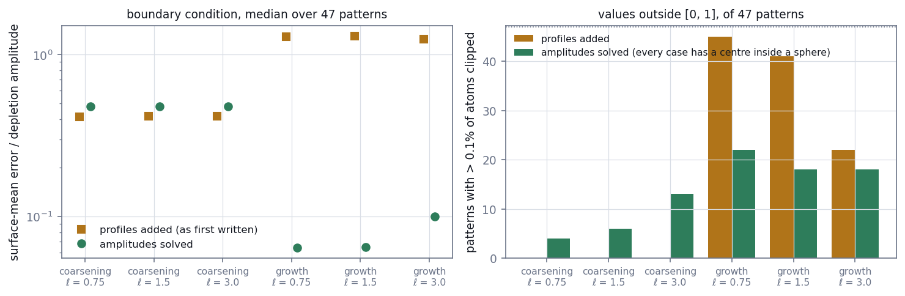
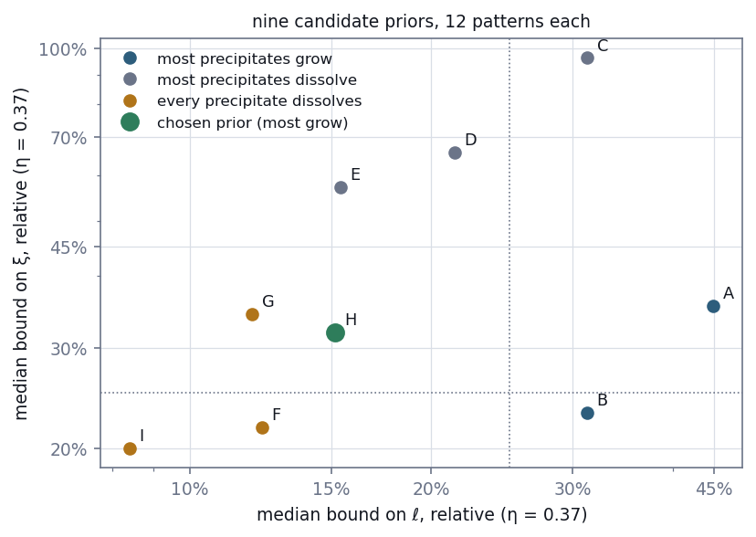
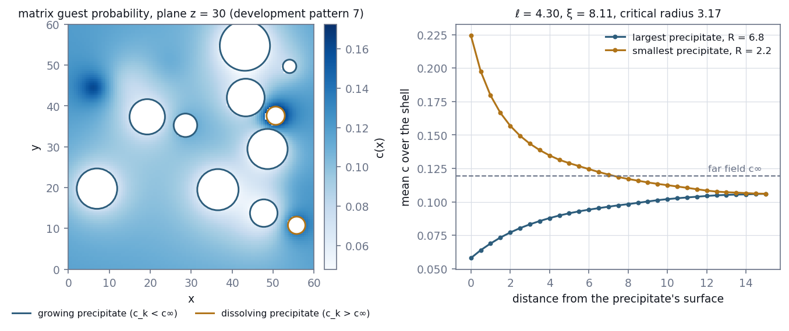
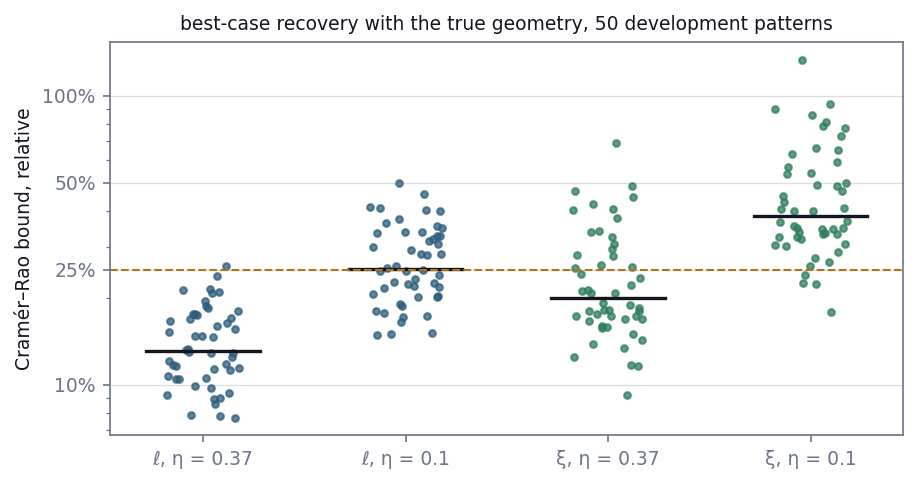
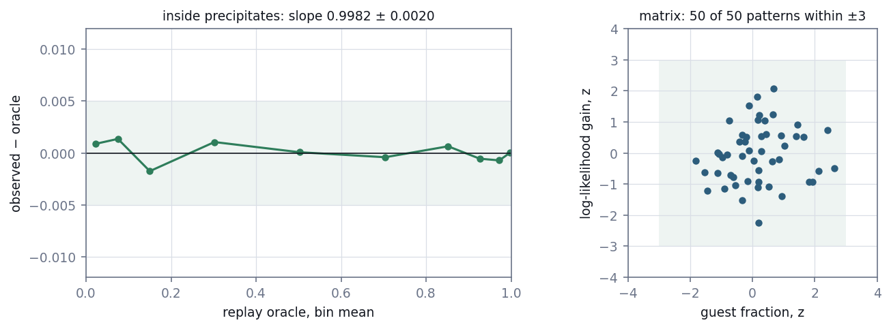

# E15 — A simulator with a physical law: the diffusion field of Stage 5.1

*Reconstruction Stage 5.1. Can the simulator be given a governing equation that a
physics-informed network could enforce, and could the equation's constants be recovered
from the atoms a detector records?*

[← back to README_detailed](../../README_detailed.md#7-experiment-walkthroughs) ·
Protocol: [`experiments/reconstruction/ROADMAP.md`](../../experiments/reconstruction/ROADMAP.md), Stage 5 ·
Implemented by [`fields/physics.py`](../../geom_mesh_net/fields/physics.py),
[`generate_diffusion_patterns.py`](../../experiments/reconstruction/generate_diffusion_patterns.py) and
[`stage5_simulator.py`](../../experiments/reconstruction/stage5_simulator.py) ·
Runtime: 45 s to generate the development patterns, 68 s the test patterns, 53 s for the gate

*Stages 2–4 will be walkthroughs E12–E14. This walkthrough covers the first half of
Stage 5; the physics-informed network itself, Stage 5.2, will be reported separately.*

---

## Abstract

Stage 5 asks whether a physical law can be built into a neural reconstruction, and
whether the method can tell when the law does not hold. Both need data that obey a law.
The simulator's matrix does not: its solute atoms are scattered uniformly, so no
differential equation constrains them. This stage adds one. Around each precipitate the
matrix concentration now follows a quasi-stationary diffusion field, screened by the
other precipitates. Each surface holds a Gibbs–Thomson concentration set by a capillary
length ℓ.

The design as first written did not obey its own law. Adding up each precipitate's
textbook profile leaves every surface carrying its neighbours' tails. On the benchmark
geometry:

- the mean surface concentration missed its Gibbs–Thomson value by 1.25–1.30 times the
  depletion signal;
- in most supersaturated patterns, more than 0.1% of matrix atoms fell outside [0, 1].

Solving for the precipitates' amplitudes makes every surface mean exact, but only while
precipitates are separated, and 77% of the benchmark's overlap another. The stage
therefore generates its own patterns, using two new clustersim options.

Even with separated precipitates, the first prior made the capillary length
unrecoverable. The Cramér–Rao bound, a floor on the error of any fit that knows the true
geometry, gave a median of 45% for ℓ. Nine priors were compared. The one chosen brings
the median bound to 13% for ℓ and 20% for ξ at a detection efficiency of 0.37. Under it,
most precipitates grow in depletion zones while the smallest dissolve.

Across the 50 development patterns:

- the equation holds to 2 × 10⁻¹⁴;
- surface means match their Gibbs–Thomson values to 6 × 10⁻¹⁵;
- no matrix atom needs clipping;
- inside precipitates, the oracle is calibrated, with slope 0.9982 ± 0.0020;
- in every pattern, the matrix labels follow the field.

**Gate 5.1 passed.**

---

## 1. Introduction

### 1.1 The question

> **Q5.1.** Can the simulator produce patterns whose matrix obeys a governing equation
> exactly, with a boundary condition at every precipitate? And can the equation's
> physical constants be recovered, at least in principle, from the labels an atom probe
> records?

This is the half of Q5 that must hold before any network is trained. A network earns the
name "physics-informed" only when the data obey the physics it enforces
(ROADMAP section 8).

### 1.2 Why the existing matrix cannot host a law

clustersim labels each matrix atom a guest independently, with the same probability
rho_b. That field is a constant. A constant satisfies any diffusion equation trivially,
so enforcing one would add no information. Any smoothness it imposed would also be wrong
at precipitate rims, where the simulated concentration jumps (E10).

### 1.3 The physics chosen

During growth and coarsening, solute diffuses toward or away from each precipitate.
Solute diffuses much faster than interfaces move, so the field is quasi-stationary. In
the mean-field picture, the other precipitates screen it. Two constants govern it:

- **The capillary length ℓ.** Through the Gibbs–Thomson relation, a curved interface of
  radius R holds the concentration c_eq·exp(ℓ/R). Small precipitates are richer at their
  surface than large ones.
- **The screening length ξ.** It sets how far a precipitate's influence reaches before
  its neighbours absorb it.

Precipitates whose surface concentration lies below the far-field value c∞ grow, inside
a depletion zone. Those above it dissolve, inside an enriched zone. The critical radius
between them is R* = ℓ / ln(c∞/c_eq).

This physics suits the purpose for three reasons:

- it is the textbook mean-field description of solute around precipitates;
- it has an analytic solution, so a network's residual can be checked exactly;
- its constants are the quantities an experimentalist would want; the capillary length
  carries the interfacial energy.

---

## 2. Methods

### 2.1 The law

Outside every precipitate:

    (∇² − ξ⁻²) (c − c∞) = 0

On each precipitate's surface, on average:

    mean of c over surface k  =  c_k  =  c_eq · exp(ℓ / R_k)

The screening length is set from the precipitates' sink strength, the mean-field result
for number density n and mean radius R̄:

    ξ = (4π n R̄)^(−1/2)  =  (4π Σ_k R_k / V)^(−1/2)

The far field is c∞ = S·c_eq, where S is the supersaturation.

### 2.2 A solution with an exact boundary condition

One screened source per precipitate,

    g_k(x) = (R_k / r_k) · exp(−(r_k − R_k) / ξ),      r_k = |x − x_k|,

satisfies the equation everywhere except its own centre and equals 1 on its own surface.
Any sum c = c∞ + Σ_k a_k g_k therefore satisfies the equation throughout the matrix. What
remains is to choose the amplitudes a_k.

**As first written**, a_k = c_k − c∞. Each profile then has the right value on its own
surface, but the neighbours' tails add to it. The surface value is no longer c_k, and in
dense patterns the sum overshoots below 0.

**As corrected**, the amplitudes are solved. A solution of the equation inside a ball has
a mean-value property: the mean over the ball's surface equals the value at its centre
times sinh(R/ξ)/(R/ξ). A neighbour j's source is such a solution inside precipitate k,
provided j's centre lies outside k. The K surface conditions therefore become a K × K
linear system:

    a_k  +  Σ_{j≠k} a_j · g_j(x_k) · sinh(R_k/ξ) / (R_k/ξ)  =  c_k − c∞

Its solution makes every surface mean exact, while the equation still holds exactly.
Single surface points still depart from the mean by the higher multipoles this solution
omits (Section 3.5).

The identity is verified rather than assumed. `physics.surface_means` integrates each
neighbour's source over each surface directly. Because a source depends only on the
angle to its centre, this is a one-dimensional Gauss–Legendre integral, and it does not
use the mean-value identity.

### 2.3 Separated precipitates and a radius floor

The mean-value step needs every other centre outside each precipitate. It also fails
where spheres overlap, since part of the "surface" then lies inside another precipitate.
clustersim gained two options, both off by default:

- **`min_gap`** places precipitates so that no two come closer than the gap, surface to
  surface.
  - All radii are drawn first. Then positions are tried from the oversampled set of
    candidate centres, largest sphere first.
  - Positions are rejected, never radii. Redrawing a radius after each failed position
    would favour small precipitates and distort the size distribution.
  - A precipitate that cannot be placed raises an error rather than being dropped.
    Silently dropping precipitates would lower the solute fraction, which is how 22
    patterns of `data/` lost clusters (E10).
- **`r_min`** redraws any radius below a floor. The Gibbs–Thomson factor exp(ℓ/R) diverges
  as R → 0, and clustersim otherwise sets negative radii to zero.

With both options off, clustersim reproduces benchmark pattern 0 exactly: a test replays
its generator and compares with the stored file. Stage 5 uses a gap of 1 atomic spacing
and a floor of 2.

Placing random spheres one at a time jams near a volume fraction of 0.38, and a gap
lowers that limit. The Stage 5 volume fraction stays near 0.1, well below it.

### 2.4 Relabelling the matrix

clustersim draws matrix labels last, independently for each atom. Replacing them
therefore changes nothing else in the pattern. Each pattern is generated in four steps:

1. clustersim produces the geometry and the in-precipitate labels.
2. c_eq is solved so that the mean of c over the pattern's matrix atoms equals the drawn
   matrix concentration. Once ℓ and S are fixed, the whole field is proportional to c_eq,
   so this takes one division.
3. Each matrix atom is relabelled a guest with probability c(x), drawn from a generator
   seeded by the pattern index.
4. The pattern is saved with its constants and amplitudes.

Inside precipitates, the labels are clustersim's own, so the replay oracle of E10 still
holds there.

### 2.5 How recoverable is a constant? The Cramér–Rao bound

Matrix labels are independent Bernoulli draws. Their Fisher information about the
constants θ = (log ℓ, log ξ, log c_eq, log c∞) is

    I(θ) = η · Σ_j ∇_θ c_j ∇_θ c_jᵀ / (c_j (1 − c_j)),

summed over the matrix atoms, with a fraction η of them observed. Derivatives are taken by
central differences, re-solving the amplitudes at each perturbed θ. The square roots of
the diagonal of I⁻¹ are the smallest relative errors any unbiased fit can reach.

This bound assumes the fit knows the true precipitate geometry, so it is a best case. The
Stage 5.2 network must segment the precipitates from the data and can only do worse.

A second quantity measures whether the field can be seen at all. The expected
log-likelihood by which the true field beats a constant matrix on the observed atoms is

    η · Σ_j KL( Bernoulli(c_j) ‖ Bernoulli(c̄) ).

### 2.6 Choosing the prior

The prior was chosen on development patterns, before any test pattern existed. Each of
nine candidates was measured on the same 12 pattern indices
(`pilot/compare_diffusion_priors.py`). They vary:

- the radius spread;
- the matrix concentration;
- the range of ℓ;
- how the supersaturation is set: directly, or through a critical radius as a fraction of
  the mean radius cr.

All share cr ∈ [3, 4], a volume fraction of 0.08–0.12 and rho_c ∈ [0.4, 0.9]. The chosen
prior, which fixes the roadmap's open definition O8, draws each of the following
uniformly:

| Parameter | Range |
| --- | --- |
| mean radius cr | 3–4 |
| radius spread rb | 0.2–0.4 |
| precipitate volume fraction | 0.08–0.12 |
| rho_c | 0.4–0.9 |
| matrix concentration | 0.05–0.15 |
| capillary length ℓ | 2–5 |
| critical radius R* | 0.6–0.8 × cr, so that S = exp(ℓ/R*) |

Lengths are in atomic spacings.

### 2.7 The dataset

`data_diffusion/` holds 150 patterns, 814 MB, gitignored:

- **Splits:** patterns 0–49 are the development split and 50–149 the test split.
- **Seeds:** each pattern's parameters, geometry and matrix labels come from generators
  seeded by the pattern index, so any one pattern regenerates on its own; this was
  verified bit for bit.
- **Frozen description:** checksums of the array contents, the provenance and every
  pattern's constants are copied to `experiments/reconstruction/benchmark/diffusion/`,
  which is tracked.

### 2.8 Gate 5.1

The gate was amended before it ran, on the development patterns only (ROADMAP Stage 5
correction).

| # | Condition | Why |
| --- | --- | --- |
| 1 | in every pattern, the PDE residual, by autograd in float64 at 2,000 random matrix atoms, is below 10⁻⁸ relative to ξ⁻² max\|c − c∞\| | the law holds |
| 2 | in every pattern, fewer than 0.1% of matrix atoms need clipping to [0, 1] | the field is a probability |
| 3 | in every pattern, each precipitate's surface mean, by direct integration, is within 10⁻⁶ of c_k relative to the depletion amplitude | the boundary condition holds |
| 4 | inside precipitates, pooled, the replay oracle passes Gate 0: slope 0.99–1.01, intercept at most 0.01 in size, every reliability bin of 10,000 or more atoms within max(0.005, 3 s.e.) | the rest of the pattern is still exactly scorable |
| 5 | in at least 48 of 50 patterns, the matrix guest fraction lies within 3 s.e. of the mean of c(x), and the log-likelihood gain of c(x) over that mean lies within 3 s.e. of its expectation | the labels follow the field |

Condition 5 needs a note. The gain is

    G = Σ_j [ y_j log(c_j / c̄) + (1 − y_j) log((1 − c_j)/(1 − c̄)) ].

Under the field, its expectation is the summed Kullback–Leibler divergence, and its
variance is Σ_j c_j(1 − c_j)[log(c_j/c̄) − log((1 − c_j)/(1 − c̄))]². Labels drawn from a
uniform matrix would fall short of the expectation by roughly twice the divergence.
`tests/test_stage5_simulator.py` checks both behaviours: the two scores behave as
standard normal draws when labels come from a field, and labels from a uniform matrix
fail.

---

## 3. Results

### 3.1 Adding profiles breaks the boundary condition

On the benchmark geometry of development patterns 0–49 (47 with at least two clusters,
`pilot/check_diffusion_field.py`), with c_eq at half the matrix concentration:

| ℓ | Surface-mean error, profiles added | Surface-mean error, amplitudes solved | Patterns clipping over 0.1%, added | Patterns clipping over 0.1%, solved |
| --- | --- | --- | --- | --- |
| 0.75 | 1.30 | 0.064 | 45 of 47 | 22 of 47 |
| 1.5 | 1.30 | 0.065 | 41 of 47 | 18 of 47 |
| 3.0 | 1.25 | 0.100 | 22 of 47 | 18 of 47 |

Errors are medians, relative to the depletion amplitude, over each precipitate's exposed
surface. At isolated precipitates, single surface points missed by 0.62–0.65 times the
amplitude with profiles added, and by 0.07–0.08 times with amplitudes solved.



**Figure 1.** The boundary condition and clipping on the benchmark geometry, for three
capillary lengths in two regimes. "Growth" puts c_eq at half the matrix concentration.
"Coarsening" puts the critical radius at the mean radius. In coarsening, surface values
barely differ from c∞, so both methods' errors are relative to an amplitude near zero.
Overlapping spheres dominate there, which is why solving does not help.

### 3.2 The benchmark geometry overlaps

In the same 47 patterns:

- the median pattern has 77% of its spheres overlapping another;
- 39 patterns have a centre inside another sphere.

Every pattern in which the solved field clipped is among those 39. None of the other 8
clipped, and in them the surface-mean error is 1% of the amplitude. The benchmark's
placement, a random subset of an oversampled point pattern with no exclusion, cannot host
a boundary condition.

### 3.3 The first prior hid the capillary length

**Benchmark geometry.** At the patterns' own matrix concentrations and η = 0.37, the
bound on ℓ was below 25% in at most 13 of 47 patterns. Two things caused this:

- the benchmark's matrix concentration is 0–5%;
- 19 of the 47 patterns have fewer than 10 clusters.

**First Stage 5 prior (A).** Moving to about 100 small separated precipitates per pattern
was not enough. Prior A kept a narrow radius spread (rb 0.1–0.3), a low matrix
concentration (2–8%), ℓ of 1–3 and a supersaturation of 2–4. Its median bound on ℓ was
45%.

The information about ℓ comes only from how surface concentrations change with radius.
That change scales with c_eq and needs a spread of radii to be seen.

### 3.4 Nine priors



**Figure 2.** Median Cramér–Rao bound on ℓ and ξ at η = 0.37, for nine candidate priors on
12 patterns each (`pilot/results/diffusion_priors.json`).

| Prior | What changes | Bound on ℓ, η = 0.37 | Bound on ξ, η = 0.37 | Share of precipitates growing | Highest c |
| --- | --- | --- | --- | --- | --- |
| A | first prior | 45% | 36% | 1.00 | 0.11 |
| B | matrix 5–15% | 31% | 23% | 1.00 | 0.20 |
| C | R* at 0.8–1.2 cr, ℓ 2–5 | 31% | 96% | 0.34 | 0.16 |
| D | B + C | 21% | 66% | 0.34 | 0.31 |
| E | D, rb 0.2–0.4 | 15% | 57% | 0.41 | 0.33 |
| F | B, ℓ 2–5, S 1.2–2 | 12% | 22% | 0.00 | 0.40 |
| G | F, S 1.5–3, ℓ 3–5 | 12% | 34% | 0.02 | 0.38 |
| **H** | **R* at 0.6–0.8 cr, matrix 5–15%, ℓ 2–5, rb 0.2–0.4** | **15%** | **32%** | **0.88** | **0.25** |
| I | F, rb 0.2–0.4 | 8% | 20% | 0.00 | 0.38 |

Three regularities appear:

- **A higher matrix concentration helps everything** (B against A).
- **The capillary length needs a large ℓ and a radius spread** (C to E).
- **Mixing growing and dissolving precipitates hides the screening length** (C, D, E).
  The depletion and enrichment zones partly cancel in the field's shape.

F and I recover both constants best, but only because every precipitate dissolves. That
contradicts the physical picture the stage set out to simulate. H keeps most precipitates
growing, with the smallest dissolving, and loses some precision on ξ.

### 3.5 The field on the development patterns



**Figure 3.** Development pattern 7, the development pattern with the most dissolving
precipitates. Left: the matrix field on the plane z = 30. Precipitate cross-sections are
outlined by whether the precipitate grows or dissolves. Right: the mean of c over shells
around its largest precipitate (R = 6.8, depleted to 0.058 at its surface) and its
smallest (R = 2.2, enriched to 0.224). Both profiles approach 0.106, below
c∞ = 0.119, because the other precipitates draw solute from the whole volume.

The 50 development patterns (`data_diffusion/patterns.json`):

| Quantity | Median | Range |
| --- | --- | --- |
| precipitates per pattern | 89 | 62–160 |
| precipitate volume fraction | 0.112 | 0.083–0.140 |
| screening length ξ | 7.2 | 5.7–8.1 |
| supersaturation S | 4.0 | 2.2–9.8 |
| critical radius R* | 2.4 | 1.9–3.2 |
| share of precipitates growing | 0.92 | 0.70–1.00 |
| spatial standard deviation of c | 0.015 | 0.005–0.033 |
| smallest gap between precipitates | 1.002 | 1.000–1.016 |



**Figure 4.** Cramér–Rao bounds on the 50 development patterns
(`pilot/results/diffusion_prior.json`). Bars mark medians.

| | η = 0.37 | η = 0.1 |
| --- | --- | --- |
| expected signal over a constant matrix | 105 nats (14–345) | 28 nats (3.7–93) |
| bound on ℓ, median | 13% | 25% |
| patterns with the bound on ℓ below 25% | 49 of 50 | 24 of 50 |
| bound on ξ, median | 20% | 38% |
| patterns with the bound on ξ below 25% | 32 of 50 | 4 of 50 |

Single surface points depart from their precipitate's Gibbs–Thomson value by a median of
7% of the depletion amplitude (90th percentile 18%). These are the multipoles the solution
omits.

### 3.6 Gate 5.1

| Condition | Required | Measured |
| --- | --- | --- |
| 1. PDE residual, worst pattern | below 10⁻⁸ | 2.1 × 10⁻¹⁴ |
| 2. matrix atoms clipped, worst pattern | below 0.1% | none |
| 3. surface mean against c_k, worst precipitate | within 10⁻⁶ | 5.5 × 10⁻¹⁵ |
| 4a. recalibration slope inside precipitates (1,190,023 atoms) | 0.99–1.01 | 0.9982 ± 0.0020 |
| 4b. recalibration intercept | at most 0.01 in size | +0.0005 ± 0.0025 |
| 4c. reliability bins within tolerance | all 10 gated | all 10; largest gap 0.0018 |
| 5. matrix fraction and gain within 3 s.e. | at least 48 of 50 | 50 of 50 |



**Figure 5.** Left: reliability of the replay oracle inside precipitates, pooled over the
development patterns. The shaded band is ±0.005. Right: each pattern's two matrix
z-scores. The shaded box is ±3.

In the matrix, the fraction scores ran from −1.8 to 2.6 and the gain scores from −2.2 to
2.1. The median gain over a constant matrix was 289 nats, against an expected 283. The
check has power: labels drawn from a uniform matrix would have scored between −46 and −9
in every pattern.

Every atom's precipitate membership matched its label in all 150 patterns. **Gate 5.1
passed.**

---

## 4. Discussion

### 4.1 Why this had to be fixed before any network was trained

The field as first written would have failed Gate 5.1 on clipping alone. The deeper
problem is what Stage 5.2 would have done with it. Its boundary term would have enforced
Gibbs–Thomson values the data do not have, off by more than the signal the network is
meant to recover. The acceptance rule, which asks whether the physics improves prediction
of held-out atoms, would then have been testing a mis-stated law against correct data.
Rejection would have been the right answer, but for a reason that says nothing about the
method.

### 4.2 How physical the simulator is

The simulator is a consistent model, not a faithful model of any alloy.

- **The boundary condition holds on average, not point by point.** Single surface points
  vary by about 7% of the amplitude. Stage 5.2's boundary term therefore penalises each
  precipitate's surface mean, the quantity the simulator makes exact.
- **ξ is a constant of the model.** It is set from the mean-field sink strength, which
  already represents the other precipitates, and those precipitates are also explicit
  in the field. Recovering ξ tests the network's inference, not a mean-field theory.
- **The prior was chosen for recoverability.** Supersaturations up to 10, capillary
  lengths up to 5 atomic spacings, and ℓ/R up to about 2 are generous for a real alloy.
  No realistic ranges for atom probe alloys were imposed; the priority was data from
  which the constants can be recovered at all. A realistic prior would likely make them
  unrecoverable, which is itself a finding for any real-data claim.
- **Curvature affects only the matrix.** A precipitate's own composition, rho_c, does not
  depend on its radius.
- **The radius distribution is truncated at 2,** a normal distribution with its lowest
  tail redrawn.

### 4.3 What the bounds mean for Stage 5.2

The bounds assume the true geometry. The network must segment precipitates from a
thinned, smoothed field, so its errors will exceed them.

- **At η = 0.37,** ℓ is within reach in almost every pattern.
- **At η = 0.1,** ξ is below 25% in only 4 of 50 patterns, so no fixed threshold for Gate
  5.2(ii) could be met there.
- **The threshold** will therefore be set relative to each pattern's bound (open
  definition O6), on development patterns, before the test run.

### 4.4 Choosing a prior on development data

Choosing a prior by measuring outcomes invites the charge of tuning until something
works. Four things answer it:

- only development patterns were used;
- the measure was a property of the data, the best achievable error, and never a
  network's result;
- the choice and its alternatives are recorded, including the two priors that did better
  on paper;
- the test patterns were generated only after the prior was frozen in the roadmap.

---

## 5. Corrections

### 5.1 The design as first written

The roadmap's Stage 5.1 specified the added-profile field, reuse of benchmark-style
geometry, and priors "so that ℓ/R spans roughly 0.05–1". All three were changed by
measurement before any network existed. The roadmap keeps the original text and records
the correction beneath it, dated 2026-09-16.

### 5.2 The first development split was regenerated

The development patterns were first generated under prior A. When its bounds showed ℓ
unrecoverable, the prior was changed and the development split regenerated in place.
The dataset's provenance records both runs, marking the first as superseded.

---

## 6. Conclusion

The simulator now produces patterns whose matrix obeys a screened diffusion equation to
machine precision, with a Gibbs–Thomson boundary condition exact at every precipitate's
surface mean. Its labels are calibrated inside precipitates and follow the field in the
matrix.

The first design would have handed Stage 5.2 a law the data did not obey. Under the first
prior, the law's constants could not have been recovered by any method. Both were found
by measurement on development data and fixed before a network was trained.

Gate 5.1 passed. At a detection efficiency of 0.37, a fit that knew the geometry could
recover the capillary length to 13% and the screening length to 20%. Stage 5.2 asks how
close a network that must find the geometry itself can come.

---

## Outputs

| File | Contents |
| --- | --- |
| `geom_mesh_net/fields/physics.py` | the field, the amplitude solve, surface means by integration, the autograd residual |
| `geom_mesh_net/simulation/clustersim.py` | `min_gap` and `r_min` |
| `experiments/reconstruction/generate_diffusion_patterns.py` | the prior (O8) and the generator |
| `experiments/reconstruction/stage5_simulator.py` | Gate 5.1; caches oracles for Stage 5.2 |
| `experiments/reconstruction/results/stage5_simulator.json` | the gate report, per-pattern diagnostics |
| `experiments/reconstruction/results/stage5_field_slice.json` | Figure 3 |
| `experiments/reconstruction/results/oracle_diffusion/` | oracle for all 150 patterns (gitignored) |
| `experiments/reconstruction/pilot/results/diffusion_field.json` | Sections 3.1–3.3, benchmark geometry |
| `experiments/reconstruction/pilot/results/diffusion_priors.json` | Section 3.4 |
| `experiments/reconstruction/pilot/results/diffusion_prior.json` | Section 3.5 |
| `experiments/reconstruction/benchmark/diffusion/` | frozen checksums, provenance and per-pattern constants |
| `data_diffusion/` | the 150 patterns (gitignored, 814 MB) |
| `tests/test_field_physics.py`, `tests/test_clustersim.py`, `tests/test_stage5_simulator.py` | 23 tests |

## Reproduce

```bash
python -m experiments.reconstruction.pilot.check_diffusion_field
python -m experiments.reconstruction.pilot.compare_diffusion_priors
python -m experiments.reconstruction.generate_diffusion_patterns --split development
python -m experiments.reconstruction.pilot.check_diffusion_prior
python -m experiments.reconstruction.generate_diffusion_patterns --split test
python -m experiments.reconstruction.stage5_simulator
PYTHONPATH=. python docs/make_reconstruction_figures.py
python -m pytest -q tests/test_field_physics.py tests/test_clustersim.py tests/test_stage5_simulator.py
```
