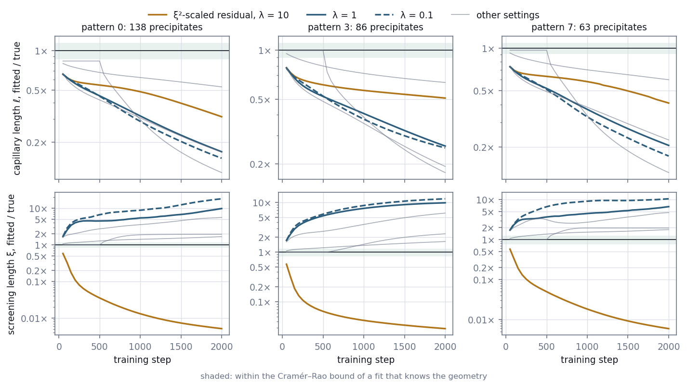
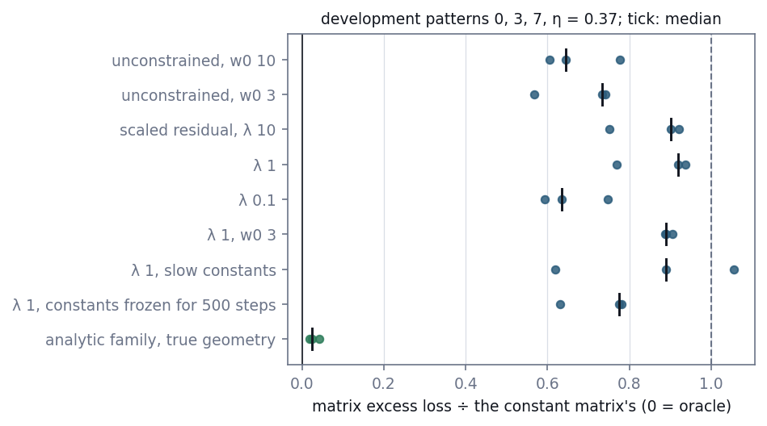
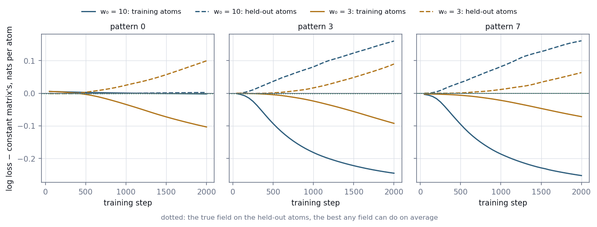
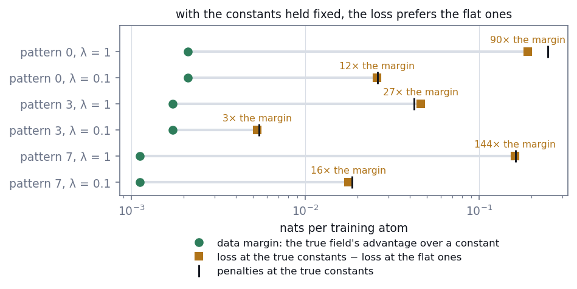

# E16 — A physics-informed network that prefers the wrong physics

*Reconstruction Stage 5.2, first design. Can a neural field that carries the diffusion law as
a penalty recover the law's constants from the atoms a detector records? Development patterns
only.*

[← back to README_detailed](../../README_detailed.md#7-experiment-walkthroughs) ·
Protocol: [`experiments/reconstruction/ROADMAP.md`](../../experiments/reconstruction/ROADMAP.md), Stage 5.2 and its second correction ·
Implemented by [`neural/implicit.py`](../../geom_mesh_net/neural/implicit.py) and
[`pilot/check_soft_pinn.py`](../../experiments/reconstruction/pilot/check_soft_pinn.py) ·
Runtime: 2 h 29 min for the pilot on an Apple M1 GPU, shared with other jobs

*This walkthrough reports a design that failed, and why. Stage 5.2 as corrected, with the law
imposed exactly instead of as a penalty, is reported in E17.*

---

## Abstract

Stage 5.2 was designed as a physics-informed neural network. A sine-activated network (SIREN)
modelled the solute field of the matrix. It was fitted to the labels of observed atoms, with
the screened diffusion equation and the Gibbs–Thomson boundary condition added to the loss as
penalties and the four physical constants trainable. Before any test pattern was touched, it was
tried on three development patterns at a detection efficiency of 0.37, with everything else
given: the true precipitates, the true matrix, and constants started near their true values.

- **It never recovered the constants.** Across six penalty settings and three patterns, the
  screening length ended between 0.005 and 18 times its true value and the capillary length
  between 0.12 and 0.63 times. Its matrix predictions kept 59–106% of a constant matrix's
  excess loss, no better than the same network without penalties (57–78%).
- **The same law imposed exactly worked.** The analytic solution with the constants free
  recovered the capillary length within 5% on the same atoms, and kept 2–4% of the constant's
  excess loss.
- **The loss itself is at fault.** With the constants held fixed, the loss was lower at flat
  constants, under which a uniform field satisfies both penalties exactly, than at the true
  ones. It was lower by 3 to 144 times the data margin, the most any field can gain over a
  constant on average (0.001–0.002 nats per atom). A finite network pays far more than that in
  penalties to represent about a hundred depletion zones.

Stage 5.2 now imposes the law exactly, through the analytic solution with trainable constants
(walkthrough [E17](E17_physics_fit.md)).

---

## 1. Introduction

### 1.1 The design under test

Stage 5.1 (walkthrough [E15](E15_diffusion_simulator.md)) gave the simulator a matrix that
obeys a law. Around each precipitate the solute concentration c(x) follows the screened
diffusion equation

    ∇²c − ξ⁻²(c − c∞) = 0   in the matrix,

and the mean of c over each precipitate's surface equals its Gibbs–Thomson value
c_eq·exp(ℓ/R_k). Four constants set the field: the equilibrium concentration c_eq, the
capillary length ℓ, the screening length ξ and the far-field concentration c∞.

Stage 5.2 was designed as the textbook physics-informed inverse problem. A neural field c(x)
is fitted to the labels of observed matrix atoms, the equation and the boundary condition enter
the loss as penalties, and the four constants are trainable. If it worked, the network would
return both a reconstructed field and the physical constants that generated it. The roadmap's
argument for why physics should help was quantitative: each depletion zone changes the guest
probability by about 0.01, too faint to resolve one precipitate at a time, but two global
constants tie every zone together.

### 1.2 Why a failure gets a walkthrough

The design failed on development data, before any test pattern was touched. The failure is
not a matter of tuning. With the constants held fixed, the loss is lower at wrong constants
than at the true ones, so no optimiser can find the truth. The reason is a comparison of two
numbers that can be measured for any physics-informed fit: how much the data can say, and how
much the penalties cost a finite network. Both are measured here.

This matters beyond this project. A physics-informed loss looks like a safe way to add prior
knowledge. When the data are weak, the penalties decide, and they decide in favour of whatever
the network can represent most easily.

---

## 2. Methods

### 2.1 The network and its loss

The field is c(x) = sigmoid(logit(c₀) + f(x)), where f is a SIREN, a multilayer perceptron with
sine activations (three hidden layers of 128 units, first-layer frequency w₀ = 10, with the
initialisation of Sitzmann et al. 2020), and c₀ is the observed matrix mean. A network with
ReLU activations cannot be used: its Laplacian is zero almost everywhere. Positions are
rescaled from the 60 nm box to [−1, 1].

The loss per step is

    L = BCE(observed matrix labels) + λ·[ mean(r_pde²) + mean_k(r_bc,k²) ],

    r_pde  = ξ_ref²·(∇²c − ξ⁻²(c − c∞)) / s     at 4,096 collocation points drawn each step,
    r_bc,k = (mean of c over surface k − c_eq·exp(ℓ/R_k)) / s,

with the Laplacian by automatic differentiation. The scale s is the observed matrix mean. The
length ξ_ref is fixed at the initial screening length, so both penalties are dimensionless.
The surface mean uses 32 Fibonacci directions per precipitate. c_eq, ℓ, ξ and c∞ are
trainable in log space.

The residual was first written as ξ²∇²c − (c − c∞), scaled by the trainable ξ instead of the
fixed ξ_ref. Both forms are reported (Section 3.1 shows why the change was made).

Training uses Adam, with a learning rate of 10⁻⁴ for the network and 10⁻² for the constants,
for 2,000 steps. The field kept is the one with the lowest loss on held-out observed atoms,
evaluated every 50 steps.

### 2.2 What the fit is given

Nothing a real measurement would have to estimate is left to chance. Every fit gets:

- **the true geometry**: centres and radii of every precipitate, for the boundary condition
  and to place collocation points (200,000 uniform points outside every sphere);
- **the true matrix**: the observed atoms lying outside every true sphere, split 80/20 into
  training and held-out atoms;
- **a good start**: c_eq at half the observed matrix mean, c∞ at the mean, ℓ at the mean
  radius and ξ at its sink-strength value, which for these patterns is the true ξ.

Atoms are observed at a detection efficiency of 0.37 with Stage 5's own thinning masks. Three
development patterns were used, chosen to span the prior: pattern 0 (138 precipitates, the
densest), 3 (86) and 7 (63).

### 2.3 Settings

| Setting | Change from the defaults |
| --- | --- |
| unconstrained, w₀ 10 | λ = 0: the same network with no physics |
| unconstrained, w₀ 3 | λ = 0, lower frequency |
| scaled residual, λ 10 | the first residual form, ξ²∇²c − (c − c∞) |
| λ 1 | the defaults |
| λ 0.1 | weaker penalties |
| λ 1, w₀ 3 | a smoother network |
| λ 1, slow constants | constants' learning rate 10⁻³ |
| λ 1, constants frozen for 500 steps | the network first fits data and physics at the starting constants |

### 2.4 The loss at fixed constants

A fit can fail in two ways. The loss can have its minimum at the right constants while the
optimiser misses it, or the minimum itself can sit at the wrong constants. To tell them apart,
the network is trained for 3,000 steps with the constants frozen, twice:

- at the **true** constants;
- at **flat** constants: ℓ = 10⁻³ and c_eq = c∞ = the observed matrix mean. A uniform field
  then satisfies both penalties exactly.

The loss at the end of each run, averaged over its last five evaluations, is compared. If the
flat constants give the lower loss, the design cannot recover the truth, however it is
optimised. Both penalty weights, λ = 1 and λ = 0.1, are tested.

### 2.5 References and scores

- **Data margin.** The per-atom training loss of a constant matrix minus that of the true
  field: the most any field can gain on the training atoms, on average.
- **The analytic family.** The exact solution of the same equation and boundary condition for
  the true geometry, with the four constants trainable
  (`implicit.ParametricDiffusionField`), fitted by maximum likelihood (L-BFGS from three
  starts) to the same training atoms. This is the law imposed as a hard constraint.
- **Matrix excess loss.** Each early-stopped field is scored on the unobserved atoms of the
  true matrix: its mean log loss minus the oracle's. Zero is perfect; the constant matrix sets
  the scale.

Training runs on Apple MPS in float32, which is not repeatable from run to run: two runs of
the same setting can end at different constants. Conclusions below rest on what holds across
patterns and settings.

---

## 3. Results

### 3.1 The constants run away



*Figure 1. The capillary length (top) and screening length (bottom) during training, as
multiples of their true values, for each penalty setting on each pattern. The shaded band is
the Cramér–Rao bound of a fit that knows the geometry.*

No setting approached the truth, and the two residual forms failed in opposite directions:

- **The ξ²-scaled residual** drove ξ below 3% of its true value in all three patterns (0.005,
  0.029 and 0.006 times by step 2,000), while ℓ fell to 0.31–0.51 times.
- **The fixed-reference residual** at λ = 1 and λ = 0.1 grew ξ to 6.7–18 times its true value
  and cut ℓ to 0.15–0.26 times. The supersaturation c∞/c_eq fell from its true 3.9–7.4 to
  0.5–1.5. Below 1 it means every precipitate dissolves, the opposite of the simulated picture.
- **A smoother network** (w₀ = 3) went the same way: ξ 4.7–6.1 times, ℓ 0.17–0.23 times.
- **A slower learning rate for the constants** only slowed the drift: after 2,000 steps ξ was
  1.6–1.8 times its true value and ℓ 0.53–0.63 times, still falling.
- **Freezing the constants for 500 steps** did not help. Once released, ℓ fell to 0.12–0.18 times.

Early stopping would report the constants at the step with the best held-out loss. There ℓ was
0.17–0.80 times its true value and ξ 0.33–7.7 times. Where they looked closest to the truth, the
best step came just after training began or just after the constants were released, before they
had moved far from their starting values.

### 3.2 The physics did not improve the field



*Figure 2. Matrix excess loss of each early-stopped field on the unobserved atoms of the true
matrix, as a share of the constant matrix's. Zero is the oracle; one is no better than a
constant. Dots are patterns; ticks are medians.*

The penalised networks kept 59–106% of the constant matrix's excess loss, the unconstrained
networks 57–78%. The physics added nothing to the field. The analytic family, fitted to the same
training atoms, kept 1.8–4.2%. On the held-out atoms its loss was within 0.0001 nats per atom of
the oracle's in every pattern.

### 3.3 The unconstrained network memorises



*Figure 3. Training and held-out loss of the network without penalties, relative to the constant
matrix's, on each pattern.*

The data margin is 0.001–0.002 nats per atom. By step 2,000 the network's training loss had
fallen below the constant's by 0.07–0.25 nats per atom, and its held-out loss had risen above it
by 0.06–0.16: it was memorising individual labels. The one exception was w₀ = 10 on pattern 0,
which barely moved. Early stopping picked steps 50–300, where the fields were close to the
constant. Without the physics, the network has nothing to hold it to the faint structure; with
the physics as a penalty, the penalty wins (Section 3.4).

### 3.4 The loss prefers the flat constants



*Figure 4. With the constants held fixed, the loss at the true constants minus the loss at flat
constants (squares), against the data margin (circles). Ticks mark the penalties at the true
constants, scaled by λ.*

| Pattern | Data margin, nats per atom | λ = 1: loss at true − loss at flat | λ = 0.1: loss at true − loss at flat |
| --- | --- | --- | --- |
| 0 | 0.0021 | 0.190 (90 margins) | 0.026 (12 margins) |
| 3 | 0.0017 | 0.046 (27 margins) | 0.0053 (3 margins) |
| 7 | 0.0011 | 0.161 (144 margins) | 0.018 (16 margins) |

In all six comparisons the loss was lower at the flat constants. The penalties at the true
constants account for nearly all of each difference: λ times their sum was 0.042–0.25 at λ = 1
and 0.0054–0.026 at λ = 0.1. At the flat constants they were at most 0.057.

Held at the true constants, the network did not even collect the data margin. At best its training
loss was 0.0004 nats per atom below the flat network's, and in three of the six runs it was higher,
by up to 0.004.
The penalties kept it from representing the depletion zones that would have earned the margin.

---

## 4. Discussion

### 4.1 A scale argument

The whole failure follows from comparing two numbers:

- **The data margin δ.** It is the most a field can gain over a constant on average: 0.001–0.002
  nats per atom here. It is small because each depletion zone changes a guest probability of
  about 0.1 by about 0.01.
- **The penalty floor P.** It is what the penalties cost a finite network that represents the
  true field. Here λP was 0.04–0.25 at λ = 1.

For the loss to prefer the true constants, λP must fall below δ, so λ must be below δ/P, roughly
0.005 to 0.04. P did not shrink when λ was lowered from 1 to 0.1, because it is set by what the
network can represent, not by how hard it is pushed. At such a small λ the penalty no longer
stops the network memorising (Section 3.3), and it no longer ties a hundred faint zones to two
constants, which was the whole reason for using the physics. No λ both enforces the law and lets
the data choose the constants.

### 4.2 Why flat constants attract

A uniform field satisfies the screened equation exactly for any ξ, and it satisfies the boundary
condition whenever every surface value equals the far-field value: ℓ → 0 and c_eq = c∞. A network
represents a constant exactly. The fitted constants therefore drift toward settings that make the
network's current, nearly flat field consistent. The two residual forms reach it by different
routes:

- **ξ²∇²c − (c − c∞).** Shrinking ξ multiplies the network's Laplacian error by a vanishing factor.
  A field that is flat except for boundary layers thinner than the collocation spacing then pays
  almost nothing.
- **ξ_ref²(∇²c − ξ⁻²(c − c∞)).** Growing ξ and lowering the supersaturation flattens the profiles
  the equation asks for, until a nearly uniform field meets both penalties.

### 4.3 The same law, imposed exactly

The analytic family uses the same law, the same geometry and the same atoms. It has four
parameters and no approximation error to trade against a 0.2% signal, so the likelihood alone
decides the constants. It recovered ℓ within 5% in every pattern. The information was in the
data; the soft-penalty formulation could not use it.

### 4.4 What this does not show

- **Scope.** Three patterns at one efficiency, one architecture (three layers of 128 sine units),
  Adam, and 2,000–3,000 steps.
- **Methods not tried.** Larger networks, Fourier-feature inputs, penalty weights that adapt
  during training, augmented-Lagrangian training, and architectures that satisfy the boundary
  condition by construction. Each would change the optimisation or lower P. None removes the
  requirement that the penalty at the true field cost less than about 0.002 nats per atom.
- **Repeatability.** Training on the Apple GPU in float32 does not repeat exactly: repeated runs
  of one setting end at different constants and penalties. The conclusions rest on what held in
  every pattern and setting, not on single values.
- **The path.** In a one-dimensional toy with a single exponential profile, a network of 32 units
  represents the profile well enough that the loss prefers the true constants; one of 16 units
  does not. With the loss right, a soft-constraint fit still collapses from a flat start, so
  optimisation can fail on its own. The E16 worksheet shows both. In three dimensions the loss
  itself is wrong.

---

## 5. Corrections

### 5.1 The residual form

The equation's residual was first written ξ²∇²c − (c − c∞). On development data it drove ξ toward
zero (Section 4.2), and it was changed to a fixed reference length. Both forms are reported
(`DiffusionPINN(residual=...)`).

### 5.2 The design itself

The roadmap's Stage 5.2 specified this network, its penalties and its trainable constants. The
roadmap keeps that text and records beneath it a second Stage 5 correction, dated 2026-09-17,
which replaces the method with the analytic family. With no network left in the method, nothing in
this track is described as a physics-informed neural network (roadmap Section 8).

---

## 6. Conclusion

A physics-informed network with the diffusion law as a penalty could not recover the law's
constants from sparse labels, even with the true geometry. The cause is structural, not a matter
of tuning. The data can tell the true field from a flat one by about 0.002 nats per atom, while
the penalties charge a finite network tens to hundreds of times that to represent the true field.
Under the loss, the wrong constants score better.

The law itself carries the information. Imposed exactly, it recovered the constants from the same
atoms. When evidence is this weak, a physics prior must be exact to be usable. Stage 5.2 now tests
that form of it.

---

## Outputs

| File | Contents |
| --- | --- |
| `geom_mesh_net/neural/implicit.py` | `DiffusionPINN` with both residual forms, `fit_pinn`, `ParametricDiffusionField`, `fit_parametric` |
| `experiments/reconstruction/pilot/check_soft_pinn.py` | the experiment |
| `experiments/reconstruction/pilot/results/soft_pinn.json` | every fit's settings, trajectory and scores; the fixed-constant comparisons; the references |
| `docs/figures/e16_*.png` | Figures 1–4 |
| `worksheets/E16_soft_pinn/` | worksheet and solutions (gitignored) |

## Reproduce

```bash
python -m experiments.reconstruction.generate_diffusion_patterns --split development
python -m experiments.reconstruction.stage5_simulator
python -m experiments.reconstruction.pilot.check_diffusion_prior
python -m experiments.reconstruction.pilot.check_soft_pinn
PYTHONPATH=. python docs/make_reconstruction_figures.py
```

`stage5_simulator` caches the oracles the pilot scores against. The Apple GPU (MPS) is used when
available; runs do not repeat exactly there.
