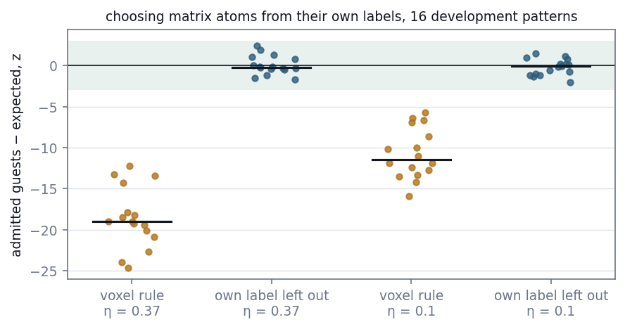
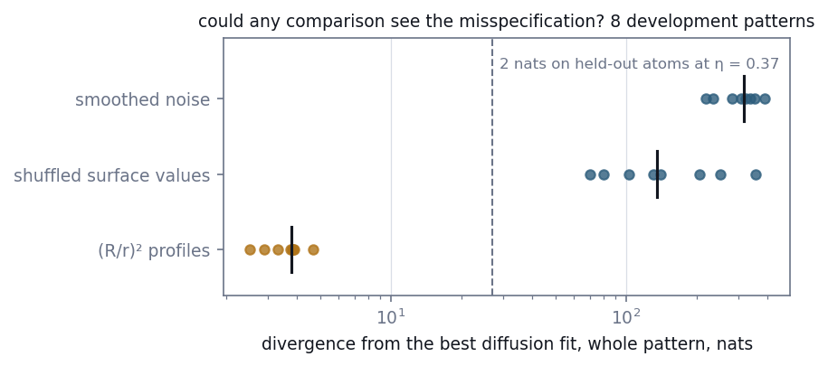
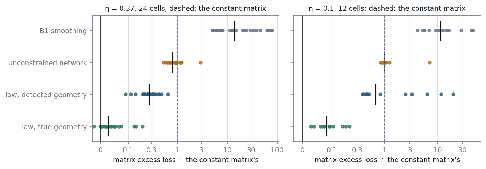
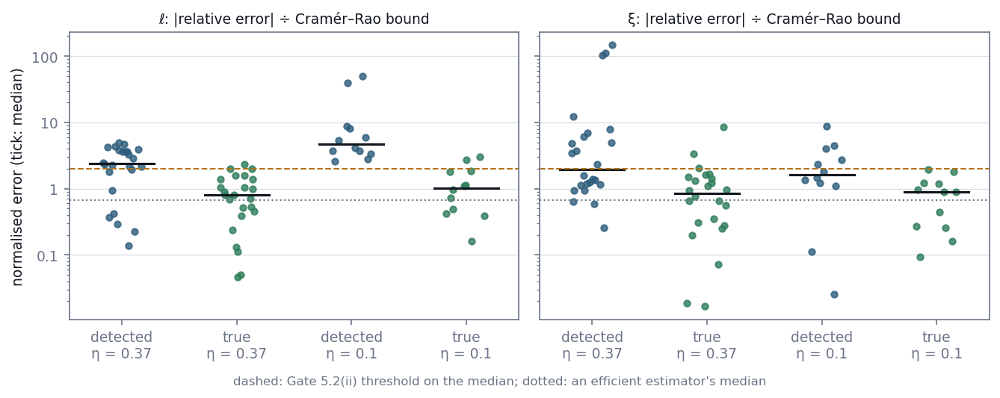
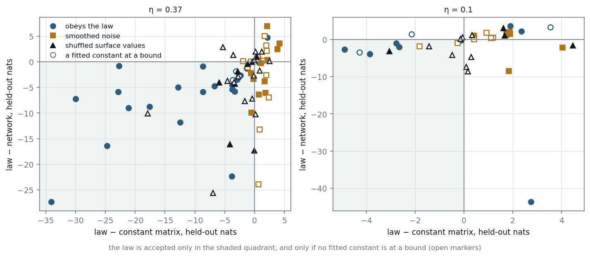

# E17 — The diffusion law as a hard constraint: Gate 5.2

*Reconstruction Stage 5.2, as corrected. Given only the atoms a detector records, can a model
that obeys the diffusion law exactly recover the law's constants, and can it tell when a
matrix does not obey the law?*

[← back to README_detailed](../../README_detailed.md#7-experiment-walkthroughs) ·
Protocol: [`experiments/reconstruction/ROADMAP.md`](../../experiments/reconstruction/ROADMAP.md), Stage 5.2 and its corrections ·
Implemented by [`fields/cluster_extraction.py`](../../geom_mesh_net/fields/cluster_extraction.py),
[`fields/misspecified.py`](../../geom_mesh_net/fields/misspecified.py),
[`generate_misspecified_patterns.py`](../../experiments/reconstruction/generate_misspecified_patterns.py) and
[`stage5_physics_fit.py`](../../experiments/reconstruction/stage5_physics_fit.py) ·
Runtime: 52 min for the 108 test cells (two workers) and 16 min for the 36 development cells on an Apple M1; pilots 4 min to 14 min

*Stage 5.2 was first designed around a physics-informed neural network. That design failed on
development patterns, and walkthrough [E16](E16_soft_pinn.md) reports why. This walkthrough
covers the method that replaced it and the gate it was tested against.*

---

## Abstract

Stage 5.2 asks whether a physical law built into a reconstruction of the solute field improves it,
recovers the law's constants, and can tell when the law does not apply. After a physics-informed
network failed on development data (E16), the law was imposed exactly: the matrix is modelled by
the screened diffusion field around precipitates detected in the data, with its four constants
fitted by maximum likelihood.

Development work found and fixed three flaws before the test:

- choosing matrix atoms from their own labels biased the admitted guest count by 11–19 standard
  errors;
- the first detection rule invented precipitates at low contrast;
- one planned control, (R/r)² profiles, could not have been rejected by any method.

The acceptance rule, as first designed, rejected only a third of misspecified cells. It was
strengthened to also require beating a constant matrix, and to reject any fit whose constants sit
at the edge of their range.

**Gate 5.2 failed, on the capillary length.** On 36 correctly specified and 72 misspecified test
cells:

- **(i) passed.** The law's fit predicted the matrix better than an unconstrained network in 31 of
  36 cells. At a detection efficiency of 0.37 its excess loss was a median 26% of a constant
  matrix's, against 79% for the network.
- **(ii) failed for ℓ.** The capillary length's median error was 3.49 times its Cramér–Rao bound
  (the limit was 2), and it was too small in 26 of 36 cells. With the true geometry the same fit
  reached 0.84. Errors in the detected radii flatten the dependence of surface concentration on
  radius, from which ℓ is read. The screening length passed, at 1.71.
- **(iii) passed.** The rule accepted 24 of 36 correctly specified cells and rejected 61 of 72
  misspecified ones. Most rejections came from fitted constants running to a bound.

The law carries real information about the matrix, and the method can tell when a matrix does not
obey it. The capillary length cannot be recovered until the precipitates are measured better.

---

## 1. Introduction

### 1.1 The question

Stage 5 asks whether a physical law can be built into a reconstruction of the solute field, and
whether the method can tell when the law does not hold. Stage 5.1 (walkthrough
[E15](E15_diffusion_simulator.md)) gave the simulator a matrix that obeys a screened diffusion
equation, with Gibbs–Thomson concentrations on the precipitates' surfaces. Four constants set
the field: c_eq, the capillary length ℓ, the screening length ξ and the far-field
concentration c∞.

The roadmap argued that the law should help because two global constants tie together about a
hundred depletion zones, each too faint to see alone. Gate 5.2 asks three things of a method
that uses the law:

- **(i)** does it predict the matrix better than the same flexible model without the law?
- **(ii)** does it recover ℓ and ξ nearly as well as any method could?
- **(iii)** does it accept the law when the matrix obeys it, and reject it when the matrix does
  not?

### 1.2 What changed before the test

The method was first a physics-informed neural network: a neural field with the equation and
boundary condition as penalties. On development patterns it could not recover the constants
even with the true geometry, because its loss preferred wrong constants under which a flat
field satisfies both penalties (E16). The law is now imposed exactly. The model is the
equation's own solution for the detected precipitates, with the four constants free.

Development work also found three flaws in the rest of the pipeline, each fixed before the
test:

- choosing the matrix atoms from the labels selected on those labels;
- the first detection rule invented precipitates where contrast was low;
- one of the two misspecified controls could not have been rejected by any method.

The acceptance rule was strengthened as well. All of these changes are recorded in the
roadmap's second Stage 5 correction, with their development evidence, and summarised here.

---

## 2. Methods

### 2.1 Data and observation

The patterns are those of Stage 5.1 (`data_diffusion/`): 60 nm boxes with 62–160 separated
spherical precipitates and a matrix whose guest probability follows the diffusion field. Atoms
are observed independently with probability η, at the benchmark's two efficiencies, 0.37 and
0.1, using Stage 5's own thinning masks. Scores use the atoms that were *not* observed.

### 2.2 Finding the precipitates

The observed labels are smoothed at the cross-validated bandwidth of Stage 1's B1 estimator. A
voxel belongs to a precipitate if its guest fraction lies more than three noise standard
deviations above the matrix level; the noise of a smoothed fraction is computed from the local
kernel weights. Regions are split at peaks more than five standard deviations above the matrix
level. Each region becomes a sphere of the same volume at its centroid. Spheres that overlap
are merged when one centre lies inside the other sphere, and otherwise shrunk until they are
0.5 nm apart, because the model's boundary-condition solve needs separated spheres.

### 2.3 Choosing the matrix atoms

The model is fitted to observed matrix atoms. They are admitted by a conservative rule: an atom
is excluded if any voxel within one step has a smoothed guest fraction more than 1.5 noise
standard deviations above the matrix level. That keeps the undetected edges of precipitates
out of the fit.

Applied naively, the rule selects on the labels. A matrix atom that happens to be a guest
raises the smoothed field around itself and is more likely to be excluded, so the admitted
atoms under-represent guests. Each atom is therefore judged on the field computed without its
own label. Labels are independent given the true field, so admission then says nothing about
the atom's own label. The Gaussian kernel is separable, so the correction is a subtraction at
a handful of voxels per atom.

### 2.4 The model

The field is the one Stage 5.1 simulates (`physics.py`), for the detected geometry:

    c(x) = c∞ + Σ_k a_k (R_k / r_k) exp(−(r_k − R_k)/ξ),

with the amplitudes a_k solved so that every precipitate's surface mean equals
c_eq·exp(ℓ/R_k). Written in torch (`implicit.ParametricDiffusionField`), the solve is
differentiable. The four constants, in log space and clamped to wide ranges, are fitted by
maximum likelihood with L-BFGS from three starting points, keeping the best.

### 2.5 Splits and comparators

One random number per atom, shared by every matrix kind of a pattern, splits the observed atoms
before anything is fitted: 20% are held back for the acceptance rule, and the remaining 80% carry
the cross-validated bandwidth, the detection, the admission rule, and then the fit — 70% of the
admitted atoms to train both models and 10% to early-stop the network. The order matters: drawing
the split afterwards lets the atoms that judge a fit help build the precipitates it is fitted with
(Section 5). The held-back fifth is admitted by the same voxel rule applied directly, since its
labels never entered the smoothed field. The comparators:

- **the unconstrained network**: the SIREN of the first design with both penalties at zero,
  trained with Adam and stopped early on its 10% (the untrained network, a near-constant
  field, counts as a candidate);
- **B1**: the smoothed field at the cross-validated bandwidth;
- **the constant matrix**: the mean of the training atoms;
- **the true geometry**: the same model fitted with the true precipitates to the observed atoms
  of the true matrix, an upper bound that no detection can beat.

### 2.6 Misspecified matrices

Each test pattern is copied twice with only its matrix labels redrawn
(`generate_misspecified_patterns.py`):

- **smoothed noise**: white noise smoothed over 3 nm, with the mean and standard deviation of
  the pattern's diffusion field. Neither the equation nor the boundary condition holds.
- **shuffled surface**: the diffusion field with each precipitate given another's
  Gibbs–Thomson value. The equation holds exactly; the capillarity law does not.

A third field, with (R/r)² profiles, was dropped. The best diffusion fit comes within a few nats
of it over a whole pattern, so no held-out comparison could reject it (Section 3.3).

### 2.7 The acceptance rule

The law is accepted for a cell, and its constants reported, only if, on the acceptance atoms,
its log loss is no greater than the network's and no greater than the constant matrix's, and no
fitted constant lies within 1% of a bound of its search range. A cross-validated kernel smoother
of the matrix labels is reported beside the rule as a diagnostic.

### 2.8 Scores and Gate 5.2

- **Matrix excess loss**: mean log loss minus the oracle's, over unobserved atoms of the true
  matrix.
- **Normalised error**: |relative error| of ℓ or ξ divided by the pattern's Cramér–Rao bound at
  its efficiency, the smallest relative error an unbiased fit that knows the geometry can reach.
  An efficient estimator's median is 0.67.

Gate 5.2, as corrected, on 36 correctly specified test cells (patterns 50–73 at η = 0.37, 50–61 at
η = 0.1) and 72 misspecified ones:

- **(i)** the law's fit has a lower matrix excess loss than the network in at least two-thirds of
  correctly specified cells;
- **(ii)** the median normalised error is below 2, for ℓ and for ξ;
- **(iii)** the rule accepts at least two-thirds of correctly specified cells and rejects at least
  two-thirds of misspecified ones.

If (iii) fails, no claim is made that the method can tell when the law applies.

---

## 3. Results

Sections 3.1–3.4 are development measurements that shaped the method; Sections 3.5–3.8 are the
test.

### 3.1 Matrix atoms chosen without selecting on their labels



*Figure 1. Among admitted atoms of the true matrix, the guest count minus the oracle's
expectation, in standard errors, on 16 development patterns. Shaded: ±3.*

Applied as a voxel lookup, the domain rule under-counted guests by a median of 19 standard errors
at η = 0.37 and 11.5 at 0.1 (range −25 to −6), with significance detection
(`pilot/check_matrix_domain.py`). With each atom's own label left out, the scores had mean 0.06
and standard deviation 1.1 at η = 0.37, and −0.21 and 0.96 at 0.1, as unbiased scores should. On the
test cells they had mean −0.15 (standard deviation 0.88) at η = 0.37 and +0.03 (1.16) at 0.1.

### 3.2 Finding the precipitates

On the same 16 development patterns, Otsu's threshold had median precision 0.96 at η = 0.37 but
0.46 on the worst pattern, and 0.61 at η = 0.1, with overlapping spheres in 15 and 16 of 16
patterns. The significance rule raised precision to 0.98 (minimum 0.92) and 0.97. It lost recall at
η = 0.1: a median of 0.68, and 0.07 on the worst pattern. On the test cells, detecting from the
four fifths of observed atoms the split leaves it, it found a median 93% of precipitates at
η = 0.37 and 52% at 0.1, with precision 0.98 and 0.97, and radii a median 3.6% and 0.4% large.

### 3.3 Which misspecifications can be seen at all



*Figure 2. How far each misspecified matrix lies from the best diffusion fit to it, with the true
geometry and all four constants free, over a whole development pattern
(`pilot/check_misspecification.py`). Dashed: the gap that would leave 2 nats on the held-out atoms
at η = 0.37.*

The (R/r)² field came within 2.5–4.7 nats of the best diffusion fit over a whole pattern, about
0.3 nats on the held-out atoms. No held-out comparison could reject it, so it was dropped as a
control. Smoothed noise stood 218–388 nats away, and shuffled surface values 70–355.

### 3.4 Choosing the acceptance rule

On the development scope (patterns 0–7 at η = 0.37, 0–3 at 0.1, each matrix kind), five rules
were compared:

| Accepted if, on the acceptance atoms, the law's loss is no worse than … | Correct accepted | Misspecified rejected |
| --- | --- | --- |
| the network's (as designed) | 10 of 12 | 8 of 24 |
| the network's and the constant's | 10 of 12 | 10 of 24 |
| **both, with no fitted constant at a bound** | **8 of 12** | **16 of 24** |
| both, and a cross-validated smoother's | 9 of 12 | 12 of 24 |
| all three, with no fitted constant at a bound | 7 of 12 | 17 of 24 |

The rule as designed was nearly powerless. The early-stopped network was often worse than a
constant: in 17 of 36 development cells, and in 57 of 108 test cells. Beating it therefore showed
little. The third rule was adopted, on reasons that do not depend on the counts: a law that
predicts no better than a constant has no support, and an estimate at the edge of its search range
is not identified. It was chosen from a first development run, and the table comes from a rerun
with the final script. On development cells it met Gate 5.2(iii) with no margin.

### 3.5 Gate 5.2(i): the field



*Figure 3. Matrix excess loss on unobserved atoms of the true matrix, as a share of the constant
matrix's, for each correctly specified test cell. Zero is the oracle. Ticks are medians.*

| Median share of the constant's excess loss | η = 0.37 (24 cells) | η = 0.1 (12 cells) |
| --- | --- | --- |
| the law, true geometry | 2.6% | 8.2% |
| **the law, detected geometry** | **26%** | **67%** |
| unconstrained network | 79% | 99% |
| B1 smoothing | 14 times | 12 times |

The law's fit beat the network in all 24 cells at η = 0.37 and in 7 of 12 at 0.1: 31 of 36, above
the 24 required. The five losses were fits far worse than a constant (2.5 to 20 times its excess),
all at η = 0.1, in patterns where detection found 8–80% of the precipitates. B1, the smoothing used to
detect them, is worse than a constant in the matrix, because it smears precipitate solute into the
surrounding matrix.

### 3.6 Gate 5.2(ii): the constants



*Figure 4. |Relative error| of ℓ and ξ divided by each pattern's Cramér–Rao bound, with detected
and true geometry. Dashed: the gate's threshold on the median. Dotted: an efficient estimator's
median.*

| Median normalised error | ℓ, detected | ℓ, true geometry | ξ, detected | ξ, true geometry |
| --- | --- | --- | --- | --- |
| η = 0.37 | 2.39 | 0.80 | 1.95 | 0.85 |
| η = 0.1 | 4.76 | 1.03 | 1.64 | 0.90 |
| **all 36 cells** | **3.49** | 0.84 | **1.71** | 0.90 |

The capillary length failed the threshold of 2 and the screening length passed. With the true
geometry both came close to efficient estimation, so the loss is in detection. The median relative
error of ℓ with detected geometry was 35% at η = 0.37 (bound 14%) and 104% at 0.1 (bound 24%). It was
negative in 21 of 24 and 5 of 12 cells. With the true geometry it had no consistent sign: negative in
13 of 24 cells at η = 0.37.

### 3.7 Gate 5.2(iii): telling when the law fails



*Figure 5. For each test cell, the law's held-out loss minus the constant matrix's (x) and minus the
network's (y), in nats. Open markers: a fitted constant at a bound.*

| | η = 0.37 | η = 0.1 | Total | Required |
| --- | --- | --- | --- | --- |
| correctly specified, accepted | 19 of 24 | 5 of 12 | 24 of 36 | at least 24 |
| smoothed noise, rejected | 21 of 24 | 12 of 12 | 33 of 36 | |
| shuffled surface, rejected | 17 of 24 | 11 of 12 | 28 of 36 | |
| misspecified, rejected | 38 of 48 | 23 of 24 | 61 of 72 | at least 48 |

Both halves passed; acceptance did so with no margin. In 43 of the 61 rejected misspecified cells, a
fitted constant sat at a bound. With shuffled surface values it was most often ℓ at its lower bound
(15 of 24 such cells); with noise, most often ξ at 0.5 or 200 nm (13 of 19). At η = 0.1 the rule rejected 7 of 12 correctly specified cells.
The law's fit lost to the network or the constant in six of them, and three had a constant at a
bound (some had both).

Accepted cells had better constants than rejected ones (median |relative error| of ℓ 44% against
96%), but not good ones: their median normalised error for ℓ was 3.34. One accepted cell at η = 0.1
(pattern 54) had a matrix excess 12 times the constant's. The acceptance atoms lie away from
interfaces, where that fit's error was concentrated.

### 3.8 The verdict

| Condition | Required | Measured | |
| --- | --- | --- | --- |
| (i) law beats network | at least 24 of 36 | 31 of 36 | passed |
| (ii) median normalised error, ℓ | below 2 | 3.49 | **failed** |
| (ii) median normalised error, ξ | below 2 | 1.71 | passed |
| (iii) correct accepted | at least 24 of 36 | 24 of 36 | passed |
| (iii) misspecified rejected | at least 48 of 72 | 61 of 72 | passed |

**Gate 5.2 failed.** Because (iii) passed, the method may be said to tell when a matrix does not obey
the law, at these rates. Because (ii) failed for ℓ, it may not be said to recover the capillary length.

---

## 4. Discussion

### 4.1 Why ℓ fails and ξ passes

The capillary length is read from how the surface concentration c_eq·exp(ℓ/R_k) changes across
precipitates of different radii: effectively a regression on 1/R. Detected radii are noisy
estimates of the true ones, and noise in a regressor flattens the fitted slope toward zero. That is
regression dilution, met in E10's calibration. The sign of the errors bears this out: ℓ came out
too small in 26 of 36 cells, while with the true radii the errors had no consistent sign. At η = 0.1
a second error adds to it: detection misses about half the precipitates, whose depletion zones stay
in the data with no sink to explain them, and the sign of the ℓ error stops being consistent (5 of
12 cells low) because that second error pushes the other way.

The screening length is read from how fast depletion decays with distance, averaged over every zone
in the box. That average tolerates a noisy radius here and there. ξ came out too large in 22 of 24
cells at η = 0.37 (median +39%), a smaller bias relative to its looser bound.

### 4.2 What acceptance means

Acceptance is evidence that the law describes the matrix. It is not evidence that the constants are
right. The rule's power came from identifiability: when the matrix did not obey the law, the
likelihood drove a constant to the edge of its range. The comparison with the network added little,
because an early-stopped network is often worse than a constant at these signal levels. The rule
also has a blind spot. Its held-out atoms lie away from interfaces, so a fit that is wrong mainly near
precipitates can pass (pattern 53).

### 4.3 The rule was chosen on development data

The adopted rule was one of five compared on development cells. Its conditions have reasons
independent of the counts, all five rules were recorded before the test, and the test run used the
rule unchanged. Still, it met the gate with no margin on development cells and on test cells alike
(24 of 36). A different but equally defensible rule might have landed on either side of the line.

### 4.4 What would recover ℓ

The information is there. Recomputed with every radius, the centres and the interior profile as
unknowns, the bound on ℓ widens by only 7–29% (`pilot/check_geometry_bound.py`), so the gap this
gate measures belongs to the method. Three routes were tried after the gate, on development
patterns (`pilot/check_joint_fit.py`, roadmap Stage 5):

- **Fitting the geometry with the constants.** Making every radius and the interior profile
  parameters of the same likelihood, over every observed atom rather than the matrix alone, cuts the
  radius error from 7.5% to 2.9% but *raises* ℓ, from 1.7 times the geometry-unknown bound to 3.0,
  and high in all eight patterns — the fit spends its freedom on the interior profile instead of on
  the geometry. Freeing the centres as well removes that: ℓ falls to 0.89 times the bound and ξ to
  0.81, both at the level of the fit that is given the true geometry, and the matrix excess loss
  falls below detect-then-fit's. The freedom also opens a degenerate direction — on one pattern the
  fit reached a lower loss with ξ at its floor — which the acceptance rule of Section 2.7 rejects.
- **Where detection misses precipitates, nothing helps yet.** On the pattern where detection found
  64% of them, freeing the geometry left ℓ 65% high, and at η = 0.1, where detection finds 44% of
  them, no method reaches its bound. The atoms of a missed precipitate sit in the
  likelihood as guests the matrix cannot explain, and the constants absorb them.
- **What does not work.** Fitting the interface width, or giving the interior profile more freedom
  (a piecewise-linear profile instead of a power law), changes ℓ by a few per cent either way.

Better radii from Stage 4's detection would feed directly into ℓ, and errors-in-variables
corrections could undo part of the attenuation if the radius error can be estimated. But the
measurement is now the clearer lever: the bound says the interface costs more than the geometry.

### 4.5 Limits

- The data are simulated. The matrix obeys the law exactly and precipitates are spheres, which is
  what makes an exact solution possible; real precipitates are neither.
- The priors, detection rule and efficiencies are those of the roadmap. A matrix with a stronger
  signal, or larger and fewer precipitates, would change every number here.
- The gate's Cramér–Rao bound assumes the true geometry. Recomputed with every radius and the
  interior profile unknown, it widens by 7% to 29% depending on how far the interface is mixed
  (`pilot/check_geometry_bound.py`), which leaves (ii) failed at about 3.1. The bound also has to
  assume an interface width, because the simulator's own boundary is a step.

---

## 5. Corrections

The roadmap's Stage 5.2 was written around a physics-informed network, a single held-out comparison
against it, and (R/r)² and noise controls. A second Stage 5 correction, dated 2026-09-17 and recorded
before any test cell was fitted, made these changes with the development evidence:

- replaced the network with the analytic family (E16);
- admitted matrix atoms with their own labels left out;
- detected precipitates by significance and resolved overlaps;
- dropped the (R/r)² control for shuffled surface values;
- strengthened the acceptance rule;
- fixed open definition O6 at a median normalised error of 2.

The roadmap keeps the original text above the correction.

A fourth correction, dated 2026-09-17, followed the first test run. It changed the harness, not the
method or the gate:

- **the split now comes first.** The bandwidth, the detection and the admission rule had used every
  observed label, and the acceptance atoms were drawn afterwards, so the atoms that judge a fit had
  helped build the precipitates it was fitted with. They are now held back before anything reads a
  label, and detection works from the remaining four fifths;
- **an incomplete run cannot report a verdict.** The gate measured whatever cells a results file
  held and silently dropped errored ones; it now checks the split's whole scope and reports
  `incomplete` instead;
- **a resumed run cannot mix configurations.** The design is hashed and a resume whose hash differs
  is refused.

Every number in this walkthrough is from the corrected run; the first is kept in
`results/stage5_physics_fit_test_first_run.json`. Closing the leak cost detection a fifth of its
atoms, and the capillary length went from 2.53 to 3.49 times its bound. The acceptance rates, which
the leak was expected to flatter, moved by one cell.

---

## 6. Conclusion

Built into the model exactly, the diffusion law made the matrix predictable where neither smoothing
nor an unconstrained network could: a median 26% of a constant's excess loss at realistic efficiency,
against 79% for the network. The fitted constants then showed when the law did not hold: faced with
noise or scrambled surface values, they ran to the edges of their range, and the rule rejected 61 of
72 such cells.

The capillary length could not be recovered: its median error was 3.5 times the best achievable, and
nearly always too small. With the true precipitates it came within the bound, so the barrier is not
the law or the fit but the geometry — and a bound recomputed without the geometry says the same,
widening by only 7–29%. The geometry is therefore what the work after this gate goes after: fitting
the precipitates with the constants, rather than detecting them first (Section 4.4).

---

## Outputs

| File | Contents |
| --- | --- |
| `geom_mesh_net/fields/cluster_extraction.py` | detection by significance, overlap resolution, matrix admission with own labels left out |
| `geom_mesh_net/fields/misspecified.py` | (R/r)², shuffled-surface and smoothed-noise fields |
| `geom_mesh_net/neural/implicit.py` | `ParametricDiffusionField`, `fit_parametric`; the network used as a control |
| `experiments/reconstruction/generate_misspecified_patterns.py` | the controls' labels (`data_diffusion/misspecified/`, gitignored) |
| `experiments/reconstruction/stage5_physics_fit.py` | the method, controls, rule and Gate 5.2 |
| `experiments/reconstruction/results/stage5_physics_fit_test.json` | the gate report and every test cell |
| `experiments/reconstruction/results/stage5_physics_fit_development.json` | the development scope |
| `experiments/reconstruction/results/stage5_physics_fit_*_first_run.json` | the superseded first run, before the split-first correction |
| `experiments/reconstruction/pilot/check_geometry_bound.py`, `pilot/results/geometry_bound.json` | the bound with the geometry unknown (Section 4.4) |
| `experiments/reconstruction/pilot/check_joint_fit.py`, `geom_mesh_net/fields/joint_fit.py` | fitting the geometry with the constants (Section 4.4) |
| `experiments/reconstruction/pilot/results/matrix_domain.json` | Sections 3.1–3.2 |
| `experiments/reconstruction/pilot/results/misspecification.json` | Section 3.3 |
| `experiments/reconstruction/benchmark/diffusion/misspecified_*.json` | frozen checksums and records of the controls |
| `docs/figures/e17_*.png` | Figures 1–5 |
| `tests/test_cluster_extraction.py`, `tests/test_misspecified_fields.py`, `tests/test_joint_fit.py` | 16 tests |

## Reproduce

```bash
python -m experiments.reconstruction.pilot.check_matrix_domain
python -m experiments.reconstruction.generate_misspecified_patterns --kind inverse_square --split development
python -m experiments.reconstruction.generate_misspecified_patterns --kind smoothed_noise --split development
python -m experiments.reconstruction.generate_misspecified_patterns --kind shuffled_surface --split development
python -m experiments.reconstruction.pilot.check_misspecification
python -m experiments.reconstruction.stage5_physics_fit --split development
python -m experiments.reconstruction.generate_misspecified_patterns --kind smoothed_noise --indices 50,51,52,53,54,55,56,57,58,59,60,61,62,63,64,65,66,67,68,69,70,71,72,73
python -m experiments.reconstruction.generate_misspecified_patterns --kind shuffled_surface --indices 50,51,52,53,54,55,56,57,58,59,60,61,62,63,64,65,66,67,68,69,70,71,72,73
python -m experiments.reconstruction.stage5_physics_fit --split test
PYTHONPATH=. python docs/make_reconstruction_figures.py
python -m pytest -q tests/test_cluster_extraction.py tests/test_misspecified_fields.py
```

Oracles must be cached first (`python -m experiments.reconstruction.stage5_simulator`). The network
runs on the Apple GPU when available, where runs do not repeat exactly; everything else is
deterministic.
