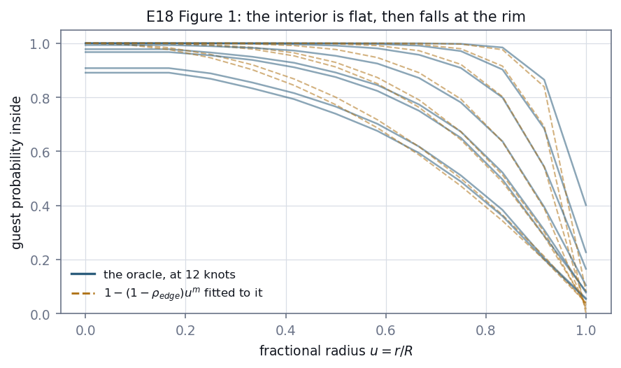
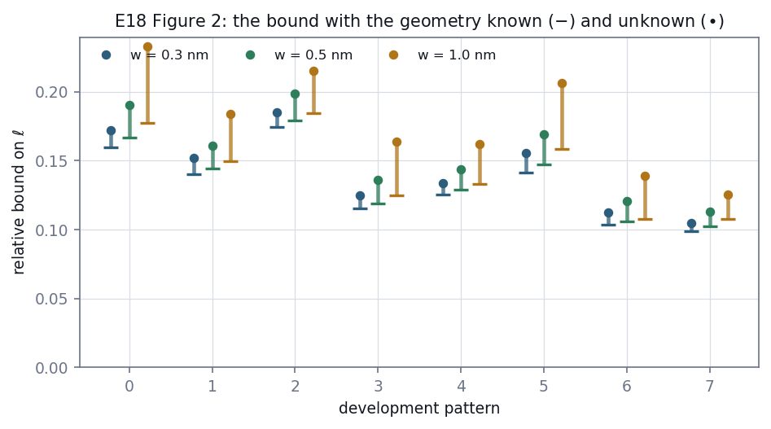
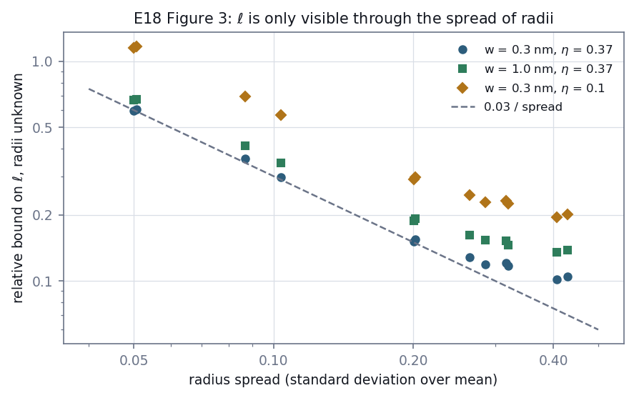
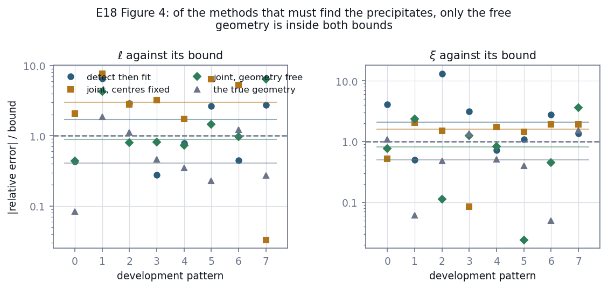

# E18 — Fitting the precipitates with the law

*Reconstruction Stage 5, after Gate 5.2. The gate failed on the capillary length. Is that the
data's fault or the method's, and what recovers it?*

[← back to README_detailed](../../README_detailed.md#7-experiment-walkthroughs) ·
Protocol: [`experiments/reconstruction/ROADMAP.md`](../../experiments/reconstruction/ROADMAP.md), Stage 5, beneath the third correction ·
Implemented by [`fields/joint_fit.py`](../../geom_mesh_net/fields/joint_fit.py),
[`pilot/check_geometry_bound.py`](../../experiments/reconstruction/pilot/check_geometry_bound.py),
[`pilot/check_identifiability_map.py`](../../experiments/reconstruction/pilot/check_identifiability_map.py) and
[`pilot/check_joint_fit.py`](../../experiments/reconstruction/pilot/check_joint_fit.py) ·
Runtime: 8 min for the bound, 44 min for the map, 24 min for the joint fits, on an Apple M1

*This is development work, not a gate. Nothing here has been run on a test pattern, and the
numbers below are eight development patterns at one detection efficiency. Walkthrough
[E17](E17_physics_fit.md) reports the gate this follows.*

---

## Abstract

Gate 5.2 asked a fitted diffusion law to recover its own constants from detected precipitates. It
failed on the capillary length ℓ, at 3.49 times a Cramér–Rao bound that assumes the true centres
and radii — a bound no method can reach, because no method has the geometry. Three measurements
follow.

- **The bound with the geometry unknown.** Freeing every radius and the shape of the precipitate
  interior widens the bound on ℓ by 7% when the interface is mixed over 0.3 nm and 29% at 2.0 nm.
  The missing accuracy is the method's, not the data's. The measurement model costs more than the
  unknown geometry does.
- **Where ℓ is recoverable at all.** ℓ enters only through the Gibbs–Thomson surface value
  c_eq·exp(ℓ/R), so a population of equal precipitates cannot separate it from c_eq. Over a sixfold
  range of radius spread, the bound on ℓ times the spread is 0.030 to 0.045. Below a spread of
  about 0.1, ℓ cannot be recovered.
- **What recovers it.** Fitting radii and the interior profile together with the constants, over
  every observed atom, cuts the radius error from 7.5% to 2.9% and makes ℓ *worse*: the interior
  profile absorbs the geometry's error at the rim, which is exactly where the surface concentration
  is read. Freeing the centres as well brings ℓ to 0.89 times the geometry-unknown bound and ξ to
  0.81, both at the level of a fit handed the true geometry, without giving up the matrix.

Two failure modes come with it: three parameters per precipitate open a degenerate direction that
one pattern's fit preferred, and precipitates detection never found are still paid for by the
constants.

---

## 1. Introduction

### 1.1 The question

E17 left a number without an interpretation. The capillary length came out a median 3.49 times its
bound, and the same fit given the true precipitates reached 0.84. That says the geometry is what
costs, but not whether the cost is avoidable. Two different worlds produce the same symptom: one
where the data never contained enough to locate ℓ once the geometry is unknown, and one where they
did and the method spent it. The first is a result about atom probe data. The second is a bug.

Telling them apart needs a bound computed the way the problem is actually posed, with the geometry
as unknown as everything else.

### 1.2 What the gate's bound assumed

Open definition O6 divides each fitted constant's error by the Cramér–Rao bound of
`pilot/check_diffusion_prior.py`. That bound frees the four constants and holds the centres and
radii at their simulated values. It is the right bound for the question "how well could anyone do
if a perfect detector existed", and the wrong one for the question the gate asks.

---

## 2. Methods

### 2.1 A measurement model, because the bound needs one

Every atom is a guest with probability

    p(x) = c(x) + [ρ(r_k / R_k) − c(x)] · S((R_k − r_k) / w)

for its nearest precipitate k at distance r_k, with c the screened diffusion field of
[`fields/physics.py`](../../geom_mesh_net/fields/physics.py), S the logistic, and ρ the profile
inside a precipitate. Two pieces are not in the Stage 5.2 model, and both had to be measured rather
than assumed.

**The interior is not uniform.** The simulator fills a precipitate from the centre outward, so the
oracle's guest probability saturates near 1 at the centre and falls at the rim. Fitted as
ρ(u) = 1 − (1 − ρ_edge)·u^m it leaves about 0.03 in probability on every pattern, which is the
residual this walkthrough keeps returning to.

**The interface is a step, and a step is not measurable.** The simulator's boundary goes from about
0.5 just inside to the matrix value just outside within half a nanometre. A step carries unbounded
Fisher information about a radius, so without a width the bound does not exist. Real atom probe
data mix the interface over a nanometre or two through local magnification and trajectory overlap.
`w` stands for that, it is an input, and every bound here is reported across a range of it.

### 2.2 The bound with the geometry unknown

`pilot/check_geometry_bound.py` builds the Fisher information of independent Bernoulli labels at
efficiency η,

    J = η · Σ_i ∇p_i ∇p_iᵀ / (p_i (1 − p_i)),

over *every* atom rather than the matrix alone, because the atoms inside a precipitate are what
measure its radius. Derivatives are central differences in log parameters, so a diagonal of J⁻¹ is
a relative error. Three nuisance sets are compared: the four constants alone; plus every radius and
the interior shape; plus every centre. A run may subsample the atoms and scale η by the reciprocal
of the share kept, which is unbiased in J and was checked against a full-atom run (pattern 1, ℓ
0.145 → 0.161 subsampled against 0.144 → 0.161 with every atom).

### 2.3 The map over radius spread

`pilot/check_identifiability_map.py` draws geometries directly — separated spheres filling 10% of a
60 nm box, mean radius 3.5 nm, ℓ = 3.5 nm, constants at the middle of the Stage 5 prior — and
applies the same machinery. Nothing in it comes from the Stage 5 patterns or from any label. Two
geometries per spread, and the realised spread saturates near 0.4 because radii are held above
2 nm.

### 2.4 The joint fit

[`fields/joint_fit.py`](../../geom_mesh_net/fields/joint_fit.py) makes the model of Section 2.1
differentiable and fits it by maximum likelihood on every observed atom: the four constants in log
space, every radius in log space, the interior profile, and optionally the centres and the
interface width. The assignment of an atom to its nearest precipitate is held fixed within a round
of L-BFGS and recomputed between rounds, so it cannot oscillate inside a line search. The interior
profile is either the two-parameter power law or a monotone piecewise-linear profile through
`knots` segments, each knot a free fraction of the one before it. `grow_geometry` adds precipitates
where the fit leaves unexplained guests, keeping a round only if the summed log loss falls by more
than (log n)/2 per added parameter.

### 2.5 What is compared, and against what

`pilot/check_joint_fit.py` scores three methods on the development patterns, all from the same
atoms and the same split-first protocol as Stage 5.2:

- **detect then fit**, which is Stage 5.2: precipitates from the smoothed field, then the constants
  on admitted matrix atoms;
- **the joint fit**, from the same detection as a starting point;
- **the true geometry**, the upper bound of E17.

Each is scored by the relative error of ℓ and ξ divided by the geometry-unknown bound at the same
interface width, by the median radius error, and by matrix excess loss on atoms that were never
observed. That last score uses each model's matrix field alone: blending in the interior would
punish a model at every true-matrix atom its own interfaces happen to cover, which is not what a
matrix score should measure.

---

## 3. Results

### 3.1 The interior profile



*Figure 1. The oracle's guest probability inside precipitates as a function of fractional radius,
against the best-fitting power law, for each development pattern.*

Measured at twelve knots, the profile is flat across the core and falls steeply over the outer
fifth: on pattern 3, 0.98 at the centre and 0.50 at 5/6 of the radius, reaching 0.10 at the rim.
The power law fitted to it takes exponents from 2.1 to 20.0 across patterns and leaves a root mean
square residual of 0.025 to 0.033. A sphere of constant composition, which is what a naive model
would assume, is not close.

### 3.2 The bound with the geometry unknown



*Figure 2. Relative Cramér–Rao bound on ℓ for each development pattern, with the geometry known and
with every radius and the interior shape unknown, at three interface widths. η = 0.37.*

| interface width | ℓ, geometry known | ℓ, radii and shape unknown | ξ, geometry known | ξ, radii and shape unknown |
| --- | --- | --- | --- | --- |
| 0.3 nm | 0.133 | 0.143 (+7%) | 0.188 | 0.209 |
| 0.5 nm | 0.136 | 0.152 (+12%) | 0.190 | 0.228 |
| 1.0 nm | 0.141 | 0.174 (+23%) | 0.191 | 0.263 |
| 2.0 nm | 0.168 | 0.217 (+29%) | 0.164 | 0.228 |

Medians over the eight development patterns at η = 0.37, as relative errors; at η = 0.1 every entry
roughly doubles, as independent Bernoulli labels require. The 2.0 nm row is two patterns rather
than eight, which is why its ξ entries sit below the 1.0 nm row's. Each pattern contributes 69 to
158 nuisance parameters.

Two things follow.

- **Not knowing the geometry costs little.** Reading Gate 5.2(ii) against a bound that assumes no
  geometry turns a measured 3.49 into about 3.1. The verdict does not change, and the gap is the
  method's.
- **The interface costs more than the geometry.** Doubling the mixing width from 0.5 to 1.0 nm
  costs more than freeing a hundred radii. Giving the interior profile more freedom — twelve knots
  instead of two parameters — costs about 10%, so the interior's *shape* is not where the
  information sits either.

### 3.3 Where ℓ is recoverable at all



*Figure 3. The bound on ℓ against the realised radius spread, for twelve drawn geometries. The line
is 0.03 divided by the spread. Both interface widths and both efficiencies.*

| radius spread | precipitates | ℓ, geometry known | ℓ, radii unknown | at w = 1.0 nm | at η = 0.1 |
| --- | --- | --- | --- | --- | --- |
| 0.05 | 121 | 0.59–0.60 | 0.60–0.61 | 0.67 | 1.15–1.17 |
| 0.09–0.10 | 116–119 | 0.29–0.35 | 0.30–0.36 | 0.34–0.41 | 0.57–0.69 |
| 0.20 | 122–130 | 0.14 | 0.15 | 0.19 | 0.29–0.30 |
| 0.26–0.29 | 114–135 | 0.11 | 0.12–0.13 | 0.15–0.16 | 0.23–0.25 |
| 0.32 | 136–142 | 0.10–0.11 | 0.12 | 0.15 | 0.23 |
| 0.41–0.43 | 61–92 | 0.09 | 0.10–0.11 | 0.14 | 0.19–0.20 |

The product of the bound and the spread is 0.030 to 0.045 across the whole range, and 0.030 to
0.034 below a spread of 0.3. As a rule of thumb, the best relative error available for the
capillary length is about 0.03 divided by the spread of the radii. At a spread of 0.05 that is
60%, and at η = 0.1 it exceeds ℓ itself. The Stage 5 patterns sit at 0.22 to 0.31.

The widest rows hold 61 and 92 precipitates rather than about 130, because the volume fraction is
fixed and larger precipitates fill it with fewer of them; their bounds sit above the trend, which
is the count entering where the spread cannot.

### 3.4 Three methods against that bound



*Figure 4. |Relative error| of ℓ and ξ divided by the geometry-unknown bound, per development
pattern, for each method. η = 0.37. Dashed: the bound itself.*

| | median ℓ / bound | median ξ / bound | within the bound | median radius error | matrix excess |
| --- | --- | --- | --- | --- | --- |
| detect then fit | 1.72 | 2.07 | 4 of 8 | 7.5% (detection's) | 0.00031 |
| joint fit, centres fixed | 3.01 | 1.61 | 1 of 8 | 2.9% | 0.00061 |
| **joint fit, geometry free** | **0.89** | **0.81** | **5 of 8** | 4.0% | **0.00026** |
| the true geometry | 0.41 | 0.49 | 5 of 8 | — | 0.00003 |

Matrix excess is in nats per atom on never-observed atoms of the true matrix.

Fitting the radii with the constants does what it was meant to do for the geometry and the opposite
of what it was meant to do for ℓ. The radius error falls from 7.5% to 2.9% and ξ improves from 2.07
to 1.61 times its bound, while ℓ rises from 1.72 to 3.01 — and it rises in *every* pattern, from
0% to +117%, where detect-then-fit is biased low in seven of eight, from −100% to +3%. A method
that recovers radii better and ℓ worse is not suffering from radius noise.

### 3.5 What the fit spends its freedom on

Six variants on pattern 3, which detection handles well (97% recall, 3% radius error), separate the
causes. All fit the same atoms.

| variant | train loss | ℓ error |
| --- | --- | --- |
| at the truth, for reference | 0.337602 | — |
| free power law, detected geometry | 0.339894 | +41% |
| **oracle's own power law fixed, detected geometry** | **0.340606** | **+8%** |
| free power law, true geometry | 0.336874 | +19% |
| oracle's power law fixed, true geometry | 0.336912 | +10% |
| 6-knot profile, detected geometry | 0.339738 | +46% |
| 12-knot profile, detected geometry | 0.339693 | +37% |
| **6-knot profile, centres free, detected geometry** | **0.334670** | **+10%** |

Fixing the interior at the oracle's own shape removes most of the bias *at a worse loss*. The fit
prefers a wrong interior to a wrong geometry, and pays for that preference in ℓ, because the rim is
where c_eq·exp(ℓ/R) is read. Giving the interior more freedom does not help, and neither does
fitting the interface width: with w free the fit chose 0.192 nm, left ℓ at +46%, and doubled the
radius error. What helps is letting the precipitates move. With the centres free the fit reaches a
lower loss than the same model given the true geometry, and ℓ lands at +10%, inside the bound.

### 3.6 Two ways it still fails

**A degenerate direction.** On pattern 7 the free fit reached a *lower* loss than the frozen one
(0.3077 against 0.3184) by driving ξ to its lower bound of 0.5 nm against a true 8.1, and inflating
ℓ to 7.2 against 4.3. Pattern 7 is where that would be expected: it has the largest screening
length of the eight and the loosest bound on it, so ξ is its least identified constant. Repeating
at a 1.0 nm interface leaves ℓ at +9% but ξ still at its floor and the radius error at 24%, so the
degeneracy is a property of the pattern, not of the assumed width. Stage 5.2's acceptance rule
rejects exactly this shape of failure, a fitted constant at a bound, so it is visible — but any
gate on this method has to keep that check.

**Precipitates nobody found.** On the pattern where detection found 64 of 102, freeing the geometry
improved the radii from 11.2% to 6.5% and left ℓ at +65%. `grow_geometry` added 12 precipitates and
then 5, both rounds earning their parameters (119.6 nats against a 66.4 penalty, then 39.5 against
27.7), and raised recall to 0.80 — and ℓ moved from +137% to +147%, ξ from −49% to −93%. A fifth of
the precipitates were still missing, and the constants still paid for them. At η = 0.1, where
detection finds a median 44%, no method reaches its bound and even the fit given the true geometry
only reaches 0.98.

### 3.7 Reproducibility

Where recall is poor the fit is not reproducible: two runs of that pattern differing only in the
number of BLAS threads gave ℓ +65% and +137%. Where detection finds nearly everything, the same
comparison reproduces to the second decimal. A gate on this method needs a fixed thread count or a
stated restart rule.

---

## 4. Discussion

### 4.1 Why the rim carries the capillary length

ℓ is read from how surface concentration varies with radius, and the surface is the rim. Anything
the model gets wrong at the rim — an interior profile that cannot follow the truth, a radius that
is 3% large, a centre that is half a nanometre off — lands in the same place as the quantity being
measured. That is why the interior profile and ℓ trade against each other, why a fit with more
interior freedom does not escape the trade, and why moving the precipitates does: it removes the
error instead of relocating it.

### 4.2 What this says about Gate 5.2

The gate's verdict stands and its reason is now sharper. The capillary length was not lost because
an unknown geometry destroys the information — that costs 7 to 29%. It was lost because
detect-then-fit has no way to correct a precipitate, and its errors land where ℓ is read. Stage 4,
which measures precipitates directly, is therefore on the critical path for the one case a joint
fit cannot repair: precipitates that were never detected at all.

### 4.3 Limits

- Eight development patterns at one efficiency. Nothing here is a gate result, and one of the eight
  produced a degenerate fit.
- The bound assumes an interface width because the simulator's interface is a step. Every number
  scales with that choice, and the fit given the true geometry beats the bound at w = 0.5 nm, which
  is the sign of a bound built on a wider interface than the data actually have.
- The interior profile is fitted to the simulator's own oracle. A real instrument's profile would
  have to be calibrated, and the bound is only as good as that calibration.
- The simulator's precipitates are separated spheres and its matrix obeys the law exactly.

### 4.4 What a gate would need

Thresholds fixed on development patterns before any test cell is fitted; a stated interface width,
since the fit is sensitive to it; the bound at that same width as the divisor; a rule for the
degenerate direction free centres open; and a decision about whether η = 0.1 belongs in a gate at
all, given that detection finds less than half the precipitates there and nothing downstream
repairs it.

---

## 5. Conclusion

The capillary length was recoverable all along. An unknown geometry costs 7 to 29% of the bound,
and a fit that estimates the precipitates instead of trusting a detector reaches 0.89 times that
bound for ℓ and 0.81 for ξ, matching a fit handed the true geometry and predicting the matrix
slightly better than Stage 5.2 does. What decides whether it can be measured at all is the spread
of the radii: about 0.03 divided by that spread is the floor, whatever method is used.

What remains is not the law or the fit. It is the precipitates nobody found, and a degenerate
direction that opens as soon as they are allowed to move.

---

## Outputs

| File | Contents |
| --- | --- |
| `geom_mesh_net/fields/joint_fit.py` | the differentiable model, the fit, and the birth step |
| `experiments/reconstruction/pilot/check_geometry_bound.py` | the bound with the geometry unknown |
| `experiments/reconstruction/pilot/check_identifiability_map.py` | the map over radius spread |
| `experiments/reconstruction/pilot/check_joint_fit.py` | the three methods compared |
| `experiments/reconstruction/pilot/results/geometry_bound.json` | Sections 3.1–3.2 |
| `experiments/reconstruction/pilot/results/geometry_bound_knots.json` | the measured interior profiles, Section 3.1 |
| `experiments/reconstruction/pilot/results/identifiability_map.json` | Section 3.3 |
| `experiments/reconstruction/pilot/results/joint_fit.json` | Sections 3.4–3.6 |
| `experiments/reconstruction/pilot/results/joint_fit_width_1nm.json` | the 1 nm repeat, Section 3.6 |
| `docs/figures/e18_*.png` | Figures 1–4 |
| `tests/test_joint_fit.py` | 6 tests |

## Reproduce

```bash
python -m experiments.reconstruction.pilot.check_geometry_bound --subsample 60000
python -m experiments.reconstruction.pilot.check_geometry_bound --patterns 0,1,2,3,4,5,6,7 \
    --widths 0.3 --efficiencies 0.37 --subsample 60000 --interior-knots 12 \
    --output experiments/reconstruction/pilot/results/geometry_bound_knots.json
python -m experiments.reconstruction.pilot.check_identifiability_map
python -m experiments.reconstruction.pilot.check_joint_fit --threads 3
python docs/make_reconstruction_figures.py
```
