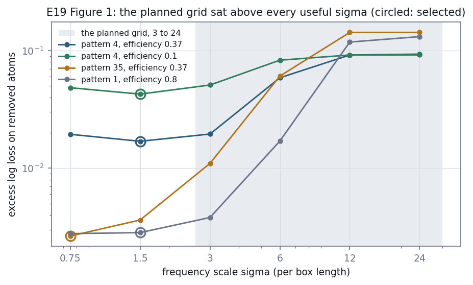
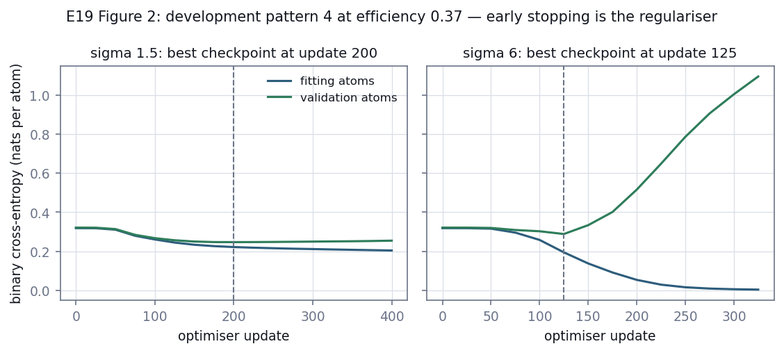
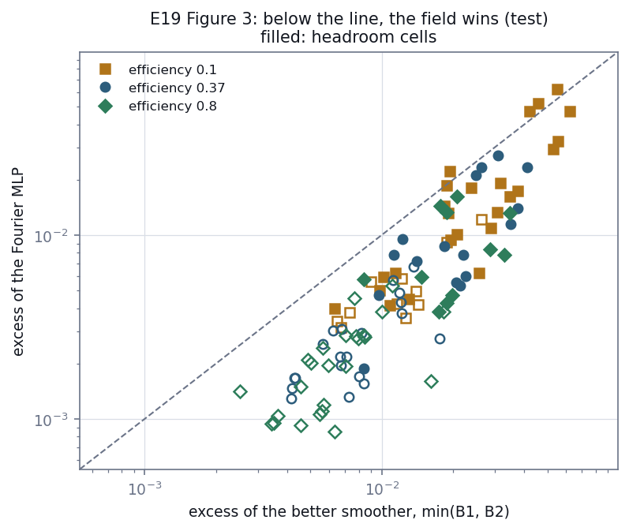
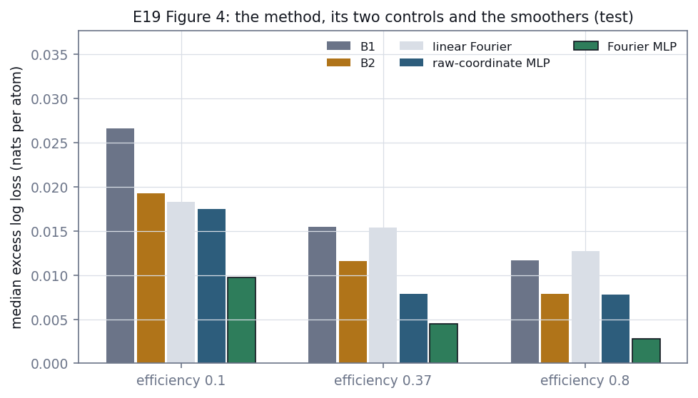
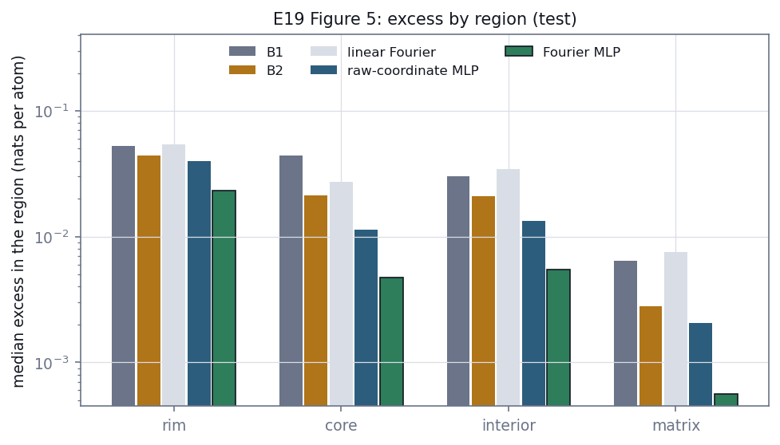

# E19 — A Fourier-feature field fitted to one pattern: Gate 2

*Reconstruction Stage 2. Fitted only to the atoms a detector records in one pattern, does a
coordinate network with Fourier features estimate the guest probability better than tuned
kernel smoothing?*

[← back to README_detailed](../../README_detailed.md#7-experiment-walkthroughs) ·
Protocol: [`experiments/reconstruction/ROADMAP.md`](../../experiments/reconstruction/ROADMAP.md), Stage 2, its design and pilot records ·
Contract: [`stage2_design.json`](../../experiments/reconstruction/stage2_design.json) (frozen, hash `f9a0085f62490e83`) ·
Implemented by [`neural/implicit.py`](../../geom_mesh_net/neural/implicit.py),
[`stage2_field.py`](../../experiments/reconstruction/stage2_field.py) and
[`pilot/check_fourier_field.py`](../../experiments/reconstruction/pilot/check_fourier_field.py) ·
Runtime: 13.2 h for the 108 test cells and 4.2 h for the 36 confirmation cells on an Apple M1,
a median of 7.7 min per cell for three models, three smoothers and the scoring; pilots 24 min to 7.2 h

---

## Abstract

Stage 1 measured how much room standard kernel smoothing leaves between a constant guess and the
exact solute field: on 48% of test cells, at least 15% of it, concentrated at cluster rims and
cores. This stage asks whether a network fitted to one pattern's observed atoms, and nothing
else, closes that room. The model is an MLP on random Fourier features of position; its two
controls are the same MLP on raw coordinates and a linear model on the same features. Every
setting was chosen on development cells and frozen in `stage2_design.json` before a test cell was
fitted.

**Gate 2 passed on all 108 test cells.**

- **It beats the better smoother in 48 of 52 headroom cells** (two thirds required) and closes a
  median **68%** of the gap B1 leaves (20% required). The four cells it loses are all small
  clusters at 10% detection efficiency, by margins under 0.007 nats per atom.
- **It gains where Stage 1 said the room was.** For small clusters its median excess is 0.039
  nats per atom at rims against the better smoother's 0.077, and 0.013 in cores against 0.030.
- **The architecture matters more than the encoding.** Against the raw-coordinate MLP the Fourier
  features are worth a median −0.0049 nats per atom (95% interval −0.0084 to −0.0029); against
  the linear model on the same features the network is worth −0.0102 (−0.0212 to −0.0072). A
  linear model on Fourier features loses to B2.
- **It is better calibrated than the smoothers it beats**, at a median expected calibration error
  of 0.0046 against B1's 0.0233 and B2's 0.0137, and relabelling every atom from its field
  reproduces the 14 spatial-summary features of the true pattern to a median 0.03–0.09 of their
  between-pattern spread, against 0.08–0.30 for B2 and 0.03–0.05 for the oracle itself.

The win is a per-pattern estimator's: the field knows nothing about precipitates in general, and
with 330,000 parameters fitted to as few as 17,000 labels, early stopping is its only
regulariser. What Stage 3 adds is a prior learned across simulations, which this stage now has a
bar for.

---

## 1. Introduction

### 1.1 The question

Stage 1 measured how close standard smoothing gets to the truth: B1, one Gaussian bandwidth,
and B2, a bandwidth that narrows where guests are dense, both chosen by cross-validation. In 48%
of test cells smoothing left at least 15% of the gap to the oracle open, most of it at cluster
rims and cores. Stage 2 asks whether a network fitted to the same observed atoms, and nothing
else, closes that gap.

The network is a coordinate MLP: position in, guest probability out. A plain MLP on raw
coordinates learns low frequencies first and fine structure slowly — spectral bias — so the
coordinates are first mapped to random Fourier features (Tancik et al., 2020). Two controls
separate what that encoding does from what the network does, so a result can say more than
"it won" or "it lost".

### 1.2 What was fixed before the test

Everything the experiment could tune was settled on development patterns and frozen in
`stage2_design.json` before a single test cell was fitted; the harness refuses test cells from
a design whose status is not `frozen`, and hashes the design into every result. Within a cell,
only two things are chosen, both from that cell's own validation atoms: the frequency scale σ
and the stopping checkpoint. Removed atoms are read only after every choice is made.

---

## 2. Methods

### 2.1 Data and cells

The 36 test patterns of the frozen benchmark (six per `cr` band × `rho_c` band) at detection
efficiencies 0.1, 0.37 and 0.8: 108 cells. Each pattern holds 216,000 atoms in a 60-unit box.
The observed atoms of a cell are those its frozen thinning mask keeps; the rest are removed and
scored. Design decisions were made on 36 development cells (the Stage 1 pilot's twelve
patterns); a second, held-back set of twelve development patterns ran once, to validate the
frozen harness.

### 2.2 The data boundary

Each cell's dataset file and thinning mask are checked against their frozen checksums. The
observed atoms are then split 80 / 20 into fitting and validation atoms by a dedicated random
stream, before anything reads a label, and the split is hashed. `prepare_cell` returns the
observed atoms and, as a separate object, the removed labels, the oracle and the regions
derived from the truth; no fitting routine accepts the second. Separate recorded streams draw
the split, the Fourier frequencies, the initial weights, the minibatch order and the
predictive-check relabelling.

### 2.3 The model

For a position x, with u = x / 60 scaled by the known box length:

    γ(u) = [sin 2πBu, cos 2πBu],   B = σ·B0,   (B0)ij ~ N(0, 1),   256 frequencies

feeding an MLP of four hidden layers of 256 ReLU units and one output logit; the probability is
its sigmoid. B0 is drawn once per cell and seed, so every σ candidate scales the same
frequencies and starts from the same weights and batch order, and differs only in σ. The model
starts exactly at the constant field of its fitting labels: the output weights are zeroed and
the output bias is their log odds. Update 0 is therefore a candidate checkpoint, and a model
that never beats the constant returns it.

### 2.4 Two controls

| Model | Parameters | What it tests |
| --- | ---: | --- |
| Fourier MLP (the method) | 328,961 | — |
| MLP of the same width and depth on 2x/60 − 1 | 198,657 | whether the Fourier encoding helps |
| linear logit on the same Fourier features | 513 | whether the network helps beyond the representation |

The raw-coordinate control matches width and depth, not capacity. Each control was given its
own learning rate on development data, so an optimisation failure could not pass as a
limitation of the model.

### 2.5 Training and selection

Unweighted binary cross-entropy on the fitting labels, Adam at 1e-4 (linear control 1e-2,
raw-coordinate control 1e-3), batches of 32,768 drawn from successive random permutations of
the fitting atoms, or the whole set when it is smaller. Validation cross-entropy is evaluated
every 25 updates; the best checkpoint is kept, training stops after 200 updates without
improvement or at 2,000, and the best checkpoint is restored. σ is chosen from {0.375, 0.75,
1.5, 3, 6} by the same validation cross-entropy, ties to the smaller σ.

### 2.6 Refit and seed

The selected fit is then restarted on all observed atoms — fitting and validation together —
with the same frequencies, initial weights and batch stream, for exactly the selected number of
updates, starting from the constant of all observed atoms. One seed, seed 0. The same policy
applies to both controls.

### 2.7 The comparators

B0, the observed guest fraction; B1 and B2 by Stage 1's procedure — five-fold cross-validation
on all observed atoms and prediction from all of them — B2 on the grid widened by O12. The
neural models choose on one validation split instead of five folds; that difference is part of
the comparison.

### 2.8 Scores and Gate 2

Stage 1's metrics, on removed atoms: excess log loss over the oracle (the primary score, equal
in expectation to the mean KL divergence from the truth), gap closed, excess by region (rim,
core, matrix, interior), Brier excess, expected calibration error, and the predictive check,
which is reported and not gated. A cell has *headroom* when B1 leaves at least 15% of the
constant-to-oracle gap open and at least 0.01 nats per atom.

Gate 2, as written before Stage 2 began, with its implementation fixed before the test:

- on headroom cells, the Fourier MLP beats the better of B1 and B2 in at least two thirds;
- the median share of B1's remaining gap it closes on headroom cells is at least 20%;
- the median over headroom cells of ECE(field) − ECE(B1) is at most 0.005;
- the median over the other cells of its excess minus B1's is at most 0.002 nats per atom.

Every one of the 108 cells must be present without error, or the verdict is `incomplete`.

---

## 3. The development pilot

Before anything was frozen, `pilot/check_fourier_field.py` ran the method and both controls on
the 36 development cells, with σ and the checkpoint chosen inside each cell exactly as the gate
chooses them. The development cells' removed atoms decided only the global settings. Every
number below is regenerated by `python -m experiments.reconstruction.pilot.check_fourier_field
--report`.

### 3.1 The planned σ grid was wrong



*Figure 1. Excess log loss against σ on four exploratory development cells, with the planned grid
shaded. Circles mark what validation selected: every one sits below the planned grid.*

The plan's grid was {3, 6, 12, 24}, placed by matching each σ to the width of the Gaussian
kernel its random features imply, L / (2πσ), against B1's bandwidths. On four contrasting cells
every selection landed at σ = 0.75 or 1.5, below the whole grid; σ ≥ 12 never improved on the
constant. The kernel of the *features* is not the resolution of the *trained network*, which
composes them through four nonlinear layers. The grid became {0.375, 0.75, 1.5, 3, 6}. On large
clusters σ = 0.375 was chosen at the lower edge in 7 of 36 cells, so σ = 0.1875 was tried there:
validation would have selected it once in twelve cells, where it would have been worse.

### 3.2 The network memorises within a few hundred updates



*Figure 2. Fitting and validation cross-entropy for development pattern 4 at efficiency 0.37, at
σ = 1.5 and σ = 6. The validation curve turns upward within a few hundred updates; the dashed line
is the checkpoint early stopping keeps.*

With 330,000 parameters and as few as 17,000 fitting labels, the network drives its fitting
cross-entropy towards zero while its validation cross-entropy turns upward within tens to
hundreds of updates. Early stopping is not a refinement here but the regulariser. A lower
learning rate did not change how good the best checkpoint was, only when it came, and 1e-4 made
it late enough for 25-update checkpoints to resolve.

### 3.3 Refit, seeds, width and device

- Restarting the selected fit on all observed atoms improved 50 of 54 seed-fits (median −0.0006
  nats per atom). Adopted.
- Across three seeds a cell's excess spread by a median 0.0007; averaging the seeds gained 0.0003
  at three times the cost. One seed.
- Hidden width 128 was worse than 256 in 28 of 36 cells and only 21% faster.
- Training on MPS and on the CPU chose the same σ and checkpoint in every cell compared.
  Gradients with respect to the *input* coordinates, though, are wrong on MPS in torch 2.10 —
  forward passes and weight gradients are not — so anything needing them runs on the CPU.

### 3.4 A weak gradient penalty neither helps nor harms

λ·mean‖∇f‖² on the logit, in physical units, over each batch, for λ ∈ {1e-4, 1e-3, 1e-2} at the
cell's selected σ: the median excess moved by at most 0.00004 nats per atom. The largest λ
worsened rims in 15 of 24 cells — the direction the roadmap predicted — by a median 0.00023,
and validation would have chosen λ = 0 in only 4 of 24 cells. At these strengths the penalty is
1–3% of the loss, so the ablation says only that weak smoothness regularisation is inert.

---

## 4. Test results

The frozen design ran once over the 108 test cells, in 13.2 hours. Every cell is present, none
errored, and none was flagged for a non-finite fit.

### 4.1 Gate 2

| Condition | Required | Measured | |
| --- | --- | ---: | --- |
| beats the better of B1 and B2 on headroom cells | ≥ ⅔ | **0.923** (48 of 52) | passed |
| median share of B1's remaining gap closed | ≥ 0.20 | **0.685** | passed |
| median ECE(field) − ECE(B1) on headroom cells | ≤ 0.005 | **−0.026** | passed |
| median excess(field) − excess(B1) on the other cells | ≤ 0.002 | **−0.008** | passed |
| all 108 cells present without error | — | 108 | complete |

**Gate 2 passed.** Two conditions passed in the direction the gate only asked not to be harmed:
the field is *better* calibrated than B1 rather than at most 0.005 worse, and on cells without
headroom it *helps* by 0.008 nats per atom rather than harming by at most 0.002.



*Figure 3. Each test cell's excess log loss for the field against the better smoother's. Below
the dashed line the field wins; filled markers are headroom cells.*

### 4.2 Where it wins

Paired medians over all 108 cells, with 95% intervals from 2,000 bootstrap resamples of patterns:

| Method | vs B1 | vs B2 |
| --- | ---: | ---: |
| Fourier MLP | **−0.0099** (−0.0147, −0.0084) | **−0.0055** (−0.0073, −0.0045) |
| raw-coordinate MLP | −0.0056 (−0.0076, −0.0043) | −0.0019 (−0.0028, −0.0005) |
| linear on Fourier features | −0.0008 (−0.0018, +0.0019) | +0.0044 (+0.0024, +0.0142) |
| B2 | −0.0051 (−0.0090, −0.0035) | — |

The advantage is largest exactly where reconstruction is hardest, and it never reverses:

| Stratum | Cells | Headroom | Beats the better smoother | Median excess: field / B2 / B1 |
| --- | ---: | ---: | ---: | --- |
| efficiency 0.1 | 36 | 25 | 0.889 | 0.0097 / 0.0192 / 0.0266 |
| efficiency 0.37 | 36 | 16 | 1.000 | 0.0045 / 0.0116 / 0.0155 |
| efficiency 0.8 | 36 | 11 | 1.000 | 0.0028 / 0.0079 / 0.0116 |
| small clusters (`cr` band 0) | 36 | 34 | 0.889 | 0.0142 / 0.0244 / 0.0404 |
| middle `cr` band | 36 | 14 | 1.000 | 0.0041 / 0.0101 / 0.0163 |
| large clusters (`cr` band 2) | 36 | 4 | 1.000 | 0.0020 / 0.0069 / 0.0102 |
| lower `rho_c` band | 54 | 22 | 0.926 | 0.0049 / 0.0101 / 0.0138 |
| upper `rho_c` band | 54 | 30 | 1.000 | 0.0044 / 0.0168 / 0.0290 |



*Figure 4. Median excess log loss of the method, its two controls and the three smoothers, at
each detection efficiency.*

### 4.3 The gain is at rims and cores

Stage 1 found B1's error concentrated at cluster rims and cores, where the median excess per atom
is ten times the matrix's. That is where the field takes its gain. For small clusters:

| Region | B1 | B2 | raw MLP | Fourier MLP |
| --- | ---: | ---: | ---: | ---: |
| rim | 0.105 | 0.077 | 0.105 | **0.039** |
| core | 0.108 | 0.030 | 0.074 | **0.013** |
| interior | 0.052 | 0.026 | 0.040 | **0.006** |
| matrix | 0.0126 | 0.0044 | 0.0065 | **0.0011** |



*Figure 5. Median excess by region over all test cells, log scale.*

A single bandwidth must compromise between a boundary and a smooth matrix. B2 narrows its
bandwidth where guests are dense, which is why it halves B1's core error, and the field improves
on it again by a factor of two to four in every region.

### 4.4 What the controls separate

The two controls answer a question E9 left open: whether a coordinate network's difficulty with
fine structure is the encoding's fault or the architecture's.

- **The encoding earns its place**: Fourier features are worth −0.0049 nats per atom
  (−0.0084, −0.0029) over raw coordinates at the same width and depth.
- **The network earns more**: −0.0102 (−0.0212, −0.0072) over a linear model on the same
  features. The linear model is the only method here that loses to B2, by +0.0044.

So the representation is not sufficient by itself, and neither is depth on raw coordinates. Both
are needed, and the ordering says the nonlinearity contributes about twice what the encoding
does.

### 4.5 Calibration and the predictive check

| Method | Median ECE | Median Brier excess |
| --- | ---: | ---: |
| B1 | 0.0233 | — |
| B2 | 0.0137 | 0.00277 |
| linear on Fourier features | 0.0168 | — |
| raw-coordinate MLP | 0.0094 | — |
| **Fourier MLP** | **0.0046** | **0.00116** |

Relabelling every atom of the pattern from each field and recomputing the 14 spatial-summary
features (Stage 1's check, reported and not gated) gives the median absolute deviation from the
true pattern's features, in units of their spread between patterns:

| Method | G | F | K | cross-G |
| --- | ---: | ---: | ---: | ---: |
| constant (B0) | 3.07 | 2.16 | 1.54 | 0.99 |
| B1 | 0.60 | 0.36 | 0.10 | 0.29 |
| B2 | 0.30 | 0.29 | 0.08 | 0.10 |
| linear on Fourier features | 0.45 | 0.20 | 0.06 | 0.12 |
| raw-coordinate MLP | 0.27 | 0.15 | 0.06 | 0.07 |
| **Fourier MLP** | **0.089** | **0.073** | **0.034** | **0.034** |
| oracle | 0.046 | 0.040 | 0.027 | 0.015 |

A pattern drawn from the field reproduces the summary statistics of the real one about twice as
badly as the oracle does, and three to seven times better than the best smoother. Nothing in the
fitting used these statistics.

### 4.6 What it chose, and where it loses

- **σ**: 0.75 in 52 cells, 1.5 in 35, 0.375 in 17 and 3 in 4. σ = 6 was never selected, and the
  lower edge was chosen in 17 cells — the pilot had tested σ = 0.1875 below it and found it worse
  where validation would have picked it.
- **Stopping**: the best checkpoint came at a median update 312, between 100 and 1,575 of a
  possible 2,000.
- **The four losses** are patterns 902, 907, 918 and 924, all small clusters at efficiency 0.1,
  where the field's excess exceeds the better smoother's by 0.0029, 0.0066, 0.0049 and 0.0072
  nats per atom. Those are the cells with the fewest observed guests, where 17,000 fitting labels
  buy the least.
- The worst single cell closed −13.8% of B1's gap, and the best 88.9%.

### 4.7 The confirmation split

Before the test, the frozen harness ran once on twelve development patterns held back from every
design decision: 36 cells, 18 with headroom, and the same four conditions measured 0.778 (14 of
18), 0.703, −0.030 and −0.007. Every condition passed there too, which is evidence that the
frozen design, not a choice made on the test cells, is what passed Gate 2.

---

## 5. Discussion

### 5.1 What this result is

A per-pattern estimator with no knowledge of precipitates beats the tuned smoothers practitioners
use, on held-out atoms of the same pattern, at every detection efficiency and in every region.
The mechanism is not mysterious: a kernel smoother applies one bandwidth (B1) or a
density-dependent one (B2) everywhere, while a network can hold a sharp boundary where the data
support one and stay flat where they do not. Fourier features give it the frequencies to do so
without the spectral bias that a raw-coordinate MLP fights.

### 5.2 What it is not

It is not a learned prior. Nothing here transfers between patterns; each cell trains from
scratch, and the gain comes from fitting the observed atoms of that pattern better. Stage 3's
question — whether a model trained across simulations beats *any* per-pattern estimator — now
has a bar, and this stage is the bar.

It is also not an argument that this architecture is right. Early stopping is the regulariser:
330,000 parameters against 17,000 to 139,000 fitting labels, with the validation curve turning
upward within a few hundred updates. A method that needed less regularisation, or that shared
information across patterns, might do better with the same features.

### 5.3 The rim result matters downstream

Both open problems in the track are about geometry. Detection segments a smoothed field to find
precipitates, and E18 showed that the capillary length is lost through errors in the detected
radii — read at the rim. This stage's field halves B2's rim error and cuts its core error by more
than half, so the natural next question is whether detection on the field, rather than on a
smoothed count, finds precipitates and radii better. That would serve Stage 4's comparison
against cluster-finding practice and Stage 5.3's joint fit at once.

### 5.4 It clears E9's confound

E9 compared local spatial-summary features against raw coordinates in a field and halted at its
own interpolation gate. Two confounds were recorded: the *K*-derived features were the port's
boundary artefacts, and the baseline was a plain ReLU MLP with no positional encoding, so
spectral bias worked against it exactly where the comparison mattered. The second is now
addressed: section 4.4 measures what the encoding is worth on this task, and the Fourier field
gives that comparison a baseline that is not handicapped.

### 5.5 Limits

- **One seed.** Development spread was a median 0.0007 nats per atom, about a seventh of the
  field's margin over B2, but a seed is not a confidence interval.
- **The comparison is not symmetric in tuning.** The smoothers choose their bandwidth by
  five-fold cross-validation on all observed atoms; the field chooses σ and its checkpoint on one
  80/20 split. That asymmetry favours the smoothers and is recorded in the methods.
- **Simulator-specific.** Spherical precipitates, uniform atom density, no position blur, no
  detector artefacts. Stage 6 is where blur enters.
- **Small clusters at 10% efficiency remain hard** for every method, and are where all four
  losses sit.
- **MPS.** Training runs on the Apple GPU, where repeats are not bit-identical; anything needing
  gradients with respect to input coordinates runs on the CPU, because torch 2.10 computes those
  wrongly on MPS.

---

## 6. Corrections

- **The planned σ grid was wrong by a factor of ten.** It was placed by matching each σ to the
  Gaussian kernel its random features imply, against B1's bandwidths. That reasoning treats the
  features as the model: the trained network composes them through four nonlinear layers, and its
  resolution is not the features'. Selections landed at 0.75 and 1.5, below the whole planned
  grid, and σ ≥ 12 never beat a constant field.
- **The gradient-penalty prediction was half right.** The roadmap predicted that validation would
  select λ ≈ 0 and that forcing λ > 0 would raise rim excess. The largest λ did raise rim excess,
  in 15 of 24 cells — but validation would have chosen λ = 0 in only 4 of 24. At strengths that
  are 1–3% of the loss the penalty is simply inert, so the ablation cannot support the
  prediction's selection half.
- **B2's grid, O12.** Stage 1 left it binding, and Stage 2 was blocked on widening it. Extended to
  k = 2048 on the 36 pilot cells, it improves the cross-validated loss in one pattern by at most
  0.00044 nats per atom against B2's median 0.0072 margin over B1, and still binds. The O12 grid
  stands, and B2 now requests only the neighbour count it uses.
- **The budget was close.** The pilot projected 14 to 16 hours for the test split; it took 13.2.

---

## 7. Conclusion

A coordinate network with random Fourier features, fitted to nothing but the atoms one detector
records in one pattern, estimates the solute field better than the cross-validated kernel
smoothers that stand for current practice: better in 48 of 52 cells with room to improve, closing
two thirds of the gap the textbook smoother leaves, better calibrated, and closer in its implied
summary statistics. It gains most at cluster rims and cores, which is where Stage 1 said the room
was and where the physics track loses the capillary length.

Gate 2 passed, and the result is a bar rather than a destination: a learned prior (Stage 3) has to
beat a per-pattern field, and detection has a better field to segment.

---

## Outputs

| File | Contents |
| --- | --- |
| `geom_mesh_net/neural/implicit.py` | `FourierFeatureField`, `RawCoordinateField`, `fit_field`, `predict_logits` |
| `geom_mesh_net/fields/baselines.py` | B2 asking only for the neighbour count it uses (O12) |
| `experiments/reconstruction/stage2_design.json` | the frozen design contract, hash `f9a0085f62490e83` |
| `experiments/reconstruction/stage2_field.py` | the method, both controls, the scoring and Gate 2 |
| `experiments/reconstruction/results/stage2_field_test.json` | the gate report, summary and all 108 test cells |
| `experiments/reconstruction/results/stage2_field_development-confirmation.json` | the held-back confirmation run |
| `experiments/reconstruction/pilot/check_fourier_field.py` | the development pilot, `--report` for its numbers |
| `experiments/reconstruction/pilot/results/fourier_field_*.json` | exploration, σ grid, seeds, width, device, edge and penalty ablation |
| `experiments/reconstruction/pilot/results/b2_grid_stage2_pilot.json` | O12's grid on the Stage 2 cells |
| `docs/figures/e19_*.png` | Figures 1–5 |
| `tests/test_fourier_field.py`, `tests/test_field_baselines.py` | the field, its selection policy and B2's neighbour count |

## Reproduce

```bash
python -m experiments.reconstruction.pilot.check_fourier_field
python -m experiments.reconstruction.pilot.check_fourier_field --report
python -m experiments.reconstruction.stage2_field --split development-confirmation
python -m experiments.reconstruction.stage2_field --split test
PYTHONPATH=. python docs/make_reconstruction_figures.py
python -m pytest -q tests/test_fourier_field.py tests/test_field_baselines.py
```

Oracles and the frozen benchmark must exist first (`python -m
experiments.reconstruction.freeze_benchmark`). The harness refuses test cells unless
`stage2_design.json` is `frozen`, and records its hash in every result.
