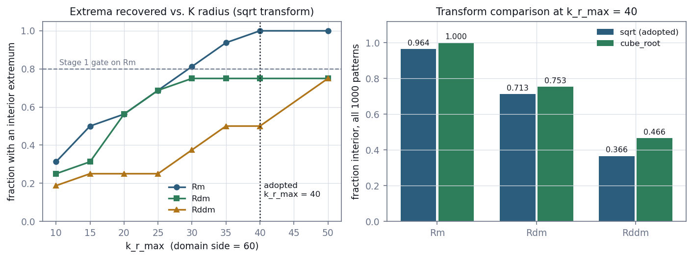
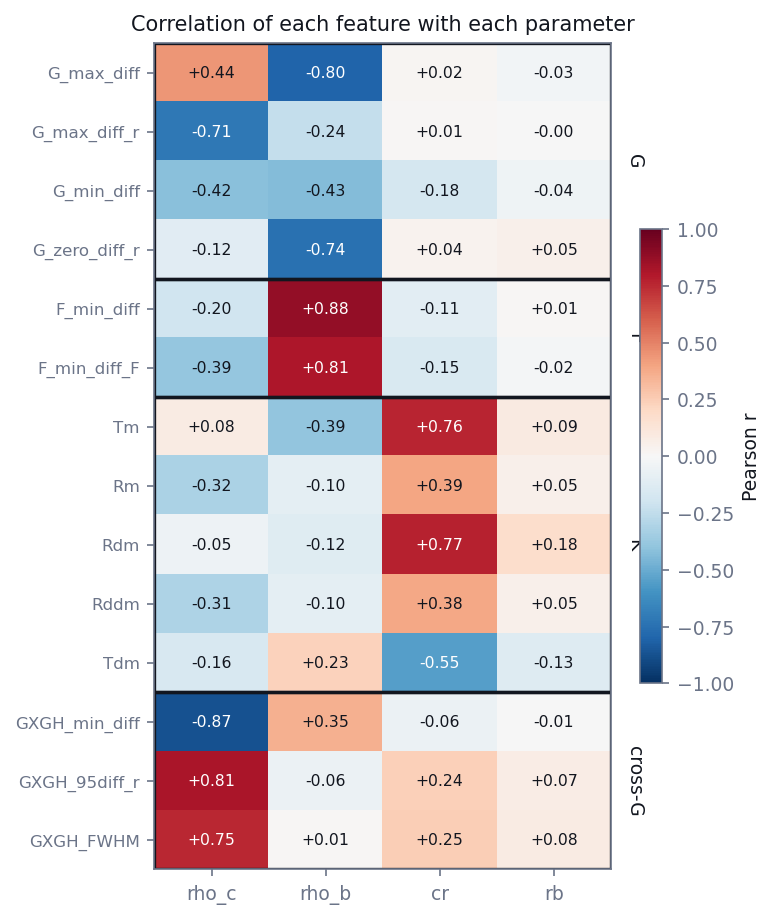

# E2 — Feature extraction and screening

*Computing the 14 spatial-summary features for every pattern, a boundary defect
in the Python port that made two thirds of the K features artefacts, and a screen
establishing which parameters are recoverable at all.*

[← back to README_detailed](../../README_detailed.md#7-experiment-walkthroughs) ·
Implemented by [`experiments/inference/extract_features.py`](../../experiments/inference/extract_features.py),
[`experiments/inference/screen_features.py`](../../experiments/inference/screen_features.py) ·
Runtime 7.6 min + 20 s

> **Correction (ROADMAP §8.9).** The defect described here was introduced by the
> Python port. It is not a property of the published method. rapt, the reference
> implementation for Bennett, Proudian & Zimmerman (2023), returns `NA` when a
> *K* difference curve has no peak and drops that pattern from training. The port
> replaced the `NA` with a grid endpoint. The measurements below describe the port
> and stand. `feature_method="rapt"`, now the default, reproduces rapt exactly,
> and `--preset stage1` reproduces the pipeline used here.

---

## Abstract

The 14 Bennett et al. global features are computed for all 1,000 patterns and
cached with their configuration, so that downstream stages never touch a point
cloud. The extraction is gated on the features being finite and — more
importantly — on the *K*-derived radius features being genuine measurements
rather than grid endpoints.

That second gate exists because of a defect found while preparing this stage. The
feature extractor returns a radius drawn from a grid; when the difference curve
has no interior extremum, the port's peak finder falls back to `argmax` and
returns the first or last grid point *as though it were a measurement*. (rapt
returns `NA` here instead.) At the library's
original radius setting only 4 of 12 patterns produced a genuine interior
extremum, so roughly two thirds of the *K* features were artefacts.

Raising the *K* radius from 10 to 40 domain units takes the interior rate for the
principal feature from 5/16 to 16/16. With the corrected settings the gate passes:
100% of patterns yield finite features and 96.4% have a genuine interior `Rm`.

A ridge screen over 25 random splits then establishes that three of the four
parameters are strongly recoverable from these features (R² 0.84–0.96) and the
fourth is not (0.112 ± 0.045) — the latter narrowly violating a prediction
registered in E1.

---

## 1. Introduction

Every downstream stage consumes a fourteen-dimensional feature vector, one per
pattern. This stage produces it, and answers a prior question: do these features
carry information about the parameters at all?

That question is worth settling cheaply before committing to a density
estimator. Ridge regression gives only a point estimate — none of the posterior
shape or calibrated uncertainty that motivates the whole approach — but it is a
valid lower bound. A parameter that ridge cannot predict will not be rescued by a
more flexible model; it either has no signal in these 14 numbers or none in the
point pattern.

---

## 2. Background: how a radius feature can be a fabrication

Five of the fourteen features derive from the *K* function: `Tm`, `Rm`, `Rdm`,
`Rddm`, `Tdm`. Three of them are *radii* — the location of a peak in the smoothed
difference curve, or in its derivatives.

`_extract_k_features` locates these by finding local maxima of a LOESS-smoothed
curve. When no local maximum exists inside the search window — because the curve
is still rising at the maximum radius — the code falls back to `np.argmax`, which
returns the index of the largest value. For a monotonically rising curve, that is
the **last grid point**.

The function then returns `radii[index]`, which is the grid maximum. Nothing in
the return value distinguishes "the peak is at r = 40" from "there is no peak and
40 is where the grid stopped".

This fallback is not in rapt. rapt's `k3features` returns `NA` when no maximum
exists, and its training script discards incomplete rows with `complete.cases`.
Against rapt on 60 patterns, the legacy port invented a value in every one of the
17 cases where rapt reports no `Rm`, and in all 40 where it reports no `Rdm`.

Under the `sqrt` transform this interacts badly with the radius setting. Because
`sqrt(K_csr)` grows as r^1.5 rather than r, difference curves keep rising further
out and their extrema sit at larger radii than they otherwise would. A small
`k_r_max` therefore guarantees the fallback fires.

---

## 3. Methods

### 3.1 Configuration

| Setting | Value | Rationale |
| --- | --- | --- |
| Null model | `csr` | closed form; 4× cheaper than relabelling, near-identical features |
| K transform | `sqrt` | matches the published feature definitions |
| `k_r_max` | **40.0** | set from the physical cluster scale; see §4.1 |
| `k_num_radii` | 801 | |
| `g_r_max` / `cross_g_r_max` | 10.0 / 8.0 | |
| `k_max_points` | 3000 | caps the pair enumeration for large-radius K |
| Guest marks | 2, 3 | |

The choice of the analytic CSR null rather than random relabelling deserves a
note. The observed-minus-expected framing exists to test a hypothesis against a
null; a posterior estimator needs only a deterministic statistic of the point
cloud. Measured on pattern 1, the CSR null costs 1.61 s per pattern against 6.23 s
for five relabellings, and the resulting features agree closely (`G_max_diff`
0.4425 against 0.4444; `F_min_diff` −0.3808 against −0.3812). The expensive Monte
Carlo is therefore off the critical path.

### 3.2 The radius scan

The interior-extremum rate was measured across a range of `k_r_max` by computing
a single fine-grid *K* curve per pattern and truncating it. Truncation is exact:
*K*(r) is a cumulative sum over pairs and does not depend on the grid maximum, so
a truncated grid gives identical values at the radii retained.

### 3.3 The gate

- at least **95%** of patterns yield 14 finite features
- at least **80%** have a genuinely interior `Rm`

`Rdm` and `Rddm` are reported but not gated. `Rddm` is known to be weak and
should not block the pipeline.

A pattern that fails is recorded with NaNs and its error text rather than
dropped; silently omitting failures would bias the training set.

### 3.4 The screen

Ridge regression, linear and quadratic in the standardised features, over **25
random 800/200 splits**. Repeated splits are necessary: a single 200-pattern
holdout gives an R² that moves by more than 0.1 between partitions, which is
larger than the effect being tested for.

---

## 4. Results

### 4.1 The radius scan



**Figure 1.** Left: fraction of 16 patterns with a genuine interior extremum,
against `k_r_max`, under the adopted `sqrt` transform. At the library default of
10 the principal radius feature `Rm` is a measurement in fewer than a third of
patterns. Right: the two transforms compared at the adopted radius over all 1,000
patterns.

**Table 1.** Interior-extremum rate by radius, 16 patterns, `sqrt` transform.

| `k_r_max` | r / L | `Rm` | `Rdm` | `Rddm` |
| ---: | ---: | ---: | ---: | ---: |
| 10 *(library default)* | 0.17 | 5/16 | 4/16 | 3/16 |
| 15 | 0.25 | 8/16 | 5/16 | 4/16 |
| 20 | 0.33 | 9/16 | 9/16 | 4/16 |
| 25 | 0.42 | 11/16 | 11/16 | 4/16 |
| 30 | 0.50 | 13/16 | 12/16 | 6/16 |
| **40** | **0.67** | **16/16** | 12/16 | 8/16 |
| 50 | 0.83 | 16/16 | 12/16 | 12/16 |

### 4.2 Raising the radius costs nothing in feature quality

A naive reading suggests large radii are harmful: over whichever patterns happen
to be interior, the correlation between `Rm` and the true cluster radius falls
from 0.954 at `k_r_max` = 25 to 0.671 at 40.

That is **selection bias, not degradation**. Restricting to the 13 of 24 patterns
that have an interior `Rm` at *every* setting, the correlation is identical to
three decimal places throughout:

**Table 2.** The apparent degradation is entirely selection.

| `k_r_max` | n interior | corr over interior patterns | corr over the common subset |
| ---: | ---: | ---: | ---: |
| 15 | 13/24 | 0.864 | **0.863** |
| 20 | 15/24 | 0.918 | **0.863** |
| 25 | 17/24 | 0.954 | **0.863** |
| 30 | 20/24 | 0.724 | **0.863** |
| 40 | 24/24 | 0.671 | **0.863** |

The common subset spans `cr` from 3.2 to 9.3 only. Small-cluster patterns reach an
interior extremum at small radii; large-cluster patterns need a large one. Raising
`k_r_max` admits the harder large-`cr` patterns, lowering the pooled correlation
while leaving every individual feature exactly as good. The 0.671 figure is the
more honest number, measured over a wider and harder set.

One caveat, found later at full scale: raising the radius does not strictly
dominate. The 36 patterns that fail the interior check at `k_r_max` = 40 are the
*small*-`cr` ones (mean `cr` 5.69 against 9.03 for the rest), because under `sqrt`
a small cluster's peak is a minor bump on a curve growing as r^1.5. Forty is a good
compromise at 96.4%, not an optimum; a per-pattern adaptive radius would do better.

### 4.3 The gate

**Table 3.** Stage gate, all 1,000 patterns, `k_r_max` = 40.

| Criterion | Threshold | Measured | |
| --- | ---: | ---: | --- |
| 14 finite features | ≥ 95% | **100.0%** (1000/1000) | pass |
| interior `Rm` | ≥ 80% | **96.4%** (964/1000) | pass |
| interior `Rdm` | not gated | 71.3% (713/1000) | |
| interior `Rddm` | not gated | 36.6% (366/1000) | |
| patterns errored | — | 0 | |

Wall clock 7.6 minutes across 7 worker processes, 3.15 s of CPU per pattern, a
6.9× speedup. **GATE PASSED.**

`Rddm` reaching an interior extremum in only 37% of patterns confirms it as the
weakest channel; E5 takes up whether it contributes anything.

### 4.4 Which feature carries which parameter



**Figure 2.** Correlation of each feature with each parameter, over all 1,000
patterns, with the four summary-function families bracketed. The block structure
is the result: each parameter is picked up by one family.

### 4.5 The screen

**Table 4.** Ridge R² on held-out patterns, 25 random 800/200 splits.

| Parameter | linear | quadratic | best R² | contraction | carried by |
| --- | ---: | ---: | ---: | ---: | --- |
| `rho_c` | 0.942 | 0.950 | **0.964 ± 0.037** | 0.803 | `GXGH_min_diff` −0.87, `GXGH_95diff_r` +0.81 |
| `rho_b` | 0.867 | 0.880 | **0.925 ± 0.061** | 0.707 | `F_min_diff` +0.88, `F_min_diff_F` +0.81 |
| `cr` | 0.785 | 0.840 | **0.843 ± 0.025** | 0.608 | `Rdm` +0.77, `Tm` +0.76 |
| `rb` | 0.081 | 0.055 | 0.112 ± 0.045 | 0.047 | `Rdm` +0.18, little else |

Three of four parameters are strongly recoverable. The **five K-derived features
are the only ones carrying `cr` at all**, which is a concrete argument for keeping
them despite §2's defect — and makes the radius correction the thing that made
cluster size inferable, rather than housekeeping.

### 4.6 A registered prediction, violated

E1 registered `rb` as uninformative, operationalised as R² ≤ 0.10. The measured
value is **0.112 ± 0.045**, positive on all 25 splits (range +0.01 to +0.18).

The ceiling was not moved. The substantive expectation survives — contraction is
0.047, so a calibrated `rb` posterior should be about 95% as wide as its prior —
but the strict claim that `rb` carries *no* information was too strong. It carries
a little, apparently through `Rdm`, which is plausible since radius spread should
affect the shape of the *K* derivative rather than its peak location.

---

## 5. Discussion

### 5.1 Why the defect matters beyond this stage

The three radius-valued *K* features were, at the library's original settings,
grid endpoints for the majority of patterns. This is the most likely explanation
for a result in the neural field track (E9): `Tm`, `Rm`, `Rdm`, `Rddm` and `Tdm`
scored 0.53–0.72 on an interpolation test while the *G*, *F* and cross-*G*
features scored 0.90–0.98.

Interpolating a boundary artefact cannot succeed, because the quantity is not a
smooth function of position. A feature that is `k_r_max` wherever the curve
happens to be monotone is piecewise constant with arbitrary jumps.

`PaperFeatureResult` and `LocalPaperFeatureResult` now carry
`k_extrema_interior`, a boolean triple, so the failure is visible rather than
silent, and Stage 1 gates on it.

### 5.2 The screen sets expectations the model must meet

The screen is not a preliminary version of the posterior; it answers a different
question and answers it more cheaply. Its role is to establish, before any density
estimator is fitted, which parameters *could* be recovered. E4 can then be read
against it: a flow that sharply determined `rb` would be suspect, not impressive.

### 5.3 A methodological note

The first version of this screen used a single 800/200 split. It gave `rb` an R²
of −0.019; the scripted version, with a different partition of the same seed, gave
+0.124. That spread is larger than the effect being tested, so a binary verdict
on one split was meaningless. The screen now reports a distribution over 25
splits.

---

## 6. Conclusion

The features are computed, cached and gated. A defect in the Python port that made
two thirds of the *K*-derived features artefacts was found and worked around by
setting the *K* radius from the physical cluster scale rather than accepting a
default, and the failure mode is now reported rather than silent. A later
comparison with rapt showed that the defect was introduced in porting, and the
extraction now reproduces rapt instead (ROADMAP §8.9).

Three of four parameters are strongly recoverable. The fourth is not, narrowly
violating a prediction registered in advance, and that violation is recorded
rather than accommodated.

---

## Outputs

| File | Contents |
| --- | --- |
| `experiments/inference/features/global_features.npz` | (1000, 14) features, validity flags, config signature |
| `experiments/inference/features/global_features.json` | configuration, timings, gate result |
| `experiments/inference/features/screen.json` | ridge screen scores over 25 splits |

## Reproduce

```bash
python -m experiments.inference.extract_features --workers 7
python -m experiments.inference.screen_features --output-json experiments/inference/features/screen.json
```

Tests: `tests/test_extract_features.py` — 23 tests, weighted toward the gate.
Each threshold is checked from both sides, at its exact boundary, and against
`inf` as well as `NaN`. A gate that cannot fail is worse than no gate.
