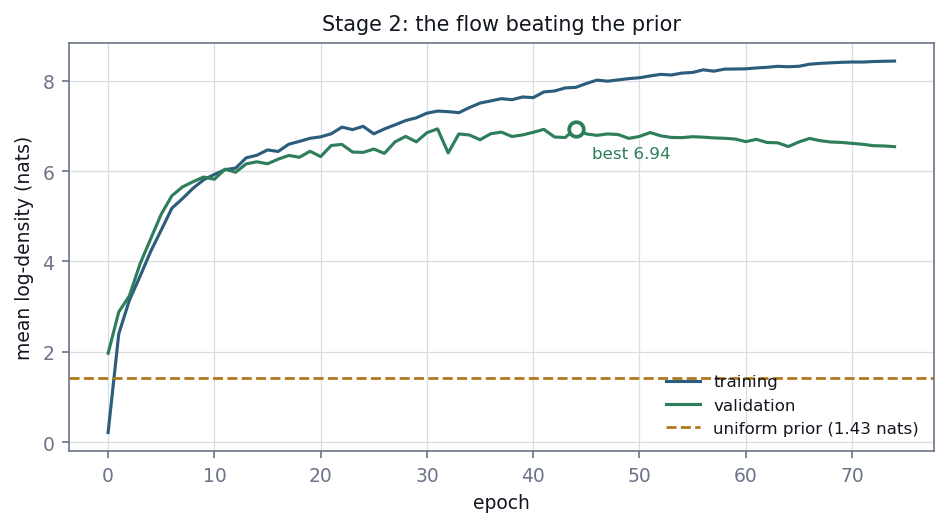

# E3 — Posterior estimation

*A conditional normalising flow, verified against a closed-form posterior, fitted
to 1,000 simulated parameter–observation pairs.*

[← back to README_detailed](../../README_detailed.md#7-experiment-walkthroughs) ·
Implemented by [`inference/flow.py`](../../inference/flow.py),
[`inference/fit_posterior.py`](../../inference/fit_posterior.py) ·
Runtime 7 s

---

## Abstract

A conditional autoregressive normalising flow is fitted by maximum likelihood to
the (θ, features) pairs. Because the pairs are drawn from the joint distribution
p(θ)p(x|θ), the minimiser of the training loss is the true posterior p(θ|s).

The flow was written directly rather than imported. A dry run confirmed the
obvious dependency would not force a version downgrade, so the deciding argument
was not dependency risk but verifiability: a four-dimensional flow is small enough
to check against a problem whose posterior is known in closed form, which is
stronger evidence than trusting an unverified package. On a conjugate Gaussian
problem the trained flow reproduces the analytic posterior mean and standard
deviation; separately, its density is numerically integrated over a box to confirm
it is a density rather than merely a score.

The gate passes: validation log-likelihood 6.939 nats against a uniform prior of
1.427. Contraction confirms the E2 screen, including `rb` at 0.039 — a posterior
96% as wide as its prior, matching a prediction registered before any model was
fitted.

A single structural outlier dominates the test-set *mean* log-likelihood, moving
it from a median of 7.400 to a mean of −187.576. The cause is identified rather
than averaged away.

---

## 1. Introduction

The forward map from parameters to point pattern has no tractable likelihood, so
the posterior cannot be written down. Neural posterior estimation sidesteps this
by learning the posterior directly from joint samples.

The construction rests on one fact. Given pairs drawn from p(θ)p(x|θ), fitting a
conditional density estimator q_φ(θ|s) by maximum likelihood,

> minimise over φ:  −Σᵢ log q_φ(θᵢ | sᵢ)

has as its minimiser the true posterior p(θ|s). This is not an approximation of a
different quantity. It is Bayesian inference recast as conditional density
estimation over samples already in hand.

The estimator is *amortised*: training happens once, and inference on a new
pattern is a single forward pass. The alternative — per-dataset MCMC — requires a
likelihood that does not exist here.

---

## 2. Methods

### 2.1 Architecture

Each layer applies an autoregressive affine transform. For dimension *i*, a small
network reads the conditioning features and the *preceding* dimensions and emits a
shift and a log-scale:

```
z_i = (w_i − shift_i(context, w_<i)) · exp(−log_scale_i(context, w_<i))
```

The transform is triangular, so its Jacobian determinant is the product of the
scales. Density evaluation is one parallel pass; sampling inverts one dimension at
a time. Dimensions are reversed between layers so every dimension conditions on
every other somewhere in the stack.

With only four dimensions there is no need for MADE-style masking: one small
network per (layer, dimension) is more explicit and easier to verify. The fitted
configuration is 6 layers of width 64.

Log-scales are bounded by a scaled `tanh`, so a diverging scale cannot produce
`inf` or `nan` mid-training. Output layers are zero-initialised, so the transform
begins as the identity and training does not open by undoing random scales.

### 2.2 Respecting the prior support

The prior is uniform on a box, so the posterior is too. The flow works in an
unconstrained space reached by

```
u = (θ − low) / (high − low) ∈ (0, 1),    w = logit(u)
```

and samples map back through a sigmoid. **Every sample therefore lands inside the
prior box by construction**, rather than by rejection, which would bias the
posterior.

The change of variables contributes a Jacobian term,

```
log p(θ|s) = log q(w|s) − log(high − low) − log u − log(1 − u)
```

included so the reported log-density is a genuine density over θ and comparable
against the uniform prior. Without it the comparison against the prior would be
meaningless.

### 2.3 Splitting and standardisation

800 train / 100 validation / 100 test, split by pattern index. Features are
standardised using **training statistics only**; using all of them would leak
held-out information into the input scaling.

### 2.4 Training

Adam at 1e-3, batch size 128, up to 500 epochs, early stopping on validation
log-likelihood with patience 30, gradient norm clipped at 5. The best validation
checkpoint is kept, so the reported figure is not the one being optimised directly
against.

### 2.5 The gate

Validation log-likelihood must beat the uniform prior. A flow that cannot has
learned nothing, which would be a genuine and reportable negative result about the
14 features rather than a bug.

---

## 3. Verification of the estimator

The flow is custom code, so the burden of proof sits with its tests. Three things
must hold, in increasing order of importance.

### 3.1 Exact invertibility

Sampling and density evaluation must describe the same distribution. A randomised
layer is pushed forward and inverted, recovering the input to 1e-5. The full stack
is pushed through the density path by hand and inverted with the sampler's own
logic, confirming the inter-layer permutations unwind in the right order. The
analytic log-Jacobian is checked against the one `torch.autograd` computes.

### 3.2 It is a density

`log_prob` is numerically integrated over a two-dimensional box on a 220 × 220
grid, giving **1.00 ± 0.02**. Without this the log-density could be any score, and
the comparison against the prior would carry no meaning.

### 3.3 It learns the right distribution

The decisive test. For θ ~ N(0,1) and s|θ ~ N(θ, σ²), the posterior is analytic:

```
θ | s ~ N( s/(1+σ²),  σ²/(1+σ²) )
```

A flow trained on samples from that joint reproduces the analytic mean and
standard deviation at three probe values, to within 0.08. A separate test
confirms it learns a *context-dependent* width, which a single global scale could
not represent.

A flow can be perfectly invertible and correctly normalised while learning the
wrong distribution; only this catches that.

Two complementary tests bracket the gate itself: on a learnable relationship the
fit must beat the prior, and on pure noise it must **not**.

---

## 4. Results

### 4.1 The gate



**Figure 1.** Training and validation log-density against the uniform prior
baseline. Early stopping at epoch 74, best validation checkpoint at epoch 50.

**Table 1.** Stage gate.

| Quantity | Value |
| --- | ---: |
| Uniform prior log density | 1.427 nats |
| **Validation log-likelihood** | **6.939 nats** |
| Gain over prior | **+5.512 nats** |
| Epochs run | 75 |
| Training time | 7.4 s |

**GATE PASSED.**

### 4.2 Per-parameter marginals

**Table 2.** Test-set marginals, 100 held-out patterns, 2,000 posterior draws each.

| Parameter | Prior sd | Posterior sd | Contraction | Bias |
| --- | ---: | ---: | ---: | ---: |
| `rho_c` | 0.2309 | 0.0311 | 0.865 | −0.0026 |
| `rho_b` | 0.0144 | 0.0014 | 0.901 | +0.0002 |
| `cr` | 3.4641 | 1.2165 | 0.649 | +0.0223 |
| `rb` | 0.1443 | 0.1387 | **0.039** | +0.0030 |

### 4.3 `rb` confirms a registered prediction

E1 predicted, before any model existed, that `rb`'s posterior should "come back
close to its prior"; E2 quantified the expectation at 95% of prior width from a
contraction of 0.047.

The fitted posterior is **96% as wide as the prior** (contraction 0.039). The flow
reports that the data do not constrain `rb`, which is the behaviour a calibrated
posterior must have and the thing a point estimate cannot express at all.

### 4.4 One pattern dominates the mean

**Table 3.** Held-out test-set log-likelihood, never used for stopping or
selection.

| Statistic | Value |
| --- | ---: |
| Median | **7.400 nats** |
| Mean | **−187.576 nats** |
| Mean excluding one pattern | 6.581 nats |
| Patterns below the prior | 6 / 100 |

The entire gap is **pattern 613**, at −19,409 nats.

Pattern 613 has **zero clusters** — one of only two such patterns in the 1,000
(E1 §3.4) — and it landed in the test set. Its true parameters say `cr` = 12.27
and `rho_c` = 0.988, large dense clusters, while the realised pattern contains
none, so its features read as complete spatial randomness.

Its feature vector is *not* an outlier in the ordinary sense: its most extreme
channel is 3.9 training standard deviations against a dataset 99th percentile of
4.2. It is a **structural** outlier, and the flow saw exactly one example of that
structure during training.

---

## 5. Discussion

### 5.1 The mean was not replaced with the median

A log-density of −19,409 means the model assigned an essentially impossible
density to something that actually happened. Averaging that away would be
precisely the kind of statistic-shopping this project has tried to avoid
elsewhere. Both figures are reported, with the cause named.

The gate is on *validation* log-likelihood, as registered. The test-set mean is
reported alongside because validation was used for early stopping and is therefore
optimistic — the stricter number belongs in the record whether or not it agrees.

### 5.2 What pattern 613 is evidence of

A pattern with no clusters carries no information about cluster radius, so an
honest posterior should widen toward the prior there. Instead the flow is
confidently wrong. That is exactly the overconfidence failure E4 exists to detect,
and it duly appears in the coverage numbers.

It is also direct evidence for the sample-size limitation: rare regions of the
joint distribution are unrepresented at n = 1,000, and no amount of architecture
tuning fixes an unseen structure.

### 5.3 A correction to the implementation

The gate was registered on *validation* log-likelihood; the first implementation
checked *test*. That is stricter than what was registered, and it reported a
failure the registered criterion would have passed. Both are now reported, with
the registered one governing.

### 5.4 On writing the flow

A dry run showed the obvious dependency would install cleanly against the existing
torch version, so dependency risk was not the deciding factor. Verifiability was.
The tests in §3 — particularly the closed-form posterior recovery — are stronger
evidence of correctness than the provenance of a package, and they took less time
than auditing one would have.

---

## 6. Conclusion

The flow beats the uniform prior by 5.5 nats on held-out data, and its estimator
is verified against a closed-form posterior rather than assumed correct. Three
parameters contract sharply; the fourth contracts by 4%, confirming a prediction
registered before the model existed.

What this stage does **not** establish is whether the posterior is *calibrated*. A
model can beat the prior handsomely and remain systematically overconfident. That
is E4, and it is the gate that matters.

---

## Outputs

| File | Contents |
| --- | --- |
| `inference/posterior/flow.pt` | fitted flow, scaler, architecture |
| `inference/posterior/test_posterior.npz` | test-set posterior samples and split indices |
| `inference/posterior/fit_metadata.json` | gate, marginals, timings |
| `inference/posterior/training_history.csv` | per-epoch log-density |

## Reproduce

```bash
PYTHONPATH=. python inference/fit_posterior.py
```

Tests: `tests/test_flow.py` — 16 tests covering invertibility, log-Jacobian
against autograd, numerical normalisation, prior-support enforcement, closed-form
posterior recovery, context-dependent width, and split disjointness.
