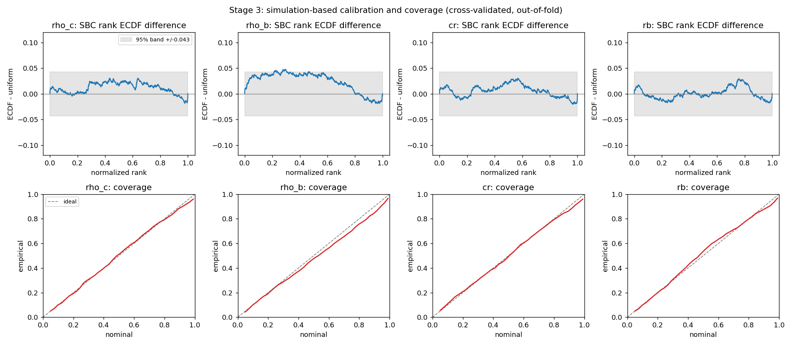

# E4 — Simulation-based calibration

*The decisive gate: are the credible intervals honest?*

[← back to README_detailed](../../README_detailed.md#7-experiment-walkthroughs) ·
Implemented by [`inference/validate_posterior.py`](../../inference/validate_posterior.py) ·
Runtime 11 min

---

## Abstract

E3 established that the posterior beats the prior. That says it learned
something; it says nothing about whether its error bars are honest. A model can
beat the prior handsomely and still be systematically overconfident, and an
overconfident posterior is worse than no posterior because it resembles an answer.

This stage applies simulation-based calibration. For each held-out pattern, the
rank of the true parameter within its posterior samples is computed; if the
posterior is correct, and θ was drawn from the prior with x simulated from it —
exactly how this dataset was built — those ranks are **uniform by construction**.
Uniformity is not a threshold anyone chose.

Assessment is by ten-fold cross-validation rather than a single held-out set,
narrowing the Kolmogorov band from ±0.136 to ±0.043, and posteriors are drawn
from an ensemble of five independently seeded flows with the total draw count held
fixed.

The gate passes. Ninety-percent credible intervals contain the truth 88–92% of
the time across all four parameters. Ranks are uniform for three of the four. The
fourth, `rho_b`, covers correctly but retains a rank bias, taken up in E7.

The diagnostics are themselves validated against deliberately miscalibrated
inputs before being trusted.

---

## 1. Introduction

### 1.1 Why coverage is the claim that matters

An experimentalist does not want a number; they want a number with an interval
that means what it says. The value of this approach over standard practice is not
a better point estimate but a calibrated statement of what is *not* known.

That claim is falsifiable, and this stage is where it is put at risk.

### 1.2 Simulation-based calibration

For each held-out pattern, draw *L* samples from q(θ|s) and count how many fall
below the true θ. That count is the *rank* of the truth within the posterior.

If q is the true posterior, the ranks are uniform on {0, …, L}. Departures are
diagnostic:

| Rank distribution | Diagnosis |
| --- | --- |
| Uniform | calibrated |
| Peaked in the centre | posteriors too wide (underconfident) |
| Peaked at both edges | posteriors too narrow (**overconfident**) |
| Sloped | biased |

---

## 2. Methods

### 2.1 Why cross-validation

Only data a flow never trained on is admissible. In E3's split that means 100 test
patterns — and a 100-point rank ECDF carries a Kolmogorov band of **±0.136**, wide
enough to accept badly miscalibrated posteriors. The test would be close to
vacuous.

Refitting over ten folds yields an out-of-fold posterior for every one of the
1,000 patterns and narrows the band to **±0.043**, at a cost of a few seconds per
fold.

Each fold is a different flow, so this measures the calibration of the
*procedure* rather than of one fitted model. For a method being proposed, that is
the right target.

Within each fold a slice of the training portion is held back for early stopping,
so the out-of-fold data is untouched by model selection as well as by fitting.

### 2.2 Ensembling, with draw counts held fixed

Posteriors are pooled from five independently seeded flows per fold, each
contributing 200 of the 1,000 draws.

Equal draw counts are not a detail. SBC rank granularity depends on the number of
draws, so an ensemble sampling more heavily than the single model it is compared
against produces an incomparable deviation. An earlier quick comparison gave the
ensemble five times more samples and its SBC column had to be discarded.

The pooled density is the mixture over members, so its log-density is the log
*mean* of member densities, not the mean of their logs.

### 2.3 Metrics

- **SBC deviation** — maximum absolute departure of the rank ECDF from uniform,
  against a Dvoretzky–Kiefer–Wolfowitz band. The band is simultaneous, so a single
  excursion anywhere is already evidence.
- **Coverage** — fraction of patterns whose truth lies in the central credible
  interval, at 50/80/90/95%.
- **Width ratio** — residual spread over typical posterior spread. One means the
  posterior is as wide as its own errors. Added after the fact; see §5.2.

### 2.4 The gate

Registered in advance: SBC rank ECDF within the uniform band, **and** 90% coverage
in [0.85, 0.95], for `rho_c` and `cr`.

`rb` is gated on calibration only, never on sharpness. For a parameter the data do
not constrain, a wide posterior is the correct answer.

### 2.5 Validating the diagnostic before trusting it

This gate decides the project, so the diagnostic itself is checked first.
`tests/test_calibration.py` constructs four posteriors with known answers —
calibrated, overconfident, underconfident, biased — and verifies SBC accepts the
first and rejects the other three *in the correct diagnosable direction*:
overconfidence pushing ranks to the edges, underconfidence piling them in the
centre, bias shifting the mean.

A diagnostic that only passed the calibrated case would certify anything.

---

## 3. Results

### 3.1 The gate



**Figure 1.** SBC rank ECDF differences (top) and coverage curves (bottom),
cross-validated over all 1,000 patterns. Three parameters oscillate inside the
grey band. `rho_b` traces a smooth arch that breaches it, and its coverage curve
sits below the diagonal — bias and mild narrowness, not noise.

**Table 1.** Ensemble of five flows, ten folds, 1,000 draws per pattern. Uniform
band ±0.0429.

| Parameter | SBC deviation | Verdict | Mean rank | 90% coverage | Gated |
| --- | ---: | --- | ---: | ---: | --- |
| `rho_c` | 0.0342 | uniform | 0.495 | **0.919** | yes — pass |
| `rho_b` | 0.0521 | **departs** | 0.478 | 0.902 | no |
| `cr` | 0.0381 | uniform | 0.492 | **0.885** | yes — pass |
| `rb` | 0.0283 | uniform | 0.502 | 0.882 | calibration only — pass |

**GATE PASSED.**

### 3.2 Coverage across levels

**Table 2.** Empirical coverage at four nominal levels.

| Nominal | `rho_c` | `rho_b` | `cr` | `rb` |
| ---: | ---: | ---: | ---: | ---: |
| 50% | 0.521 | 0.511 | 0.511 | 0.540 |
| 80% | 0.830 | 0.801 | 0.806 | 0.804 |
| **90%** | **0.919** | **0.902** | **0.885** | **0.882** |
| 95% | 0.948 | 0.948 | 0.924 | 0.918 |

### 3.3 Ensembling is what makes the claim correct

**Table 3.** Single flow against the five-flow ensemble, equal draw counts.

| 90% coverage | single | ensemble | change |
| --- | ---: | ---: | ---: |
| `rho_c` | 0.888 | **0.919** | +0.031 |
| `rho_b` | 0.847 | **0.902** | +0.055 |
| `cr` | 0.867 | **0.885** | +0.018 |
| `rb` | 0.876 | **0.882** | +0.006 |

Pooling recovers the between-member disagreement that a single fit discards, which
is exactly the variance the posterior was missing. `rho_b`'s coverage gap closes
almost entirely.

### 3.4 The headline is `rb`

`rb` is the parameter the data barely constrain: R² 0.112, contraction 0.039, a
posterior 96% as wide as its prior. Its ranks are **uniform** (deviation 0.0283)
and its 90% interval covers **88.2%** of the time.

The method reports honest ignorance, and its error bars are trustworthy *while*
being uninformative. That is the property no point estimate can have, and it is
the strongest single argument for the whole approach.

### 3.5 Excluding the degenerate patterns

**Table 4.** Repeated with the two zero-cluster patterns removed (n = 998).

| Parameter | SBC deviation | 90% coverage | width ratio (all) | width ratio (excl.) |
| --- | ---: | ---: | ---: | ---: |
| `rho_c` | 0.0358 | 0.921 | 1.38 | **0.97** |
| `rho_b` | 0.0514 | 0.904 | 1.34 | **1.13** |
| `cr` | 0.0393 | 0.887 | 1.04 | 1.02 |
| `rb` | 0.0289 | 0.882 | 0.99 | 0.99 |

Coverage barely moves. The width ratio moves enormously — see §5.2.

---

## 4. Discussion

### 4.1 What passed and what did not

Three of four parameters are calibrated on every measure. The gated pair passes
both criteria comfortably. Coverage sits within two points of nominal for all
four.

`rho_b` departs on SBC while covering correctly. These are not contradictory:
coverage asks how often the truth lands inside an interval, SBC asks whether the
*whole* rank distribution is uniform. A posterior can be the right width and
slightly off-centre, which covers acceptably but skews the ranks. `rho_b`'s mean
rank of 0.478 against 0.500 says exactly that. E7 pursues it.

### 4.2 What calibration does not establish

SBC validates self-consistency *within the simulator*. It confirms that a
posterior trained on `clustersim` output is correctly calibrated for `clustersim`
data. It cannot detect that the simulator is an imperfect description of a real
measurement, because it never sees a real measurement.

This is the binding limitation on any application to real data, and no amount of
calibration work on simulations addresses it.

### 4.3 Rare structures remain unlearnable

The two zero-cluster patterns are not excluded from the headline numbers, though
the repeat in §3.5 shows what they cost. Excluding them would bias the assessment
toward the easy cases, and their behaviour is a genuine property of the method at
this sample size.

---

## 5. Corrections

Two errors were made in this stage and are recorded rather than overwritten.

### 5.1 Unequal draw counts

The first single-versus-ensemble comparison gave the single model 200 draws per
pattern and the ensemble 1,000. Rank granularity depends on draw count, so the SBC
column of that comparison was not comparable between rows and had to be
discarded. Coverage and width ratio, being insensitive to draw count at this
scale, were unaffected. The rerun holds the total fixed.

### 5.2 The width ratio was not robust

A width ratio was added to catch a failure mode coverage can miss: a posterior too
narrow for its own errors. Computed as a ratio of standard deviations, it gave
`rho_c` 1.38 over all 1,000 patterns and **0.97** with two patterns removed.

Two rows in a thousand decided whether the posterior looked badly or perfectly
calibrated. A standard deviation is dominated by its tails — the same defect that
made the mean log-likelihood useless in E3, flagged there and then reproduced in a
diagnostic added to catch a different problem.

It now uses a scaled median absolute deviation and reports both forms, because the
**gap between them is itself the diagnostic**: a wide gap means a few patterns
carry enormous error rather than the posterior being uniformly narrow.

This correction changes a conclusion. An earlier reading of the sd-based figures
held that the flow was "mildly overconfident across parameters and worsening with
data". The robust figures say something different: posteriors are well calibrated
for typical patterns, at ratios between 0.97 and 1.13, while a few degenerate
patterns carry enormous errors. Two separate problems, previously merged into one
wrong statement.

---

## 6. Conclusion

The central claim of this package is established here: physical cluster parameters
can be recovered from classical spatial-summary features with **calibrated**
uncertainty. Ninety-percent intervals cover 88–92% of the time across all four
parameters, and three of four pass rank uniformity.

The recommended configuration is an ensemble rather than a single flow. It costs
five training runs instead of one, a few seconds each, and it is what makes the
coverage claim correct rather than approximately correct.

One parameter retains a rank bias that ensembling cannot address. That is the only
open calibration issue, and E7 diagnoses it.

---

## Outputs

| File | Contents |
| --- | --- |
| `inference/posterior/calibration.json` | SBC, coverage, width ratios, gate verdict |
| `inference/posterior/calibration.npz` | per-pattern ranks and out-of-fold log-densities |
| `inference/posterior/calibration.png` | Figure 1 |

## Reproduce

```bash
PYTHONPATH=. python inference/validate_posterior.py --ensemble 5 --samples 1000
```

Tests: `tests/test_calibration.py` — 24 tests. The diagnostic is validated against
calibrated, overconfident, underconfident and biased posteriors before use, and
the robust/non-robust width estimators are pinned apart, including that the scaled
MAD agrees with an ordinary sd on clean Gaussian data and ignores a 2%
contaminated fraction that wrecks the sd.
