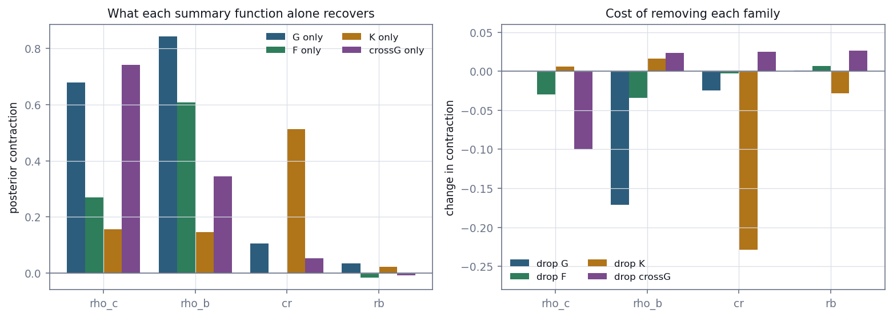

# E5 — Feature sufficiency

*Which summary function carries which parameter, measured by posterior
contraction rather than correlation.*

[← back to README_detailed](../../README_detailed.md#7-experiment-walkthroughs) ·
Implemented by [`inference/ablate_features.py`](../../inference/ablate_features.py) ·
Runtime 15 min

---

## Abstract

`walkthroughs/clustersim_todo.md` has carried the question "which features
capture the most information?" since before any of this work existed. Stages 2
and 3 make it answerable rather than a matter of intuition: refit the posterior on
a subset of features and measure how much the posterior contracts.

Contraction is a stronger instrument than correlation. Correlation asks whether a
feature moves *with* a parameter; contraction asks whether it reduces the
uncertainty remaining *after every other feature is accounted for*. A feature
perfectly correlated with a parameter but redundant with another contributes
nothing, and only the ablation shows that.

The result is unusually clean: **each parameter is carried by exactly one summary
function**. Dropping the *K* family costs the cluster radius 0.254 of contraction
while leaving the two concentration parameters untouched to within 0.01.

Two queued questions are also settled. The `sqrt` and `cube_root` *K* transforms
are indistinguishable in posterior quality despite `cube_root` recovering extrema
more reliably. `Rddm` remains unresolved: no evidence it contributes, some
evidence it is unstable.

---

## 1. Introduction

The fourteen features are a port of a published definition, adopted wholesale.
Nothing so far establishes that all fourteen earn their place, or which of them
does what.

Two specific questions were queued before this stage ran:

1. **Does `Rddm` contribute anything?** It reaches an interior extremum in only
   37% of patterns (E2 §4.3), making it the prime suspect for being noise.
2. **Does `cube_root` beat `sqrt`?** The three-dimensional variance-stabilising
   transform is the cube root, but the published definition uses `sqrt`. The
   argument had been made on theory twice and never measured.

---

## 2. Methods

### 2.1 Configurations

23 configurations, each fitted from **6 training seeds**:

- the full 14-feature baseline
- each of the four summary-function families in isolation
- each family dropped from the full set
- each of the 14 features dropped individually

**Table 1.** Family membership.

| Family | Features |
| --- | --- |
| G | `G_max_diff`, `G_max_diff_r`, `G_min_diff`, `G_zero_diff_r` |
| F | `F_min_diff`, `F_min_diff_F` |
| K | `Tm`, `Rm`, `Rdm`, `Rddm`, `Tdm` |
| cross-G | `GXGH_min_diff`, `GXGH_95diff_r`, `GXGH_FWHM` |

A test pins this partition: every feature belongs to exactly one family, and the
set is exactly the fourteen. If it drifted, the "drop family" rows would silently
stop meaning what they claim.

### 2.2 Metrics

**Median** held-out log-likelihood, not the mean. E3 showed a single structural
outlier moving the mean by 200 nats, which would swamp every ablation effect.

**Per-parameter contraction**, `1 − posterior sd / prior sd`, averaged over the
held-out set. E4 established this quantity is trustworthy, since the posteriors
are calibrated.

Multiple seeds are necessary: the seed-to-seed spread is comparable to the effect
being measured for the weaker features.

### 2.3 The transform comparison

Features were re-extracted for all 1,000 patterns with `k_transform="cube_root"`,
holding `k_r_max` at 40 so the transform is the **only** difference. Both feature
sets were then fitted with the same split and three seeds.

---

## 3. Results

### 3.1 One carrier per parameter



**Figure 1.** Left: posterior contraction achieved by each summary-function family
alone. Right: change in contraction when each family is removed from the full set.

**Table 2.** What each family alone recovers.

| Family alone | log-lik | `rho_c` | `rho_b` | `cr` | `rb` |
| --- | ---: | ---: | ---: | ---: | ---: |
| G | 5.464 | 0.680 | **0.850** | 0.113 | 0.045 |
| F | 3.530 | 0.277 | 0.608 | −0.006 | −0.024 |
| K | 3.496 | 0.190 | 0.170 | **0.525** | 0.026 |
| cross-G | 4.458 | **0.741** | 0.333 | 0.050 | −0.004 |

**Table 3.** Cost of removing each family (change from the 14-feature baseline;
negative means it mattered).

| Family dropped | `rho_c` | `rho_b` | `cr` | `rb` |
| --- | ---: | ---: | ---: | ---: |
| G | −0.004 | **−0.169** | −0.036 | −0.001 |
| F | −0.042 | −0.042 | −0.021 | −0.006 |
| K | −0.003 | +0.008 | **−0.254** | −0.042 |
| cross-G | **−0.120** | +0.016 | +0.008 | +0.011 |

The division of labour is clean and physically sensible:

- **guest-to-host cross-*G*** → in-cluster concentration `rho_c`
- **nearest-neighbour *G* and empty-space *F*** → matrix concentration `rho_b`
- **second-order *K*** → cluster length scale `cr`
- **nothing** → radius spread `rb`

Dropping *K* costs `cr` a quarter of its contraction while leaving `rho_c`
(−0.003) and `rho_b` (+0.008) untouched. That is as specific as an ablation gets.

### 3.2 The K features earn their place

This settles the status of the *K* features. Everything E2 records about their
boundary-pinning defect is true, **and they remain indispensable**: without them
cluster radius is not recoverable at all, at 0.113 from *G* and 0.050 from
cross-*G* against 0.525 from *K* alone.

The `k_r_max` correction was therefore not housekeeping. It is what made cluster
size inferable.

### 3.3 Independent confirmation of the screen

E2's ridge screen reached the same mapping by correlation. Correlation and
contraction ask different questions and need not have agreed; that they do is a
genuine consistency check rather than a restatement.

### 3.4 Leave-one-out resolves almost nothing, as expected

**Table 4.** Leave-one-out, paired by seed, 6 seeds.

| Dropped | Δ log-lik | ± se | Verdict |
| --- | ---: | ---: | --- |
| `GXGH_min_diff` | −0.334 | 0.070 | carries information |
| `F_min_diff` | −0.298 | 0.075 | carries information |
| `G_zero_diff_r` | −0.208 | 0.056 | carries information |
| `Rdm` | −0.103 | 0.057 | not resolved |
| `Rm` | −0.075 | 0.068 | not resolved |
| `G_min_diff` | −0.034 | 0.075 | not resolved |
| `G_max_diff` | +0.054 | 0.079 | not resolved |
| `Tm` | +0.074 | 0.097 | not resolved |
| `G_max_diff_r` | +0.109 | 0.114 | not resolved |
| `Tdm` | +0.111 | 0.092 | not resolved |
| **`Rddm`** | **+0.149** | **0.144** | **not resolved** |
| `GXGH_95diff_r` | +0.165 | 0.119 | not resolved |
| `F_min_diff_F` | +0.194 | 0.105 | not resolved |
| `GXGH_FWHM` | +0.194 | 0.145 | not resolved |

Only 3 of 14 resolve at two standard errors. This is expected rather than a
failure: the features are redundant, so removing any single one loses little.
**Leave-one-out is the wrong instrument for correlated inputs**; the family
ablation is the one that answers the question.

The three that do resolve are exactly the top correlates from E2 — a consistency
check, not a new finding.

### 3.5 `Rddm`: not resolved, and the noisiest feature

`Rddm` sits at **+0.149 ± 0.144**. The point estimate says dropping it helps
slightly; it cannot be distinguished from zero.

It is also the noisiest feature in the table — paired standard error 0.144 against
a median of 0.086 — which is itself consistent with it reaching an interior
extremum in only 37% of patterns.

A follow-up decomposed why. Restricted to patterns where `Rddm` *is* a genuine
measurement, its correlation with the true cluster radius is **+0.797** — the best
single predictor of `cr` in the entire feature set, better than `Rdm` (+0.772) and
far better than `Rm` (+0.486). Over all patterns it drops to +0.385, because when
invalid it tracks `Rm` at +0.996.

So `Rddm` is highly informative when real and redundant junk when not, and mixing
the two destroys the signal. The validity flag itself correlates −0.530 with `cr`.

An attempt to exploit this with a missing-data encoding — supplying the validity
flags as extra inputs — made things **worse** (−0.869 log-likelihood). A control
established why: at this sample size every additional input column costs ~0.09–0.18
nats regardless of content, and while the `Rddm` flag costs only half what a pure
noise column costs — so it genuinely carries information — it cannot pay for its
own dimension at n = 800.

The conclusion is to keep `Rddm`, not drop it. The evidence is unresolved, the
information is demonstrably present, and dropping a published feature definition
on a point estimate is a one-way door. The real fix is an adaptive per-pattern
`k_r_max` that makes it valid more often.

### 3.6 `sqrt` versus `cube_root`, measured at last

**Table 5.** Identical `k_r_max` = 40, same split, 3 seeds.

| | median log-lik | `rho_c` | `rho_b` | `cr` | `rb` |
| --- | ---: | ---: | ---: | ---: | ---: |
| `sqrt` (adopted) | 7.619 ± 0.277 | 0.867 | 0.900 | 0.649 | 0.058 |
| `cube_root` | 7.573 ± 0.065 | 0.857 | 0.892 | **0.679** | 0.028 |
| difference | −0.046 | −0.010 | −0.008 | +0.030 | −0.031 |

The log-likelihood difference is **0.2× the seed noise** — indistinguishable.

`cube_root` is mechanically better at recovering *K* extrema (interior `Rm`
1000/1000 against 964/1000; `Rddm` 466 against 366) and buys +0.030 on `cr`
contraction, but **that advantage does not reach the posterior**.

So retaining `sqrt` to match the published definition costs nothing measurable.
The argument is closed on evidence.

One unanticipated observation: `cube_root` trains four times more stably (seed sd
0.065 against 0.277). A plausible reading is that `sqrt`'s boundary-pinned *K*
features inject noise into training — a small practical argument for `cube_root`
that has nothing to do with variance-stabilisation theory, and was not predicted.

---

## 4. Discussion

### 4.1 The mapping is interpretable, which matters

The inference is not a black box over an undifferentiated feature vector. Each
parameter traces to one summary function with a physical rationale: guest-to-host
distances report how concentrated solute is inside precipitates; empty-space and
nearest-neighbour distances report how much solute is dissolved in between;
second-order structure reports the length scale.

That interpretability is worth as much as the accuracy for a method intended for
practitioners who already reason in terms of these functions.

### 4.2 `rb` has no carrier

No family recovers `rb` above 0.045. This is the third independent line of
evidence, after E1's correlation of +0.003 with realised mean radius and E2's R²
of 0.112, that the radius spread is essentially unidentifiable from these
features.

The posterior's handling of that is E4's headline result.

---

## 5. Corrections

Two methodological errors are recorded rather than quietly fixed.

### 5.1 The first ablation was underpowered

It used 3 seeds and resolved nothing: all 14 leave-one-out deltas sat inside the
seed-noise band. Reporting that would have licensed "no individual feature
matters" — a conclusion about the method's power masquerading as one about the
features.

### 5.2 Pairing did not do what was claimed

The stated remedy was to compare configurations *paired* by seed, on the reasoning
that they share training noise which would cancel.

Measured, pairing shrinks the standard error by only about **1.2×**, because
different feature subsets do not in fact train alike and the noise is not
common-mode. The resolution came from doubling the seed count, not from the
pairing.

Pairing also cannot move a point estimate at all — the mean of paired differences
is identically the difference of means — which an earlier version of the output
obscured by printing the two as separate columns.

---

## 6. Conclusion

Each parameter is carried by exactly one summary function, and the mapping is
physically interpretable. The *K* features, despite carrying a defect that made
two thirds of them artefacts before correction, are the sole carrier of cluster
length scale and cannot be dispensed with.

The `sqrt` transform costs nothing measurable against the theoretically preferred
`cube_root`, settling an argument that had been conducted on theory alone.
`Rddm` is unresolved and should be kept pending the adaptive-radius fix that would
make it valid more often.

---

## Outputs

| File | Contents |
| --- | --- |
| `inference/posterior/ablation_sqrt.json` | all 23 configurations, per-seed values |
| `inference/features/global_features_cube_root.json` | transform comparison extraction |

## Reproduce

```bash
PYTHONPATH=. python inference/ablate_features.py --label sqrt --seeds 6
PYTHONPATH=. python inference/extract_features.py --workers 7 \
    --k-transform cube_root \
    --output inference/features/global_features_cube_root.npz
```

Tests: `tests/test_ablation.py` — 6 tests, the important one checking the
ablation's core assumption. It plants a target determined by one feature and three
independent of it, and verifies fitting contracts the first and not the others.
Without it, a null result could mean "no information" or "method does not work",
and the two would be indistinguishable.
