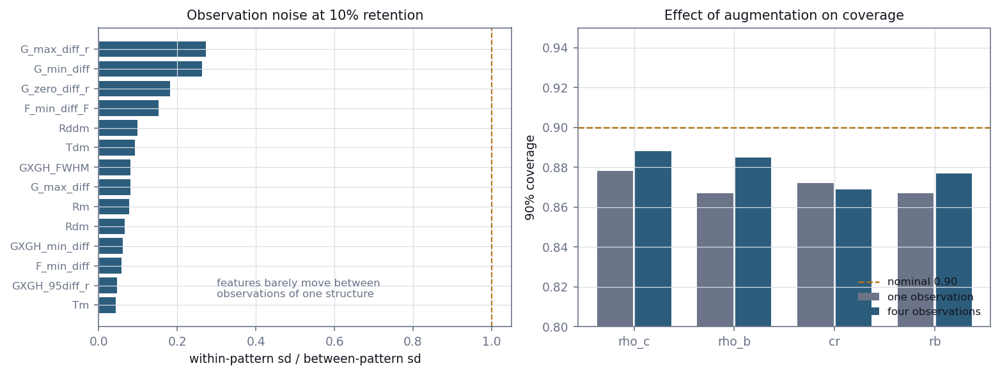

# E6 — Observation augmentation

*Re-observing each pattern by independent thinning: why it adds little, and the
robustness finding that came out of it.*

[← back to README_detailed](../../README_detailed.md#7-experiment-walkthroughs) ·
Implemented by [`experiments/inference/augment_features.py`](../../experiments/inference/augment_features.py),
[`experiments/inference/compare_augmentation.py`](../../experiments/inference/compare_augmentation.py) ·
Runtime 11 min + 12 min

---

## Abstract

Stages 2 through 4 all encountered sample-size limits. This experiment tests the
free remedy: instead of simulating new parameter draws, observe each existing
pattern several times by independently thinning its point cloud. Each thinning is
a genuine draw from p(s|θ), so the parameter is unchanged while the observation is
not — exactly the variability a posterior needs in order to be wide enough.

It adds little, and the reason was measurable before running it. Independent
observations of the *same* structure move the features by only 4–9% of the spread
between *different* structures. Even discarding 95% of the atoms, the summary
statistics barely change. The replicates are near-duplicates.

Quadrupling the training rows improved median held-out log-likelihood by 0.306 and
coverage slightly, but improved simulation-based calibration for only two of four
parameters.

The negative result carries a positive finding. These features are **insensitive
to detector efficiency across an order of magnitude**, which is directly relevant
to any future application to real measurements, where efficiency runs 37–80% and
varies between instruments. It also eliminates the most obvious explanation for
the one miscalibrated parameter, which E7 takes up.

---

## 1. Introduction

### 1.1 The motivation

Three separate limits pointed at sample size. E3 found a rare structure the flow
had one training example of. E4's calibration depends on how well the conditional
density is estimated. E5 left eleven of fourteen features unresolved for want of
statistical power.

Generating more patterns costs disk and time. Observation augmentation costs
neither: the patterns already exist, and observing each of them several times
multiplies the training rows for the price of recomputing features.

### 1.2 Why it is legitimate

The concern with augmentation is that it duplicates rows without adding
information. That is not the case here in principle. Each thinning is a genuine
draw from the observation distribution p(s|θ): the physical structure is fixed and
the measurement differs.

This teaches the flow how much the summary features move for a *fixed* structure,
which is precisely the variance a posterior must account for. E4 found the one
miscalibrated parameter to be mildly overconfident — a posterior too narrow for
its own observation noise — so this was the natural remedy to try.

### 1.3 It also models something physically real

An atom probe detects a fraction of the atoms that reach it. A measured point
cloud already *is* a thinned realisation of the underlying structure. Training on
thinned clouds is arguably closer to the real observation process than training on
the complete one.

---

## 2. Methods

### 2.1 Thinning

Independent Bernoulli thinning at a fixed retention rate, seeded per (pattern,
replicate) so the cache is reproducible. The library's own `thin_cluster` uses a
module-level generator and would not have been reproducible per replicate.

Four replicates per pattern at **10% retention** — about 21,600 points from
216,000. Ten percent matches the observation fraction used by the neural field
track (E9), and §3.1 explains why a more aggressive rate was chosen than the
physically motivated one.

### 2.2 The comparison

Two models differing *only* in how many observations per pattern the training set
contains:

| | training rows per fold |
| --- | ---: |
| **control** | one thinning per pattern — 810 |
| **augmented** | every thinning per pattern — 3,240 |

Both are scored on the **same** held-out observations. Comparing an augmented
model against the full-cloud features of E2 would confound augmentation with
thinning.

### 2.3 Two things that would fail silently

**Splitting is by `pattern_index`, never by row.** Replicates of one pattern share
a θ, so a row-wise split would put near-duplicates of training examples into the
held-out set and make every calibration number optimistic.

**SBC uses one replicate per held-out pattern.** Several ranks from the same θ are
not independent, and stacking them into a rank histogram would fake uniformity.

---

## 3. Results

### 3.1 The features barely notice being thinned

Measured before committing to the full run, on 12 patterns:

**Table 1.** Within-pattern feature spread as a fraction of between-pattern
spread, by retention rate.

| Retention | Points kept | Median ratio | Min | Max |
| ---: | ---: | ---: | ---: | ---: |
| 50% | 108,000 | **0.015** | 0.010 | 0.164 |
| 25% | 54,000 | 0.050 | 0.011 | 0.277 |
| 10% | 21,600 | 0.073 | 0.019 | 0.329 |
| 5% | 10,800 | 0.093 | 0.023 | 0.451 |

At the physically motivated 50% — a mid-range detector efficiency — independent
observations of the same structure move the features by **1.5%** of the
between-structure spread. Even at 5% retention the median only reaches 9%.

This predicted, before the full run, that augmentation would add little. The rate
was set to 10% to give the mechanism its best realistic shot.

### 3.2 The full extraction



**Figure 1.** Left: within-pattern spread per feature as a fraction of
between-pattern spread, at 10% retention over all 4,000 observations. Right:
coverage with one observation per pattern against four.

**Table 2.** Extraction, 1,000 patterns × 4 thinnings.

| Quantity | Value |
| --- | ---: |
| Feature evaluations | 4,000 |
| Mean points retained | 21,597 |
| 14 finite features | 100.0% |
| Interior `Rm` | 96.8% |
| Interior `Rddm` | 36.4% |
| Wall clock | 11.2 min |

The gate passes on thinned clouds as readily as on complete ones — itself part of
the robustness finding.

### 3.3 The comparison

**Table 3.** Control against augmented, ten folds each, same held-out
observations.

| | control | augmented | change |
| --- | ---: | ---: | ---: |
| Training rows per fold | 810 | 3,240 | 4.0× |
| Median held-out log-likelihood | 6.126 | **6.432** | +0.306 |

**Table 4.** Per-parameter effect.

| Parameter | SBC dev (ctrl) | SBC dev (aug) | Coverage (ctrl) | Coverage (aug) | Contraction (ctrl) | Contraction (aug) |
| --- | ---: | ---: | ---: | ---: | ---: | ---: |
| `rho_c` | 0.0325 | **0.0185** | 0.878 | 0.888 | 0.814 | 0.828 |
| `rho_b` | 0.0285 | 0.0535 | 0.867 | 0.885 | 0.808 | 0.815 |
| `cr` | 0.0205 | 0.0355 | 0.872 | 0.869 | 0.639 | 0.667 |
| `rb` | 0.0315 | **0.0225** | 0.867 | 0.877 | 0.065 | 0.085 |

SBC deviation improved for **2 of 4** parameters. Coverage and contraction
improved slightly for nearly all. The overall picture is a modest gain, not the
step change that more information would produce.

### 3.4 An unexpected result about `rho_b`

On the thinned control, `rho_b`'s SBC deviation is **0.0285 — inside the band**.
On the precise full-cloud features of E4 it is 0.0475, outside. Augmenting pushes
it to 0.0535.

Wide posteriors mask the defect; narrow ones expose it. On noisy thinned features
`rho_b` is calibrated because everything is wider; on precise features the
underlying problem becomes visible.

---

## 4. Discussion

### 4.1 Why augmentation could not have helped much

The mechanism depends on replicates differing. They barely do. At 10% retention
the median feature moves by 7% of the between-pattern spread, so four replicates
are close to four copies.

More importantly, this **eliminates the hypothesis that motivated the
experiment**. Augmentation was tried because `rho_b` looked overconfident — a
posterior too narrow for its own observation noise. If there is almost no
observation noise, then a narrow posterior is narrow *correctly*, and `rho_b`'s
miscalibration must come from somewhere else: the θ→s map itself, or model
misfit.

That is a useful negative result rather than a wasted run, and it set up E7.

### 4.2 Robustness to thinning is the finding worth keeping

The features are essentially unchanged when 90% of atoms are discarded. For a
technique where detector efficiency runs 37–80% and varies between instruments,
that insensitivity is exactly the property one would want.

It bears on the transfer problem identified as the binding limitation on real
data. Detector efficiency is one of the axes along which a real measurement
differs from this simulator, and along that axis the features appear robust. It
says nothing about the other axes — trajectory aberration, precipitate morphology
— but it removes one.

### 4.3 A consequence for storage

If the features survive 90% thinning, patterns need not be stored at full density.
A 10% subsample is roughly a tenth the size, which would make a ten-thousand
pattern dataset fit in the disk the current thousand occupies. This has not been
acted on, but it changes the feasibility of the scale-up in a way worth recording.

---

## 5. Conclusion

Observation augmentation adds little, and the mechanism was measured rather than
assumed: independent observations of one structure barely move the features, so
replicates are near-duplicates.

The experiment earns its place through two findings it was not designed to
produce. The features are robust to discarding 90% of atoms, which matters for
any real-data application. And it eliminates observation noise as the explanation
for the one miscalibrated parameter, redirecting that diagnosis — E7 — toward what
turned out to be the actual cause.

---

## Outputs

| File | Contents |
| --- | --- |
| `experiments/inference/features/augmented_features.npz` | (4000, 14) features with `pattern_index` (gitignored) |
| `experiments/inference/features/augmented_features.json` | config, gate, within/between spread per feature |
| `experiments/inference/posterior/augmentation_comparison.json` | control against augmented |

## Reproduce

```bash
python -m experiments.inference.augment_features --replicates 4 --retention 0.10 --workers 7
python -m experiments.inference.compare_augmentation --folds 10
```
