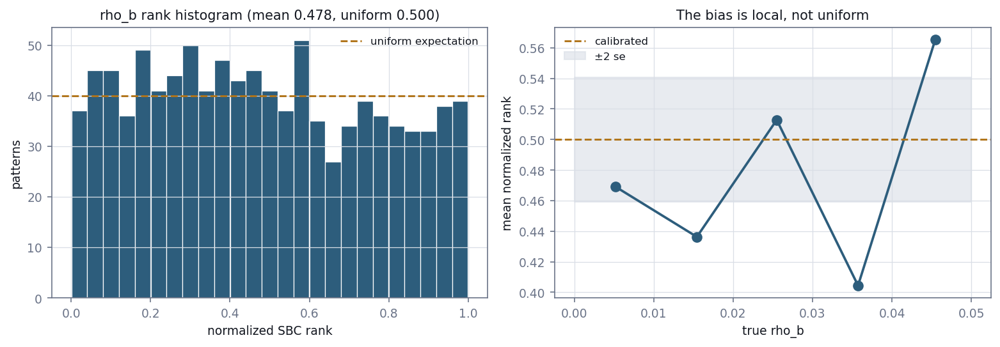

# E7 — Diagnosing `rho_b`

*Four hypotheses tested in order of cost; three ruled out by measurement.*

[← back to README_detailed](../../README_detailed.md#7-experiment-walkthroughs) ·
Implemented by [`experiments/inference/diagnose_rho_b.py`](../../experiments/inference/diagnose_rho_b.py) ·
Runtime 2 min

---

## Abstract

E4 left one parameter outside the uniform band: `rho_b`, the matrix
concentration, at an SBC deviation of 0.0475 against a band of 0.0429, with 90%
coverage of 0.847. Small, systematic, and not caused by the two degenerate
patterns.

Before spending disk on more simulations it was worth knowing *where* the bias
comes from, because that determines whether more data could fix it at all. Four
candidate explanations were tested in ascending order of cost, and the answer was
none of the obvious ones.

Shrinkage is ruled out: the posterior mean is essentially unbiased. Flow capacity
is ruled out, and informatively — larger flows are *worse*. More simulations are
ruled out by a learning curve that plateaus. What remains is a **width that fails
to adapt**: the posterior stays narrow where the features stop being informative,
by a factor of 4.2 in one region of the parameter range.

Ensembling five independently seeded flows closes most of it, taking `rho_b`'s
coverage from 0.847 to 0.902. What survives is bias rather than width, correlating
−0.137 with a parameter it should be independent of.

The experiment also produced two corrections to reasoning stated earlier in the
project, both recorded.

---

## 1. Introduction

The value of this approach is that its intervals mean what they say. One parameter
where they do not is worth understanding rather than tolerating, and worth
understanding *before* deciding what to do about it — a diagnosis that says
"structural" implies a different remedy from one that says "small sample".

Four hypotheses, each with a distinct measurable signature:

| Hypothesis | Signature |
| --- | --- |
| **Shrinkage** | posterior mean regresses toward the prior centre; slope on truth below 1 |
| **Confounding** | rank correlates with a parameter it should be independent of |
| **Insufficient capacity** | a larger flow improves it |
| **Too few simulations** | a learning curve still improving at n = 800 |

---

## 2. Methods

Out-of-fold posteriors were regenerated across ten folds, keeping the *samples*
rather than only the ranks, so posterior means and widths could be examined
directly.

Diagnostics computed per pattern: normalised SBC rank, residual (posterior mean
minus truth), posterior standard deviation, and the ratio of residual spread to
posterior spread — which is 1.0 when the posterior is exactly as wide as its own
errors, above 1 when overconfident.

Capacity was tested by refitting at three sizes. Sample size was tested with a
learning curve: training sets of 100 to 750 patterns against a **fixed**
200-pattern holdout.

---

## 3. Results

### 3.1 Overall

**Table 1.** `rho_b` summary, out-of-fold over 1,000 patterns.

| Quantity | Value |
| --- | ---: |
| Mean normalised rank | 0.4698 *(uniform = 0.5)* |
| Mean residual | +0.00008 |
| Residual sd | 0.00185 |
| Mean posterior sd | 0.00124 |
| **Residual sd / posterior sd** | **1.491** |

A mean rank below 0.5 means the truth sits below the posterior centre more often
than it should: the posterior is biased slightly high. The ratio of 1.49 says the
posterior is about half again too narrow for its own errors.

### 3.2 Hypothesis 1 — shrinkage: **not supported**

| Test | Measured | Expected under shrinkage |
| --- | ---: | --- |
| Regression slope, posterior mean on truth | **0.990** | below 1 |
| corr(rank, true `rho_b`) | +0.099 | strongly positive |

The posterior mean tracks the truth almost exactly. Whatever is wrong, it is not
that estimates are pulled toward the middle of the prior.

### 3.3 Hypothesis 2 — confounding: **supported**

The rank must be independent of every parameter, including its own.

**Table 2.** Rank and residual correlations against each parameter.

| Parameter | corr(rank) | corr(residual) |
| --- | ---: | ---: |
| `rho_c` | −0.059 | +0.080 |
| `rho_b` | +0.099 | −0.074 |
| `cr` | +0.013 | −0.003 |
| **`rb`** | **−0.137** | +0.088 |

`rho_b`'s calibration depends on `rb` — the radius-spread parameter, which has
nothing to do with matrix concentration and which E5 showed no feature family
carries. The flow appears to be leaking `rb`'s unresolved uncertainty into
`rho_b`'s posterior.

### 3.4 Hypothesis 3 — the width does not adapt: **supported**



**Figure 1.** Left: `rho_b`'s SBC rank histogram against the uniform
expectation. Right: mean rank by quintile of the true value, with a ±2 standard
error band. The bias is local, not uniform.

**Table 3.** By quintile of true `rho_b` (n = 200 each).

| Quintile | Mean rank | Residual sd | Posterior sd | Ratio |
| --- | ---: | ---: | ---: | ---: |
| 0.0000–0.0104 | 0.4674 | 0.00042 | 0.00033 | 1.27 |
| 0.0104–0.0205 | 0.4184 | 0.00236 | 0.00056 | **4.22** |
| 0.0205–0.0305 | 0.4965 | 0.00094 | 0.00094 | 1.00 |
| 0.0305–0.0410 | 0.4086 | 0.00259 | 0.00220 | 1.17 |
| 0.0410–0.0500 | 0.5583 | 0.00182 | 0.00219 | 0.83 |

In the second quintile the posterior is **4.2× too narrow**; in the fifth it is
slightly too wide. The width does not track where the features stop being
informative.

### 3.5 Hypothesis 4 — insufficient capacity: **not supported**, and informatively

**Table 4.** Three flow sizes, five folds.

| Flow | SBC deviation | In band | 90% coverage | Width ratio |
| --- | ---: | --- | ---: | ---: |
| 6 layers × 64 *(fitted)* | 0.0435 | no | 0.850 | 1.31 |
| 10 layers × 128 | 0.0405 | yes | 0.876 | **1.47** |
| 14 layers × 192 | 0.0435 | no | 0.859 | **1.77** |

Larger flows are **more** overconfident. That is the signature of overfitting the
conditional width, not of insufficient expressiveness — so the affine transform is
not too rigid, the fit is too tight.

### 3.6 Hypothesis 5 — too few simulations: **not supported**

**Table 5.** Learning curve, fixed 200-pattern holdout, three seeds. Width ratio;
1.0 is honest.

| n_train | `rho_c` | `rho_b` | `cr` | `rb` | `rho_b` coverage |
| ---: | ---: | ---: | ---: | ---: | ---: |
| 100 | 0.55 | 0.42 | 0.78 | 1.15 | 0.992 |
| 200 | 0.80 | 0.87 | 1.03 | 1.16 | 0.933 |
| 400 | 0.83 | 1.19 | 1.06 | 1.10 | 0.868 |
| 600 | 0.98 | 1.09 | 1.20 | 1.11 | 0.870 |
| 750 | 0.95 | 1.11 | 1.24 | 1.13 | 0.873 |

`rho_b` plateaus at a ratio of ~1.1 and coverage ~0.87 from n = 400 onward.
Extrapolating, ten thousand patterns would land in the same place.

At small n the posteriors are too *wide* (n = 100: ratio 0.42, coverage 0.992);
the flow begins underconfident and sharpens through 1.0 into overconfidence as
data grows.

### 3.7 The fix: ensembling

**Table 6.** Single flow against a five-flow ensemble, equal draw counts, from E4.

| 90% coverage | single | ensemble |
| --- | ---: | ---: |
| `rho_c` | 0.888 | 0.919 |
| **`rho_b`** | **0.847** | **0.902** |
| `cr` | 0.867 | 0.885 |
| `rb` | 0.876 | 0.882 |

Pooling recovers the between-member disagreement a single fit discards, which is
the variance the posterior was missing. `rho_b`'s coverage gap closes almost
entirely.

What remains after ensembling is the **bias**: SBC deviation 0.0521, mean rank
0.478 against 0.500. Ensembling widens posteriors; it cannot recentre them.

---

## 4. Discussion

### 4.1 Width was the fixable half

The diagnosis decomposes cleanly. `rho_b` had two problems: a posterior too narrow
for its errors, and a slight offset in its centre. Ensembling addresses the first
completely and the second not at all.

The remaining bias is small — two percentage points of rank — and its correlation
with `rb` points at a joint-modelling issue rather than a marginal one. The flow
is presumably unable to separate two parameters that the features do not
distinguish, and the resulting uncertainty lands asymmetrically.

### 4.2 Why the diagnosis mattered before acting

Each ruled-out hypothesis implied a different remedy, and three of them would have
been wasted effort:

- shrinkage → regularisation changes
- capacity → a larger flow, which is measurably *worse*
- sample size → hours of generation and gigabytes of disk, for a plateau

Only the fourth, the width defect, pointed at something cheap that worked. The
two minutes of diagnosis avoided an overnight run that the learning curve shows
would have changed nothing.

### 4.3 It is not specific to `rho_b`

The learning curve in §3.6 shows `cr` degrading from 1.03 to 1.24 as training data
grows — worse than `rho_b` — while passing E4's gate at coverage 0.867, the bottom
edge of its tolerance. The gate was loose enough not to catch it.

That figure carries a caveat: it was computed with the standard-deviation width
ratio later found to be non-robust (E4 §5.2), so it is **unverified** pending a
recheck with the robust estimator.

---

## 5. Corrections

### 5.1 "More simulations would worsen `rho_b`"

Stated on the evidence that augmentation — quadrupling rows — moved `rho_b`'s SBC
deviation from 0.0285 to 0.0535.

The inference was wrong. Augmentation adds **near-duplicate** rows, which increase
overfitting without adding information; genuinely new draws do the opposite. The
two mechanisms are opposite and were conflated.

The conclusion survived, but only because the learning curve in §3.6 independently
showed a plateau. That plateau is the actual evidence; the augmentation result
says nothing about new data.

### 5.2 The width ratio was not robust

The diagnostic used throughout this experiment, computed as a ratio of standard
deviations, was subsequently found to be dominated by outliers: over 1,000
patterns it gives `rho_c` 1.38, and 0.97 with two zero-cluster patterns removed.

This does not invalidate the local analysis in §3.4 — a 4.22 ratio in one quintile
against 1.00 in another is a within-parameter comparison on the same 200 patterns
each — but it does mean the overall figure of 1.491 in Table 1 overstates typical
behaviour. The robust equivalent puts `rho_b` at 1.13.

E4 §5.2 records the correction and its consequence.

---

## 6. Conclusion

`rho_b`'s miscalibration is a width defect, not shrinkage, not insufficient
capacity, and not insufficient data — each ruled out by measurement rather than
argument. Ensembling closes the coverage gap from 0.847 to 0.902.

What remains is a small bias correlating with the one parameter the features
cannot resolve. It is the only open calibration issue in the package, and it will
follow the method to any new dataset, which makes it matter more for a future
real-data application than for anything on this one.

The experiment also cost two overnight runs that the learning curve shows would
have achieved nothing — the strongest argument for diagnosing before scaling.

---

## Reproduce

```bash
python -m experiments.inference.diagnose_rho_b
python -m experiments.inference.diagnose_rho_b --parameter cr
```

The script takes any parameter, so the `cr` recheck flagged in §4.3 is a one-line
change.
