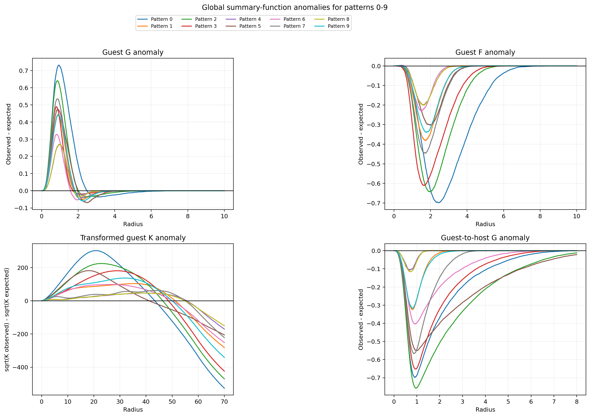
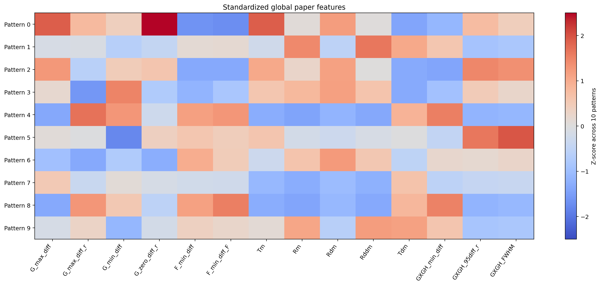

# E8 — Global feature validation

*Numerical validation of the ported summary functions on ten patterns.*

[← back to README_detailed](../../README_detailed.md#7-experiment-walkthroughs) ·
Implemented by [`example_01/validate_global_paper_features.py`](../../example_01/validate_global_paper_features.py) ·
Runtime ~1 min

---

## Abstract

The spatial-summary machinery is a port from the R packages `rapt` and `rTEM`.
Before it could support any downstream claim it had to be shown to produce sound
output: finite, bounded, monotone where monotonicity is required, and with the
summary curves reaching their asymptotes within the radius ranges used.

Ten patterns were processed with all 216,000 points, and every numerical and
range check passed with no failures and no warnings. The fourteen features were
recorded per pattern alongside the realised cluster statistics.

The validation is retained here because it did what it was designed to do —
confirm numerical soundness — while also illustrating its own limit. It checks
that the estimators produce well-formed output; it does not check that they
produce *correct* output, and one defect that passed every check in this
experiment was later found by comparing against closed forms instead (E2). The
configuration it used is now refused outright by the library.

---

## 1. Introduction

Porting statistical estimators between languages is error-prone in ways that do
not announce themselves. An off-by-one in an edge correction, a mis-transcribed
normalising constant, or a boundary convention silently changed will all produce
plausible-looking curves.

This experiment established a first line of defence: run the port on real
patterns and assert that its output is well-formed.

---

## 2. Methods

### 2.1 Configuration

**Table 1.** Validation configuration.

| Setting | Value |
| --- | --- |
| Patterns | 0–9, complete point clouds |
| Guest labels | 2, 3 |
| Random relabellings | 5 |
| Guest *G* and *F* maximum radius | 10.0 |
| Guest *K* maximum radius | **70.0** |
| Guest-to-host *G* maximum radius | 8.0 |
| Maximum guest points per *K* estimate | 3,000 |

All points are used for *G*, *F* and cross-*G*. The *K* point cap is a random
guest subsample, keeping the large-radius translation correction tractable.

### 2.2 Checks

Per pattern:

| Check | Assertion |
| --- | --- |
| `cdf_finite` | all *G*, *F*, cross-*G* values finite |
| `cdf_bounded` | all CDF values in [0, 1] |
| `cdf_monotonic` | CDFs non-decreasing in radius |
| `k_finite` | all *K* values finite |
| `k_nonnegative` | *K* ≥ 0 |
| `k_monotonic` | *K* non-decreasing in radius |
| `features_finite` | all 14 features finite |
| `k_peak_at_boundary` | the *K* peak is not at the grid edge |
| `guest_g_endpoint` | *G* reaches its asymptote |
| `guest_f_endpoint` | *F* reaches its asymptote |
| `cross_g_endpoint` | cross-*G* reaches its asymptote |
| `cross_g_reaches_95` | cross-*G* attains 0.95 within its range |

---

## 3. Results

### 3.1 All checks pass

**Table 2.** Diagnostic status, ten patterns.

| Result | Count |
| --- | ---: |
| Numerical failures | **0** |
| Range warnings | **0** |
| Patterns with `numerical_status` = PASS | 10 / 10 |
| Patterns with `range_status` = PASS | 10 / 10 |

All CDFs are finite, bounded and monotone; *K* is finite, non-negative and
monotone; all fourteen features are finite. Every curve reaches its endpoint at
1.0 and cross-*G* attains 0.95 within its range for all ten patterns.

### 3.2 Features and structure

**Table 3.** Selected features against the realised cluster structure. Full table
in `global_paper_features_10_patterns.csv`.

| Pattern | Clusters | Mean radius | Guest fraction | `G_max_diff` | `F_min_diff` | `Tm` | `Rm` |
| ---: | ---: | ---: | ---: | ---: | ---: | ---: | ---: |
| 0 | 2 | 9.65 | 0.0481 | 0.732 | −0.699 | 301.87 | 20.80 |
| 1 | 10 | 8.29 | 0.0927 | 0.444 | −0.381 | 103.39 | 35.65 |
| 2 | 2 | 13.30 | 0.0880 | 0.641 | −0.643 | 224.45 | 22.90 |

Calculation time was 5.9–6.1 s per pattern.

The relationship the downstream work depends on is visible here: `G_max_diff`
tracks how sharply the guest population is clustered, and `F_min_diff` tracks the
guest-free void structure, both varying systematically with cluster count and
radius.

### 3.3 Figures



**Figure 1.** Observed-minus-expected summary curves for all ten patterns
overlaid. The systematic spread between patterns is the signal every downstream
stage consumes.



**Figure 2.** The fourteen features across ten patterns, standardised.
Per-pattern curve plots are in the same directory.

---

## 4. Discussion

### 4.1 What this validated, and what it could not

Every check here is a check of *well-formedness*. A CDF that is finite, bounded
and monotone is a plausible CDF; it is not necessarily the right one. An
estimator with a wrong normalising constant passes all twelve checks.

The defect that mattered — the boundary-pinning of the *K* radius features, which
made roughly two thirds of them grid endpoints rather than measurements (E2 §2) —
passed every check in this experiment. It had to, because a grid endpoint *is* a
finite number lying in a plausible range. It was found only by comparing the
estimator against closed forms and by examining the fraction of patterns with a
genuine interior extremum.

Notably, `k_peak_at_boundary` was checked and reported `False` for every pattern —
because at `k_r_max` = 70 the peak genuinely was interior. The check was sound;
the configuration masked the problem that appears at smaller radii.

### 4.2 The configuration is now refused

This experiment used `k_r_max` = 70.0 in a 60-unit domain.

Subsequent work established that the translation-corrected *K* estimator is
unbiased right up to r = L — measured ratio to analytic CSR of 1.000 at r/L = 1.0
— and breaks only beyond it, biasing downward by about 9% at r/L = 1.17. Pairs
separated by more than the shortest domain side can only exist along diagonals,
and the positive-overlap filter discards them inconsistently.

The library now rejects a *K* radius exceeding the shortest side of the
observation window (roadmap §8.6). **The *K* features in this output are
therefore affected and should be regenerated**; the *G*, *F* and cross-*G*
features are not.

### 4.3 What replaced it

The validation approach here — assert properties of the output — was superseded by
comparison against closed forms, now in `tests/`:

| Estimator | Checked against |
| --- | --- |
| Ripley's *K* | analytic CSR on homogeneous Poisson patterns, ratio 1.0009 |
| Kaplan–Meier CDF | a hand-worked three-observation censored example |
| CSR baselines | their closed forms |
| Conditional flow | a conjugate Gaussian posterior |

These can catch a genuine error; property assertions can only detect
malformedness. Both have a place, but only the second kind establishes
correctness.

---

## 5. Conclusion

The port produces numerically sound output: ten patterns, twelve checks each, no
failures and no warnings. That was worth establishing and remains true.

It is retained here as much for its limit as for its result. A validation suite
that asserts output is well-formed will not find an estimator that is well-formed
and wrong, and this package's most consequential defect was exactly that. The
closed-form comparisons that replaced it are the reason the later claims can be
trusted.

---

## Outputs

| File | Contents |
| --- | --- |
| `example_01/global_paper_feature_validation/global_paper_features_10_patterns.csv` | features and cluster statistics |
| `.../validation_diagnostics.csv` | all twelve checks per pattern |
| `.../summary_function_anomalies_10_patterns.png` | Figure 1 |
| `.../global_paper_feature_heatmap.png` | Figure 2 |
| `.../pattern_*_summary_functions.png` | per-pattern curves |

## Reproduce

```bash
PYTHONPATH=. python example_01/validate_global_paper_features.py
```

Note that the stored configuration sets `k_r_max` = 70.0, which the library now
refuses. Reproducing requires a radius within the domain.
