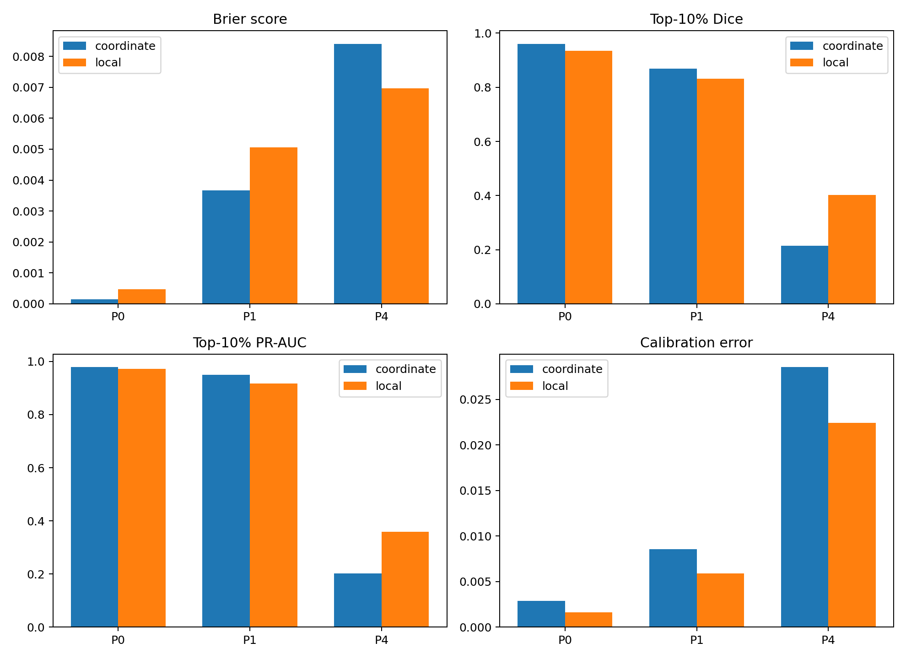

# E9 — Local spatial features in a neural field

*A prespecified screening experiment that halted at its own interpolation gate,
and the reinterpretation of its result.*

[← back to README_detailed](../../README_detailed.md#7-experiment-walkthroughs) ·
Implemented by [`example_01/execute_experimental_methodology_01.py`](../../example_01/execute_experimental_methodology_01.py) ·
Protocol: [`EXPERIMENTAL_METHODOLOGY_01.md`](../../example_01/EXPERIMENTAL_METHODOLOGY_01.md) ·
Report: [`REPORT.md`](../../example_01/methodology_01_results/report/REPORT.md) ·
Runtime 34 min preprocessing + 51 s training

---

## Abstract

This experiment belongs to the package's original objective: reconstructing a
continuous guest-probability field from a sparse observed point cloud with a
neural field. It asked one focused question — does adding spatially varying local
spatial features improve a per-pattern neural field relative to coordinates alone?

The protocol was prespecified in full before any model was fitted, including a
gate on whether the coarse-grid feature interpolation was accurate enough for the
comparison to mean anything. **That gate failed for all three patterns**, and the
experiment correctly stopped, labelling the model fits as exploratory diagnostics
that do not override the stopping rule.

The conclusion about interpolation was sound. The conclusion about features was
not, and the reinterpretation is the substance of this walkthrough. Re-examining
the experiment's own numbers against a constant-predictor baseline shows that on
two of its three patterns the coordinate-only control had **already solved the
task**, so no feature set could improve on it. On the third, where the control
barely beat a constant, local features won clearly. The median was taken over one
unsolved problem and two solved ones.

Two confounds must be removed before the comparison is rerun: the codebase
contains no positional encoding anywhere, and the *K* features it used were
largely the boundary artefacts documented in E2.

---

## 1. Introduction

The target is a continuous field: for each point in the domain, the probability
that a point there is a guest species. The observed data is a sparse point cloud.
A neural field maps coordinates to that probability.

The question is whether telling the network about *local spatial structure* — the
14 features computed in a neighbourhood around each location — helps it
reconstruct the field better than coordinates alone.

---

## 2. Methods

The protocol was fixed in advance. Its key provisions:

### 2.1 Data and targets

Three patterns spanning the structural range:

| Pattern | Role | Clusters | Structure |
| --- | --- | ---: | --- |
| 0 | strong | 2 | large, sparse |
| 1 | moderate | 10 | intermediate |
| 4 | weak / fine | 170 | many small clusters |

For each: 10% of points selected as the **observation** cloud used to compute
features, and the complementary 90% used to construct the **target** field.
Separating them prevents the feature calculation from using the exact points that
define the evaluation target.

Targets on a 0.5-unit grid, Gaussian bandwidth 1.5 — 120³ = 1,728,000 voxels.

### 2.2 Local features

Exact local features on a coarse 15 × 15 × 15 grid (4-unit spacing, 3,375
locations per pattern), computed in a 12-unit clipped cube around each query
point, against a 89-relabelling random-label null. Then trilinearly interpolated
to the full 120³ grid.

### 2.3 The interpolation gate — declared before fitting

Because the full-grid features are interpolated from a coarse grid, the
approximation had to be validated first. 256 additional exact locations per
pattern, excluded from the coarse grid, compared against their interpolated
values.

**Pass criteria:**

- median robust normalised RMSE across the 14 channels ≤ 0.15
- at least 12 of 14 channels with Spearman ≥ 0.80
- no cluster-scale radius channel with robust normalised RMSE > 0.30

> *"If interpolation fails, neural-field comparison stops."*

### 2.4 Models and validation

Two models per pattern, identical architecture (3 hidden layers, 128 units, ReLU,
sigmoid output): **Model C** on normalised coordinates alone, **Model L** on
coordinates plus the 14 standardised local features.

Validation used **spatial blocks**, not random voxels: the domain divided into a
5 × 5 × 5 grid of 12-unit blocks, 20% held out. Both models received identical
voxel indices in the same order.

---

## 3. Results

### 3.1 The gate failed

**Table 1.** Interpolation validation.

| Pattern | Median normalised RMSE | Channels with Spearman ≥ 0.80 | Max radius-feature error | Result |
| ---: | ---: | ---: | ---: | --- |
| 0 | 0.1502 | 8 / 14 | 0.4275 | **FAIL** |
| 1 | 0.1557 | 8 / 14 | 0.2991 | **FAIL** |
| 4 | 0.2535 | 5 / 14 | 0.3377 | **FAIL** |

All three patterns failed, on all three criteria.


**Figure 1.** Per-feature interpolation quality.

### 3.2 The failure is concentrated in the K features

**Table 2.** Feature-level interpolation statistics, averaged over patterns.

| Feature | Family | Mean normalised RMSE | Mean Spearman |
| --- | --- | ---: | ---: |
| `F_min_diff` | F | 0.0522 | **0.979** |
| `G_max_diff` | G | 0.1038 | **0.943** |
| `GXGH_95diff_r` | cross-G | 0.1046 | **0.938** |
| `G_min_diff` | G | 0.1194 | 0.914 |
| `GXGH_min_diff` | cross-G | 0.1305 | 0.902 |
| `F_min_diff_F` | F | 0.1718 | 0.790 |
| `GXGH_FWHM` | cross-G | 0.1895 | 0.745 |
| `G_max_diff_r` | G | 0.1969 | 0.817 |
| **`Tm`** | **K** | 0.2160 | **0.688** |
| `G_zero_diff_r` | G | 0.2363 | 0.769 |
| **`Rm`** | **K** | 0.2405 | **0.674** |
| **`Rddm`** | **K** | 0.2406 | **0.689** |
| **`Tdm`** | **K** | 0.2810 | **0.534** |
| **`Rdm`** | **K** | 0.3514 | 0.723 |

The five worst channels are the five *K*-derived features, at Spearman 0.53–0.72,
while *G*, *F* and cross-*G* score 0.90–0.98.

This was unexplained at the time. E2 later supplied the explanation: at the
library's original *K* radius those features were **grid endpoints rather than
measurements** for roughly two thirds of patterns. A feature that equals `k_r_max`
wherever the curve happens to be monotone is piecewise constant with arbitrary
jumps — not a smooth function of position, and therefore not interpolable in
principle.

### 3.3 Model metrics (exploratory)

Because the gate failed, these are labelled exploratory and do not override the
stopping rule.

**Table 3.** Held-out block metrics.

| Pattern | Model | Brier | Dice (top 10%) | PR-AUC | ECE | Pearson | Spearman |
| ---: | --- | ---: | ---: | ---: | ---: | ---: | ---: |
| 0 | coordinate | 0.000145 | 0.9609 | 0.9788 | 0.00290 | 0.9976 | 0.3909 |
| 0 | local | 0.000469 | 0.9348 | 0.9721 | 0.00162 | 0.9920 | 0.4476 |
| 1 | coordinate | 0.003666 | 0.8689 | 0.9505 | 0.00856 | 0.9564 | 0.5896 |
| 1 | local | 0.005062 | 0.8309 | 0.9171 | 0.00588 | 0.9375 | 0.5940 |
| 4 | coordinate | 0.008408 | 0.2146 | 0.2014 | 0.02856 | 0.5381 | 0.6466 |
| 4 | **local** | **0.006968** | **0.4021** | **0.3583** | **0.02242** | 0.5979 | 0.6417 |



**Figure 2.** Model metric comparison across patterns.

The experiment's own summary: local improved both Brier and Dice in 1 of 3
patterns; median relative Brier change −38.08%; **does not advance**.

---

## 4. Reinterpretation

### 4.1 Two of the three patterns had no headroom

The experiment reported Brier scores without a reference point. Computing the
constant-predictor baseline — predicting the training mean everywhere — on the
same held-out voxels reframes them entirely.

**Table 4.** Brier against a constant predictor.

| Pattern | Constant | Coordinate | Local | Coordinate vs constant |
| ---: | ---: | ---: | ---: | --- |
| 0 (2 large clusters) | 0.02947 | 0.000145 | 0.000469 | **200× better** |
| 1 (10 clusters) | 0.04121 | 0.003666 | 0.005062 | **11× better** |
| 4 (170 small clusters) | 0.00954 | 0.008408 | **0.006968** | **1.13× better** |

On patterns 0 and 1 the coordinate-only control is 200× and 11× better than a
constant — it has essentially solved the task, and no feature set could improve on
it. "Features don't help" is uninformative there.

On pattern 4 the coordinate model is only 13% better than a constant: it has
largely failed. And that is exactly where local features won decisively —
Brier 0.00841 → 0.00697, Dice 0.215 → 0.402, PR-AUC 0.201 → 0.358.

The median was taken over one unsolved problem and two already-solved ones. The
conclusion about **interpolation** was sound; the conclusion about **features** is
an artefact of pattern selection.

### 4.2 Pearson is not a usable headline here

Pattern 0 reports `pearson = 0.9976` alongside `spearman = 0.3909`. Pearson is
carried by a handful of high-value cluster voxels; Spearman says the model has
almost no ability to rank the remaining structure. Notably the local model
*improves* Spearman on pattern 0 (0.391 → 0.448) while losing on Pearson.

### 4.3 Two confounds before any rerun

**No positional encoding exists anywhere in the codebase.** A search for Fourier
features, positional encoding or SIREN returns nothing; the field is a plain ReLU
MLP on raw normalised coordinates. Pattern 4's clusters have radius ≈ 4.4 in a
60-unit domain — precisely the regime where ReLU spectral bias bites. So the one
pattern where features appeared to help may simply be the pattern where the
control was crippled.

**The K features were largely artefacts.** §3.2 and E2. Any rerun should use the
corrected radius settings.

---

## 5. Discussion

### 5.1 The experiment's methodology was sound

Whatever the reinterpretation, the protocol deserves credit. The interpolation
gate was declared before any model was fitted, it failed, and the work stopped —
with the model fits explicitly labelled as exploratory rather than quietly
promoted. That is rarer than it should be.

Other provisions that held up: separating observation and target points,
validating on spatial blocks rather than random voxels, and giving both models
identical batch indices.

### 5.2 What it contributed to the inference track

This experiment produced the observation that the *K*-derived features behave
differently from the rest. That observation went unexplained for months and was
the thread that led, in E2, to the boundary-pinning defect — which turned out to
affect the global features the entire inference pipeline depends on.

A failed experiment that surfaces a real defect in shared machinery has earned its
runtime.

### 5.3 A caveat on the block validation

Held-out 12-unit blocks can fragment connected targets, so the connected-component
metrics are secondary to the voxelwise, ranking and calibration ones. The original
report says so, and it is worth repeating.

---

## 6. Conclusion

The experiment halted at its own gate, correctly. Coarse-grid trilinear
interpolation of the 14 local features is not validated at 4-unit spacing, and
several extrema and radius-derived channels are too spatially irregular for it.

The reinterpretation stands separately: the comparison had no headroom on two of
its three patterns, and on the third — the only one where the control had genuinely
failed — local features won clearly. Before that comparison is rerun, the baseline
needs positional encoding and the features need the corrected radius settings.
Until both, the question remains open rather than answered.

---

## Outputs

| File | Contents |
| --- | --- |
| `example_01/methodology_01_results/report/REPORT.md` | full auto-generated report |
| `.../report/interpolation_metrics.csv` | per-feature interpolation statistics |
| `.../report/model_metrics.csv` | complete model metrics |
| `.../report/figures/` | eight figures |
| `.../patterns/` | point splits, feature grids, masks, predictions (gitignored) |

## Reproduce

```bash
PYTHONPATH=. python example_01/execute_experimental_methodology_01.py
```

Approximately 34 minutes of preprocessing plus a minute of training. Per-pattern
caches make an interrupted run resumable.
